summary: ADK 2.1、A2A、Agent Runtime で作るマルチエージェント AI ハンズオン
id: create-multi-agent
categories: AI, Cloud
environments: Web
status: Published
feedback link: https://github.com/googlecodelabs/your-first-pwapp/issues
author: GDG on Campus University of Osaka

# ADK x A2A x Agent Runtime で作るマルチエージェント AI

## はじめに

Duration: 0:05:00


このコードラボでは、ADK 2.1 の Graph Workflow と A2A specialist agents を使って、旅行計画 AI エージェントを作ります。

### このコードラボで作るもの

完成すると、Coordinator Workflow が旅行の希望を構造化し、候補生成、並列リサーチ、専門エージェントによる評価、ユーザー選択、詳細旅程生成、旅しおり画像生成までを実行します。

### このコードラボで学ぶこと

- ADK 2.1 の graph-based Workflow を使ってエージェントの制御フローを構築する方法
- `output_schema` で旅行希望や候補評価を構造化する方法
- `google_search` を使った候補ごとの fan-out / fan-in リサーチを作る方法
- A2A Agent Card を公開し、`RemoteA2aAgent` で専門エージェントを呼び出す方法
- `RequestInput` で clarification、候補選択、再提案ルートを作る方法
- 旅程 Markdown と旅しおり画像を生成する planner / illustrator フェーズを作る方法
- Agent Runtime にエージェントをデプロイする方法

### 必要なもの

- Google Cloud Shell
- Google アカウント

### 前提知識

- Python の基本的な読み書き
- ターミナルでコマンドを実行する基本操作

### このコードラボで扱わないこと

- 実際の予約、決済、旅行商品の販売
- 交通機関、宿泊施設、天気、料金のリアルタイム保証
- 本番運用向けのセキュリティ、監視、評価基盤の詳細設計
- Agent Gateway、Memory Bank など周辺機能の本格運用

## 旅行計画エージェントのアーキテクチャを確認する

Duration: 0:10:00

このステップでは、これから実装する旅行計画エージェントの全体像を確認します。最終成果物は `gdsc-osaka/create-multi-agent-example`、初期状態は `gdsc-osaka/create-multi-agent` です。

### Coordinator Workflow の流れを確認する

完成後の coordinator は、1 つの大きな LLM に全部を任せるのではなく、Graph Workflow で処理を分割します。

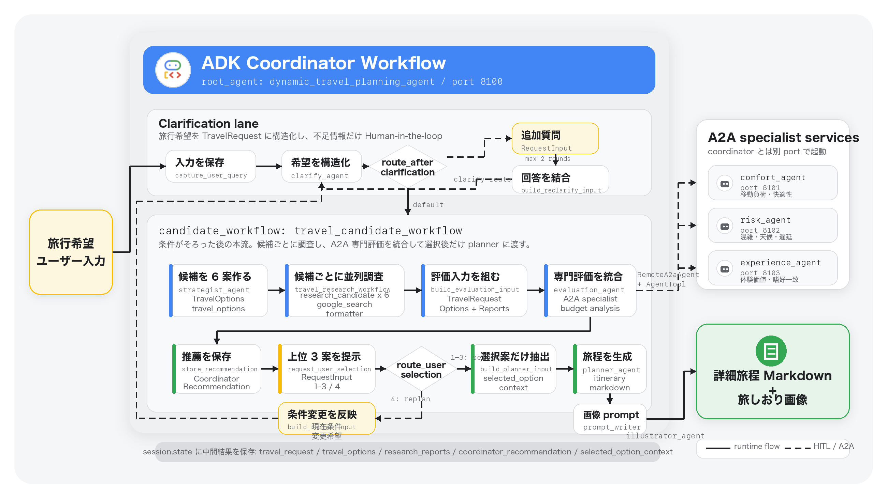

`clarify_agent` は旅行希望を構造化し、不足情報があれば `RequestInput` でユーザーに追加質問します。条件がそろったら候補生成、候補ごとの検索リサーチ、専門エージェント評価、候補選択、詳細旅程、旅しおり画像生成へ進みます。

> **補足:** `comfort_agent`、`risk_agent`、`experience_agent` は coordinator と同じプロセス内の sub-agent ではありません。A2A サービスとして別 port で起動し、coordinator は Agent Card を読んで呼び出します。

### session.state に保存するデータを確認する

Workflow の各 node は、後続 node が使う中間成果物を `session.state` に保存します。

| state key | 保存する内容 | 主に使う場所 |
| --- | --- | --- |
| `raw_user_query` | 最初のユーザー入力 | 再 clarification |
| `travel_request` | 構造化された旅行希望 | 候補生成、評価、planner |
| `clarification_rounds` | 追加質問の回数 | clarification ループ制御 |
| `travel_options` | 生成された旅行候補 | リサーチ、評価、選択 |
| `research_reports` | `option_id` ごとの検索リサーチ結果 | 評価、planner |
| `coordinator_recommendation` | 上位 3 案と比較サマリー | ユーザー選択、再提案 |
| `selected_option_id` | ユーザーが選んだ候補 ID | planner |
| `selected_option_context` | 選ばれた候補だけの文脈 | planner |
| `itinerary_markdown` | 詳細旅程 Markdown | illustrator |
| `illustrator_prompt` | 画像生成用 prompt | illustrator |

この設計の重要な点は、planner に全候補の情報を渡さないことです。`selected_option_context` に選ばれた候補だけを詰めることで、複数候補の観光地や注意点が混ざる事故を減らします。

## セットアップ

Duration: 0:15:00

このステップでは、Cloud Shell で初期コードを開き、依存関係と環境変数を準備します。

### Google Cloud Shell を開く

下のボタンから Cloud Shell を開きます。リポジトリの clone と Cloud Shell Editor の起動が自動で始まります。

<button>
  [Cloud Shell で初期コードを開く](https://shell.cloud.google.com/cloudshell/editor?cloudshell_git_repo=https://github.com/gdsc-osaka/create-multi-agent.git&cloudshell_workspace=.&cloudshell_open_in_editor=.env&show=ide%2Cterminal&ephemeral=true)
</button>

Cloud Shell が初回起動の場合は、利用規約の確認や環境作成に数分かかることがあります。

完成コードは次のリポジトリにあります。詰まったときだけ参照してください。

https://github.com/gdsc-osaka/create-multi-agent-example

### setup script を実行する

`scripts/setup.sh` は connpass ID と Google Cloud project ID を確認し、`uv sync --extra dev` で依存関係を入れます。

ターミナルを開いて下記を実行します。

```bash
./scripts/setup.sh
```

**期待される出力:**

```text
connpass ID: alice_123
Google Cloud project ID: create-multi-agent
Setup complete for [alice_123].
```

`uv` が入っていない場合は、script がインストールします。`uv sync` が完了すると `.venv` が作成されます。

### 環境変数を設定する

`.env` を開き、旅行エージェント用の値になっていることを確認します。ローカル A2A specialist の URL は次の値にします。

`.env`

```bash
COMFORT_A2A_URL=http://localhost:8101
RISK_A2A_URL=http://localhost:8102
EXPERIENCE_A2A_URL=http://localhost:8103

GOOGLE_API_KEY=
GOOGLE_CLOUD_PROJECT=create-multi-agent
GOOGLE_CLOUD_LOCATION=us-central1

TRAVEL_AGENT_TRACE_TO_CLOUD=false
```

モデル呼び出しには Google AI Studio の API key を使います。`GOOGLE_API_KEY` に自分の API key を設定してください。`GOOGLE_CLOUD_PROJECT` と `GOOGLE_CLOUD_LOCATION` は Agent Runtime へのデプロイで使います。

> **Warning:** `.env` に書いた API key や project 固有の値は commit しないでください。このハンズオンでは `.env.example` だけを共有します。

### ADK を import できることを確認する

ターミナルを開いて下記を実行します。

```bash
uv run --extra dev python - <<'PY'
import google.adk
print("ADK is ready")
PY
```

**期待される出力:**

```text
ADK is ready
```

`ModuleNotFoundError` が出る場合は、ターミナルで下記を実行します。

```bash
uv sync --extra dev
```

## Agent Development Kit 2.0 の概要

Duration: 0:12:00

このステップでは、今回使う ADK の考え方を確認します。このコードラボでは ADK 2.1 を使いますが、2.0 で導入された graph-based Workflow、dynamic workflow、collaborative workflow、human input、session / state / memory の考え方が土台になります。

### グラフベースのワークフロー

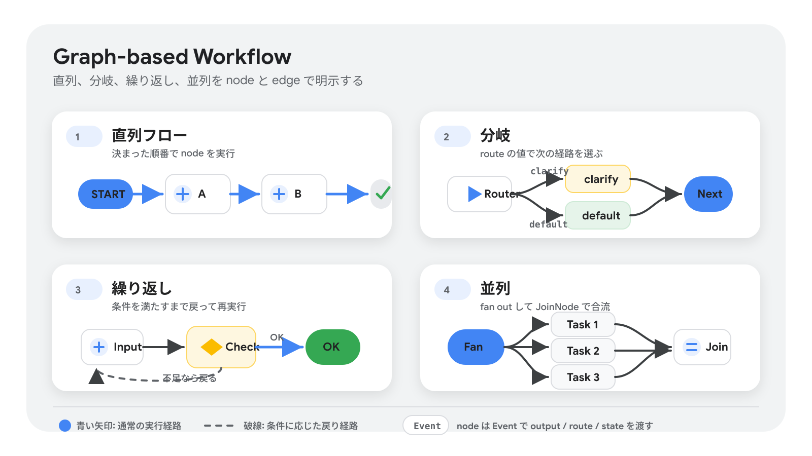

ADK の graph-based workflow は、エージェントの処理を「実行 node」と「edge」の graph として定義します。node には Agent、Tool、Python 関数、Human input、別 Workflow を置けます。prompt だけで長い手順を守らせるのではなく、処理順序、分岐、並列実行、状態管理をコードとして明示できるため、複雑なエージェントを予測しやすくできます。

今回の Coordinator では、最初に旅行希望を `TravelRequest` に構造化し、情報が足りない場合は clarification に進みます。情報がそろっている場合は、候補生成、検索リサーチ、専門エージェント評価へ進みます。

詳しくは [Graph-based agent workflows](https://adk.dev/graphs/) を参照してください。

#### ルートシーケンス

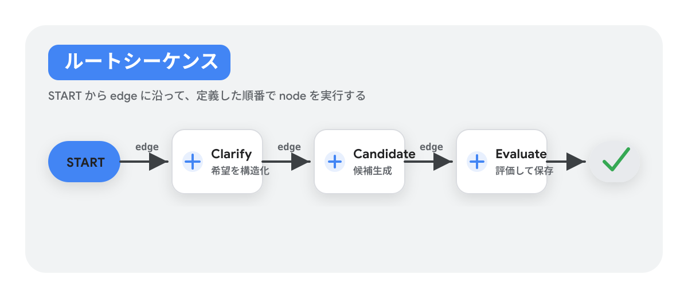

`Workflow` は `edges` 配列で実行経路を定義します。最初の経路は `START` から始まり、列挙された node を順番に実行します。

このコードラボでは、入力を構造化する node、候補を作る node、候補を評価する node のように、役割ごとに処理を分けます。各 node の責務を小さくすると、どこで何が起きたかを ADK Web の Inspector で追いやすくなります。

#### ルート分岐と条件付き実行

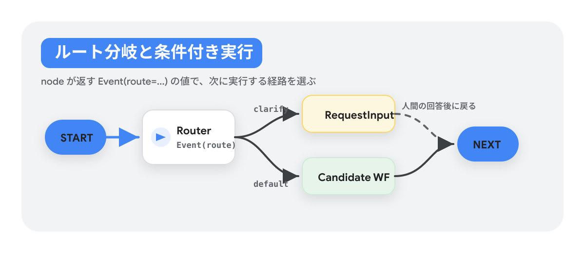

分岐を作るときは、通常は関数 node が `Event(route=...)` を返します。次の edge では、route value と実行先 node を対応付けます。

このコードラボでは、`unknowns` に出発地、期間、予算、交通手段などの重要な不足情報がある場合に `clarify` route を返します。条件がそろっている場合は `default` route で候補生成へ進めます。

#### 並列タスク: fan out と join

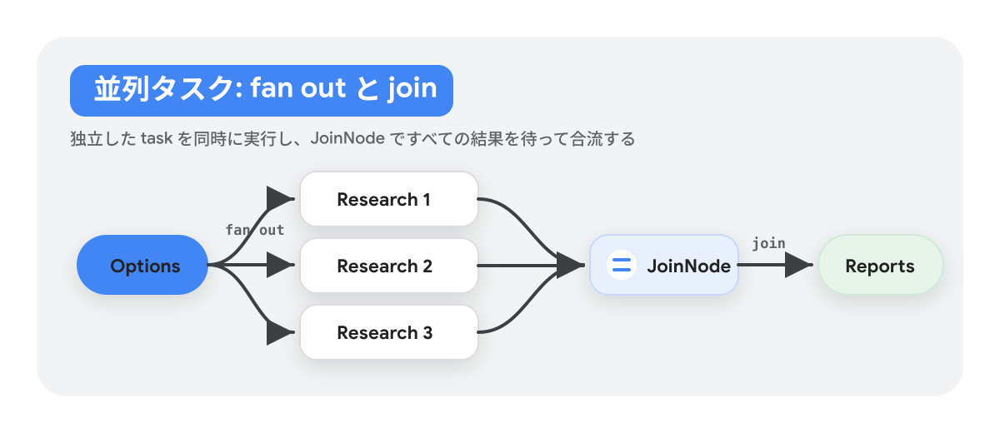

複数の独立した処理を同時に走らせたい場合は、graph を複数の経路に fan out し、最後に `JoinNode` で合流させます。`JoinNode` は上流の並列 node がすべて `Event` を返すまで待ち、集まった出力を次の node に渡します。

このコードラボでは `travel_research_workflow` が各 `TravelOption` に対して `research_candidate` を並列実行し、結果を `research_reports` に保存します。

> **Warning:** `JoinNode` はすべての上流 node から出力が届くまで進みません。失敗時にも fallback の `Event` を返す設計にしないと、合流点で workflow が止まります。

#### ネストされたワークフロー

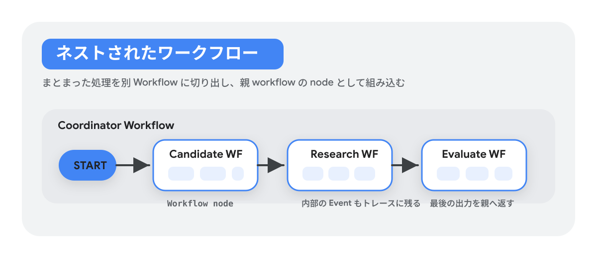

複雑な処理は、別の `Workflow` として切り出し、親 workflow の node として組み込めます。これにより、候補生成、リサーチ、専門評価のようなまとまった責務を再利用しやすくなります。

ネストされた workflow の途中の `Event` はトレースのために親 workflow にも見えます。ネスト workflow が完了すると、最後の leaf node の出力が親 workflow 側の出力として扱われます。

詳しくは [Graph routes](https://adk.dev/graphs/routes/) を参照してください。

### データの受け渡し

Graph workflow の node は `Event` を通じてデータを受け渡します。ADK の公式 document では、主に `output`、`message`、`state` の 3 種類を使い分けます。

| Event parameter | 用途 | このコードラボでの考え方 |
| --- | --- | --- |
| `output` | 次の node へ渡す通常のデータ | 構造化された `TravelRequest` や `TravelOption` のような node 間の入力 |
| `message` | ユーザーに返す、またはユーザーへ入力を求める情報 | 進行状況や clarification の質問 |
| `state` | session 中に node をまたいで保持する小さなデータ | `travel_request`、`travel_options`、`selected_option_id` など |

`output` は次の node に渡す標準的な値です。長い構造化データを渡す場合は、serializable な dict や Pydantic model を使います。ただし、1 回の node 実行で複数の `Event.output` を出すことはできません。

`message` はユーザー向けの応答に使います。node 間の内部データを渡す目的ではなく、ユーザーに情報を見せる、またはユーザーから情報をもらう場面に限定して使うと整理しやすくなります。

`state` は ADK session の間、node をまたいで自動的に保持される値です。複雑な workflow の制御や、後続 node が参照する中間成果物に向いています。一方で、大きなファイルや大量データの保存場所ではありません。その場合は artifact、database、外部 tool などを使います。

詳しくは [Data handling for agent workflows](https://adk.dev/graphs/data-handling/) を参照してください。

### Dynamic workflow

Dynamic workflow は、static な graph 構造では表しにくい処理を Python の制御構文で書くための仕組みです。`@node` で workflow node を定義し、`Context.run_node()` で agent node や function node を関数のように呼び出します。

Dynamic workflow が向いているのは、次のような処理です。

- `while` loop や再帰を含む反復処理
- 条件分岐が多く、graph の edge として書くと読みにくい処理
- `asyncio.gather` などを使う柔軟な並列処理
- resume 時に成功済みの sub-node を再実行せず、途中から再開したい処理

Graph workflow は全体の流れを明示しやすく、dynamic workflow は複雑な routing logic を通常の Python として書きやすい、という違いがあります。このコードラボでは主に graph workflow を使いますが、候補数や評価条件が実行時に大きく変わる場合は dynamic workflow も選択肢になります。

詳しくは [Dynamic agent workflows](https://adk.dev/graphs/dynamic/) を参照してください。

```python
from google.adk import Context
from google.adk import Workflow
from google.adk.workflow import node
from typing import Any

@node(name="hello_node")
def my_node(node_input: Any):
    return "Hello World"

# define a dynamic workflow node
@node(rerun_on_resume=True)
async def my_workflow(ctx: Context, node_input: str) -> str:
    # run_node executes a node and returns its output
    result = await ctx.run_node(my_node, node_input="hello")
    return result

# Run the workflow
root_agent = Workflow(
    name="root_agent",
    edges=[("START", my_workflow)],
)
```

### Collaborative workflow

Collaborative workflow は、coordinator agent が複数の sub-agent にタスクを委譲するための考え方です。各 sub-agent は特定の責務を持ち、完了後に coordinator へ戻ります。複雑なタスクを、天気確認、航空券検索、リスク評価のような専門 agent に分けると、責務と出力を管理しやすくなります。

このコードラボの `comfort_agent`、`risk_agent`、`experience_agent` は A2A で接続する remote specialist ですが、設計上は「coordinator が専門 agent に候補評価を依頼する」という collaborative workflow の考え方に近い構成です。

#### モード設定

ADK の collaborative agent では、sub-agent に `mode` を設定して挙動を制御します。

| mode | ユーザー入力 | 親 agent への戻り方 | 並列実行 |
| --- | --- | --- | --- |
| `chat` | 自由な対話が可能 | 手動で handoff | 非対応 |
| `task` | clarification のための入力のみ | `complete_task` で自動復帰 | 非対応 |
| `single_turn` | ユーザー入力なし | 結果を返して即時復帰 | 対応 |

`mode` は coordinator から呼ばれる sub-agent 用の設定です。root agent に設定するものではありません。また、graph-based workflow に Agent / LlmAgent を node として入れる場合は、`task` または `single_turn` mode にする必要があります。

> **補足:** ADK Python v2.0.0 では、graph-based workflow 内での `task` mode の collaborative behavior は無効化されています。公式 document では、将来の release で再有効化予定と説明されています。

詳しくは [Build collaborative agent teams](https://adk.dev/workflows/collaboration/) を参照してください。

### Human input

Human input は、workflow の途中で人間に確認、判断、追加データ入力を求めるための node です。ADK では `RequestInput` を yield すると workflow が一時停止し、ユーザー入力を受け取ったあと、その値が次の node に渡されます。

`RequestInput` には主に次の設定があります。

| option | 用途 |
| --- | --- |
| `message` | ユーザーに表示する入力依頼文 |
| `payload` | 入力依頼に添える構造化データ |
| `response_schema` | ユーザー回答に期待する構造 |

このコードラボでは、不足情報の clarification、候補選択、再提案の確認に human input を使います。たとえば旅行希望に日数や予算がない場合、workflow は `RequestInput` で質問し、ユーザーの回答を受け取ってから `clarify_agent` に戻ります。

> **補足:** `response_schema` は、ユーザーの自由入力を自動で指定形式に変換するものではありません。自然文の回答を構造化したい場合は、UI で入力形式を制御するか、次の Agent node で schema に合わせて整形します。

詳しくは [Human input for agent workflows](https://adk.dev/graphs/human-input/) を参照してください。

### Session、State、Memory

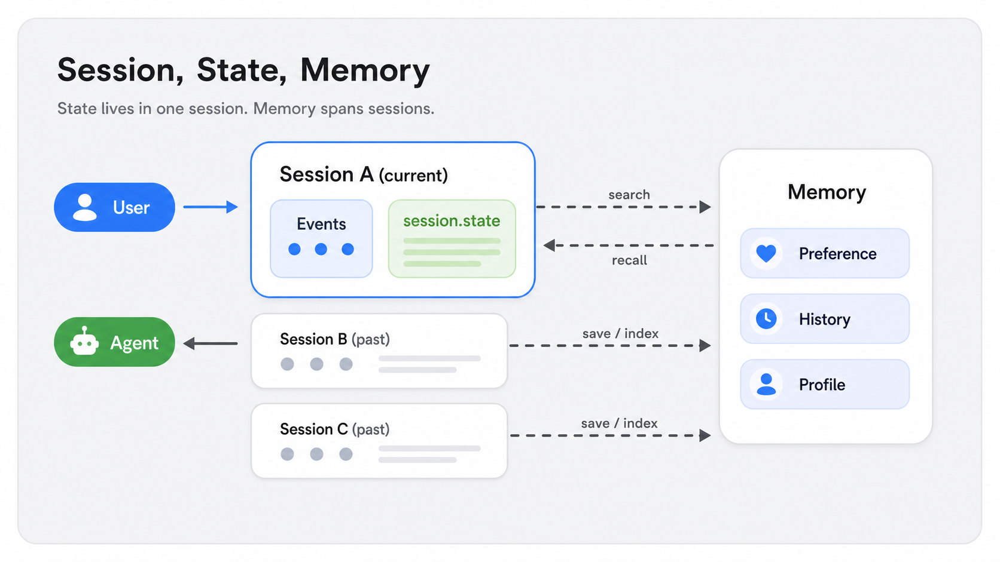

ADK では、複数ターンの会話文脈を `Session`、`State`、`Memory` に分けて考えます。この 3 つを区別すると、今の会話だけで使うデータと、過去の会話をまたいで検索したい情報を分けられます。

#### Session: 現在の会話スレッド

`Session` は、ユーザーと agent system の 1 つの継続中のやり取りを表します。会話中に起きたメッセージや agent の action は、時系列の `Event` として session に含まれます。

このコードラボでは、ADK Web で 1 つの旅行相談を進めている間が 1 つの session です。clarification、候補生成、選択、旅程生成は同じ session の流れとして記録されます。

#### State (`session.state`): 現在の会話内のデータ

`State` は、特定の session の中だけで使うデータです。現在の会話に関係する一時的な値を保存します。

このコードラボでは、`session.state` に `travel_request`、`travel_options`、`research_reports`、`selected_option_id`、`itinerary_markdown` などを保存します。これにより、後続 node は前の node の成果物を参照できます。

#### Memory: session をまたいで検索できる情報

`Memory` は、過去の session や外部データソースをまたいで検索できる長期的な情報です。agent が現在の会話だけではなく、以前のやり取りや蓄積された知識を検索して思い出すための knowledge base として使います。

このコードラボでは Memory Bank の本格運用は扱いません。旅行計画の途中データは `session.state` に置き、別 session でも再利用したいプロフィールや好みを扱う段階で Memory を検討します。

詳しくは [Introduction to Conversational Context: Session, State, and Memory](https://adk.dev/sessions/) を参照してください。

## A2A の概要

Duration: 0:10:00

このステップでは、A2A が何を標準化し、どのような場面で local sub-agent ではなく A2A agent として分けるべきかを確認します。

### A2A とは

A2A (Agent2Agent Protocol) は、複数の専門エージェントが互いに通信するための標準プロトコルです。複雑な agentic system では 1 つのエージェントだけでは足りず、検索、評価、予約、社内データ参照などを専門エージェントに分けて協調させる場面が増えます。A2A は、そのようなエージェント間の発見、通信、タスク委譲、成果物交換を標準化します。

A2A はエージェント実装フレームワークではありません。ADK、LangGraph、CrewAI、Semantic Kernel、独自実装など、異なる言語やフレームワークで作られたエージェントをつなぐためのアプリケーションレベルの相互運用レイヤーです。相手エージェントの内部状態、メモリ、ツール実装、推論過程を共有しなくても、能力、メッセージ、タスク、成果物を通じて連携できます。

詳しくは [Introduction to A2A](https://adk.dev/a2a/intro/) と [A2A Protocol specification](https://a2a-protocol.org/latest/specification/) を参照してください。

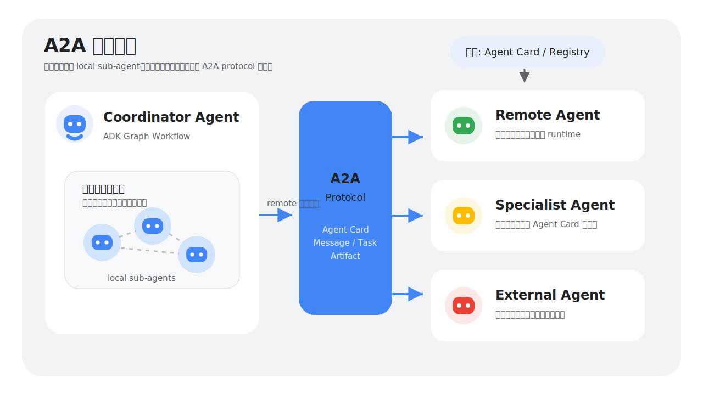

### A2A とローカル sub-agent の使い分け

ADK では、同じアプリケーションプロセス内で動く local sub-agent と、ネットワーク越しに別サービスとして動く remote agent (A2A) を区別します。

Local sub-agent は、メインエージェントの内部モジュールやライブラリに近い存在です。同じプロセス内で実行されるため、メモリ上で高速にやり取りでき、内部状態を共有しやすく、アプリケーション内の責務分割に向いています。

Remote agent (A2A) は、独立したサービスとして起動し、ネットワーク越しに標準プロトコルで通信するエージェントです。別チーム、別組織、別言語、別フレームワークで作られたエージェントを、強い契約に基づいて接続したいときに使います。

#### A2A を使う具体例

A2A は、エージェントを「同じコードベースの部品」ではなく「独立して提供されるサービス」として扱いたいときに向いています。

- 外部金融データ提供者が A2A 対応の market data agent を公開しており、自社の分析エージェントからリアルタイム株価や指標を問い合わせたい。
- 受注、在庫、配送のように、システム全体が独立サービスに分かれていて、それぞれの専門エージェントをネットワーク越しに連携させたい。
- Python で作った業務エージェントから、Java や Go で実装された既存システムの専門エージェントを呼び出したい。
- 複数チームがエージェントを提供するプラットフォームで、入出力、認証、タスク管理の契約を標準化し、互換性と安定性を保ちたい。

このコードラボの `comfort_agent`、`risk_agent`、`experience_agent` は、coordinator と同じプロセス内の helper ではなく、別 port で起動する specialist service として扱います。そのため coordinator は A2A Client として Agent Card を読み、`RemoteA2aAgent` 経由で評価タスクを依頼します。

#### A2A を使わない具体例（ローカル sub-agent を優先）

A2A はネットワーク、認証、シリアライズ、デプロイの境界を導入します。内部の責務分割だけが目的なら、local sub-agent や通常の関数・クラスの方が単純です。

- 1 つのエージェント内で入力データを整形する `DataValidator` のような部品を分けたいだけで、独立デプロイや外部接続は不要である。
- 高頻度・低レイテンシで動く内部処理があり、ネットワーク越しの呼び出しが性能上のボトルネックになる。
- sub-agent がメインエージェントの内部 state や shared memory に直接アクセスする必要があり、A2A のメッセージ交換に変換するとかえって複雑になる。
- 再利用したい処理が小さな helper function や class で十分表現でき、独立した task lifecycle や認証境界を持たせる必要がない。

### 具体例: カスタマーサービス agent と商品カタログ agent

ADK の公式ドキュメントでは、カスタマーサービス agent が別サービスの product catalog agent から商品情報を取得する例が紹介されています。

A2A を使わない場合、カスタマーサービス agent は product catalog agent に問い合わせる標準的な方法を持たないかもしれません。特に、product catalog agent が別チームのサービスだったり、別フレームワークで実装されていたりすると、個別 API、認証、データ形式を都度合わせる必要があります。

A2A を使う場合、product catalog agent は A2A Server として公開され、Agent Card に endpoint、capabilities、skills、入出力形式、認証要件を記述します。カスタマーサービス agent は ADK の `RemoteA2aAgent` を client-side proxy として使い、商品情報の問い合わせを「remote agent へのタスク」として送ります。ADK はネットワーク通信、データ形式、認証まわりの詳細を抽象化するため、開発者から見ると remote agent を local tool のように扱えます。

この分け方により、カスタマーサービス側は顧客対応に集中し、商品カタログ側は在庫・価格・仕様情報の提供に集中できます。サービス境界、チーム境界、技術スタックの違いを保ったまま、専門エージェント同士を接続できるのが A2A の価値です。

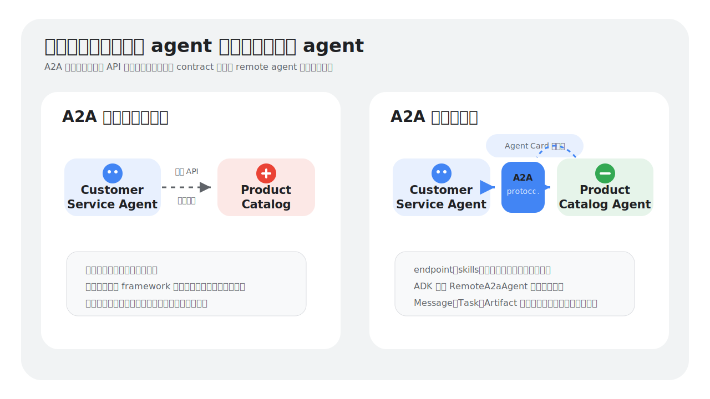

### A2A の仕組み

A2A の通信は、主に Agent Card、Message、Task、Artifact という単位で考えます。

- Agent Card: エージェントの名前、説明、提供者、endpoint、対応プロトコル、capabilities、skills、入出力 MIME type、認証要件などを表す JSON metadata です。公開エージェントでは `https://{agent-server-domain}/.well-known/agent-card.json` のような well-known URL で発見できる形が推奨されます。
- Message: client と remote agent の 1 turn のやり取りです。テキストだけでなく、ファイル、URL、構造化データなどを `Part` として含められます。
- Task: 長時間処理、multi-turn、human-in-the-loop、非同期更新を追跡するための stateful な作業単位です。`working`、`input-required`、`auth-required`、`completed`、`failed` などの状態を持ちます。
- Artifact: task の結果として生成される成果物です。文書、画像、構造化データなどを返せます。

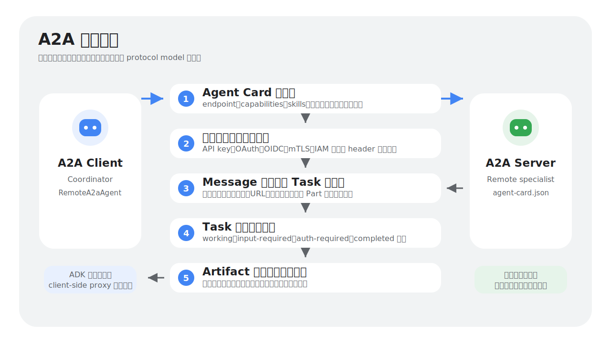

このコードラボでは、ローカル起動した Comfort Agent の Agent Card を次の URL で確認します。

```text
http://localhost:8101/.well-known/agent-card.json
```

Coordinator 側では、remote specialist を `RemoteA2aAgent` として定義します。

```python
comfort_agent = RemoteA2aAgent(
    name="comfort_agent",
    agent_card=remote_agent_card_url("COMFORT_A2A_URL", "http://localhost:8101"),
    description="移動負荷、休憩、宿泊快適性、疲労しにくさで候補を評価する。",
    output_schema=EvaluationReport,
    use_legacy=False,
)
```

`agent_card` には service の base URL ではなく、Agent Card の URL を渡します。`remote_agent_card_url()` は `.env` の値を読み、localhost と Agent Runtime の URL を同じ呼び出し方で扱えるようにします。

> **補足:** 古い記事やサンプルでは `/.well-known/agent.json` が出てくることがあります。今回のコードでは `/.well-known/agent-card.json` を使います。

#### 認証

A2A は独自の認証方式を発明するのではなく、既存の Web security を前提にします。本番環境では HTTPS による transport security、server identity verification、client authentication、authorization を設計します。

Agent Card には、API key、HTTP auth、OAuth 2.0、OpenID Connect、mTLS などの security scheme と、エージェント全体または skill ごとの security requirements を記述できます。認証情報そのものは通常 A2A payload に埋め込まず、HTTP header など protocol binding に応じた標準的な場所で渡します。

Agent Card には endpoint や skill 情報が含まれるため、公開範囲にも注意が必要です。詳細な capability や内部向け endpoint は、認証後に取得する Extended Agent Card として分ける設計ができます。A2A v1.0 では Agent Card を JWS で署名する仕組みもあり、クライアントは信頼できる provider のカードかどうかを検証できます。

このコードラボのローカル実行では認証なしの localhost endpoint を使います。Agent Runtime にデプロイした A2A URL をローカルから呼ぶ場合は、後のステップで `TRAVEL_AGENT_A2A_USE_ADC_AUTH=true` を設定し、Google Cloud の認証付きリクエストとして扱います。

## Gemini Enterprise Agent Platform の概要

Duration: 0:08:00

このステップでは、ここまで作ってきた ADK / A2A エージェントを、なぜ Agent Runtime にデプロイするのかを確認します。

### Gemini Enterprise Agent Platform とは

Gemini Enterprise Agent Platform は、企業向けの AI エージェントとモデルベースのアプリケーションを、構築、デプロイ、ガバナンス、改善まで一貫して扱う Google Cloud の統合プラットフォームです。低コードの Agent Studio、コードベースの Agent Development Kit（ADK）、マネージドな Agent Runtime、セキュリティと監査のための Agent Gateway / Agent Registry、評価と観測のための Observability / Evaluation などを組み合わせて使います。

公式ドキュメントでは、Agent Platform のエージェント関連機能は大きく Build、Scale、Govern、Optimize の4つの領域で整理されています。Build は作る領域、Scale は本番運用に載せる領域、Govern は組織として安全に管理する領域、Optimize は観測と評価で継続改善する領域です。

このコードラボで直接使うのは、このうち Scale に含まれる Agent Runtime です。ただし、Agent Runtime は単なるホスティング先ではありません。ADK で構築したエージェントを、セッション、認証、監視、評価、A2A 連携などの運用機能につなげる入口になります。

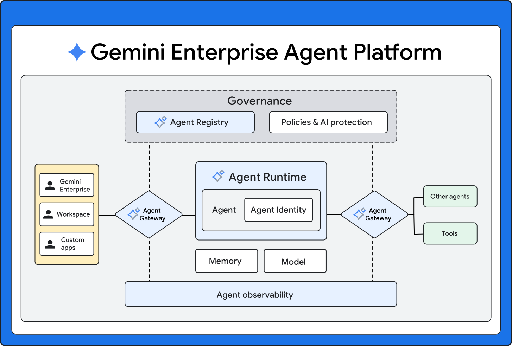

### エージェントを構築する（Agents - Build）

Build は、エージェントの設計、実装、ツール接続、社内データの取り込みを扱う領域です。公式ドキュメントでは、ADK や Agent Studio だけでなく、Agent Garden、Managed Agents API、RAG Engine、Vector Search、Agent Search、MCP / A2A なども Build の周辺機能として整理されています。

#### ADK と Agent Studio

ADK は、Python、Java、Go などからエージェントをコードで構築するためのオープンソースフレームワークです。単一のタスクを処理するエージェントから、複数のエージェントが協調するワークフローまでを、モデルに強く依存しない形で設計できます。

Agent Studio は、Google Cloud コンソール上でエージェントを設計、試作、管理するための低コードの開発環境です。モデル比較、プロンプト調整、ツールやデータソースの接続などを UI から扱えるため、コードで実装する前の試作や、業務部門との確認に向いています。

#### データ、ツール、エージェント間連携

エージェントが業務で役立つには、モデル単体の応答だけでなく、社内データ、外部ツール、他のエージェントと接続できることが重要です。RAG Engine、Vector Search、Agent Search は、社内ドキュメントや構造化されていない情報を検索してエージェントに渡すための基盤です。

MCP はエージェントがツールやデータソースを呼び出すための接続方式として使われます。一方、A2A はエージェント同士が互いの能力を Agent Card で発見し、タスクを依頼するためのプロトコルです。このコードラボでは、coordinator が specialist agents を A2A で呼び出す構成を実装します。

#### このリポジトリで実装するもの

`gdsc-osaka/create-multi-agent` には、完成形のうち実装対象の一部だけが空の状態で残っています。`gdsc-osaka/create-multi-agent-example` が完成形です。

```text
agents/coordinator/agent.py              全体の Graph Workflow wiring
agents/coordinator/clarify.py            旅行希望の構造化と clarification
agents/coordinator/candidates.py         候補生成、検索 research fan-out / fan-in
agents/coordinator/evaluation.py         RemoteA2aAgent specialist 呼び出しと統合評価
agents/coordinator/planner.py            推薦、ユーザー選択、詳細旅程
agents/coordinator/illustrator.py        旅しおり画像生成
agents/comfort/agent.py                  快適性評価 specialist
agents/risk/agent.py                     リスク評価 specialist
agents/experience/agent.py               体験価値評価 specialist
```

この後の実装パートでは、これらのファイルを順番に作り、まずローカルで coordinator と specialist agents を A2A サービスとして動かします。

### エージェントを本番運用に載せる（Agents - Scale）

Scale は、作成したエージェントを本番環境で安定して動かすための領域です。公式ドキュメントでは、Agent Runtime、Sessions、Memory Bank、Code Execution、ストリーミング、Private Service Connect などがこの領域に含まれます。

#### Agent Runtime

Agent Runtime は、ADK、LangChain、LangGraph、AG2、LlamaIndex、独自実装などのエージェントを Google Cloud 上で実行するためのマネージドランタイムです。ローカルでは coordinator と specialist agents をそれぞれ port 8100 から 8103 で起動しますが、Agent Runtime へデプロイすると、同じエージェントを Google Cloud 上の managed runtime として実行できます。

Agent Runtime にデプロイした A2A agent は、Runtime の A2A URL から Agent Card と task endpoint にアクセスできます。これにより、ローカルで確認した「coordinator が specialist を呼び出す」構成を、Google Cloud 上のエンドポイント同士の連携として扱えます。

#### Sessions と Memory Bank

Sessions は、1つの会話やタスクの中で発生する状態、イベント履歴、途中結果を管理するための機能です。Memory Bank は、複数セッションをまたいでユーザーの嗜好や過去文脈を保持する長期記憶の機能です。

このコードラボ本編では Sessions や Memory Bank を直接実装しませんが、Agent Runtime に載せることで、将来的に会話状態や長期記憶を扱う構成へ拡張しやすくなります。Extra 課題では Memory Bank を使ったパーソナライズも扱います。

#### このコードラボでのデプロイ順序

Coordinator は specialist agents の A2A URL を必要とします。そのため、デプロイ script は specialist agents を先にデプロイし、取得した A2A URL を coordinator の環境変数に注入してから coordinator をデプロイします。

```text
1. Comfort Agent
2. Risk Agent
3. Experience Agent
4. Dynamic Travel Planning Agent
```

この順序により、Runtime 上の coordinator も Runtime 上の specialist agents を呼び出せます。

### エージェントを統制する（Agents - Govern）

Govern は、組織内のエージェントを発見、共有、認証、認可、監査するための領域です。エージェントが社内データや外部システムを扱うようになると、誰が、どのエージェントを、どの権限で、どの経路から呼び出せるかを明確にする必要があります。

#### Agent Registry と Agent Gateway

Agent Registry は、エージェント、ツール、MCP サーバー、エンドポイントなどを組織内で発見、追跡、管理するためのカタログです。A2A で公開される Agent Card やエンドポイント情報を、組織として管理する考え方に近い機能です。

Agent Gateway は、エージェントやツール呼び出しの前段で認証、認可、ポリシー適用、テレメトリ、監査を担うゲートウェイです。複数のエージェントが連携する構成では、通信経路を集中管理し、ポリシーに沿わない呼び出しを止める役割を持ちます。

#### Identity、Policy、Security

Agent Identity は、エージェントごとの ID と権限境界を扱うための考え方です。サービスアカウント、IAM、ユーザー代理、OAuth などと組み合わせて、エージェントが何にアクセスできるかを制御します。

Govern 領域には、IAM policy、semantic governance policy、Model Armor、監査ログ、セキュリティ検出なども含まれます。このコードラボでは認証付きの Agent Runtime 呼び出しまでを扱いますが、本番設計では Agent Card の公開範囲、A2A endpoint の認証、ログと監査の保存先まで設計する必要があります。

### エージェントを改善する（Agents - Optimize）

Optimize は、デプロイしたエージェントの品質、速度、コスト、安全性を継続的に改善するための領域です。エージェントは一度作って終わりではなく、実行ログ、失敗例、評価結果をもとに改善していきます。

#### Observability

Observability は、エージェントの実行をトレース、ログ、メトリクスで確認するための機能です。ユーザー入力から、モデル呼び出し、ツール呼び出し、サブエージェント呼び出し、最終応答までを追跡できると、遅延、失敗、意図しない分岐の原因を調べやすくなります。

このコードラボのような A2A 構成では、coordinator と specialist agents のどこで判断が分かれたのか、どの specialist の結果が最終推薦に影響したのかを追えることが重要です。

#### Evaluation と Example Store

Evaluation は、エージェントの応答品質や安全性を、オフライン評価、シミュレーション、オンライン評価などで測定するための機能です。旅行計画エージェントであれば、ユーザー条件を満たしているか、リスク説明が妥当か、過度に高価な案を出していないか、といった観点を評価できます。

Example Store は、few-shot 例、成功例、失敗例、評価用データを保存し、プロンプト改善や評価に使うためのストアです。Optimize 領域を使うと、実運用で見つかった失敗パターンを再現可能な評価データとして残し、次の改善につなげられます。

## Clarify Agent を実装する

Duration: 0:20:00

このステップでは、ユーザー入力を `TravelRequest` に構造化し、不足情報がある場合だけ追加質問する最小 Workflow を作ります。

### clarify_models.py を作成する

`agents/coordinator/clarify_models.py` を作成します。新規ファイルなので、次の diff は全行が追加です。

> **Tips:** コードブロック右上のコピーボタンを押すと、青背景や赤背景の diff 記号を除いた、追加するコードだけがコピーされます。

```diff python
--- /dev/null
+++ b/agents/coordinator/clarify_models.py
@@
+from __future__ import annotations
+
+from pydantic import BaseModel, Field
+
+
+class TravelRequest(BaseModel):
+    origin: str | None = Field(default=None, description="出発地。例: 東京、大阪。")
+    duration: str | None = Field(default=None, description="旅行期間。")
+    budget: str | None = Field(default=None, description="総予算または一人あたり予算。")
+    transport: str | None = Field(default=None, description="主な交通手段。")
+    companions: str | None = Field(default=None, description="同行者構成。")
+    preferences: list[str] = Field(default_factory=list, description="旅行嗜好。")
+    constraints: list[str] = Field(default_factory=list, description="制約条件。")
+    unknowns: list[str] = Field(default_factory=list, description="品質に影響する不足情報。")
+    raw_user_query: str = Field(description="元のユーザー入力。")
```

> **Tips:** BaseModel が Agent の出力形式を固定し、`str | None` が文字列または未入力を許可し、`Field(default_factory=list)` が候補ごとに独立した空リストを作ります。

`unknowns` には、旅程品質に影響する不足情報だけを入れます。好みの細部まで不足扱いにすると、毎回 clarification が発生して先に進みにくくなります。

### clarify.py を作成する

`agents/coordinator/clarify.py` を作成し、まず Agent と state key を定義します。

```diff python
--- /dev/null
+++ b/agents/coordinator/clarify.py
@@
+from __future__ import annotations
+
+from typing import Any
+
+from google.adk import Agent
+from google.adk.agents.context import Context
+from google.adk.events import RequestInput
+from google.adk.events.event import Event
+from google.adk.workflow import DEFAULT_ROUTE
+
+from agents.coordinator.clarify_models import TravelRequest
+from agents.coordinator.utils import text
+
+ROUTE_CLARIFY = "clarify"
+MAX_CLARIFICATION_ROUNDS = 2
+CLARIFY_AGENT_MODEL = "gemini-3.5-flash"
+
+STATE_RAW_USER_QUERY = "raw_user_query"
+STATE_TRAVEL_REQUEST = "travel_request"
+STATE_CLARIFICATION_ROUNDS = "clarification_rounds"
+
+clarify_agent = Agent(
+    name="clarify",
+    model=CLARIFY_AGENT_MODEL,
+    description="旅行希望を構造化し、不足情報を抽出する。",
+    output_schema=TravelRequest,
+    instruction=(
+        "ユーザーの旅行希望を TravelRequest に構造化してください。"
+        "期間、出発地、予算、交通手段、同行者、旅行嗜好、制約を抽出します。"
+        "origin, duration, budget, transport など旅程品質に重大な影響がある情報が"
+        "不明な場合のみ unknowns に入れてください。"
+        "推測で補える軽微な項目は unknowns に入れすぎないでください。"
+    ),
+    mode="single_turn",
+)
```

> **Tips:** model がこの Agent の Gemini model を指定し、`output_schema=TravelRequest` が応答を Pydantic model にそろえ、`mode="single_turn"` が会話履歴に依存しない 1 回完結の実行にします。

同じファイルに Workflow node を追加します。

```diff python
--- a/agents/coordinator/clarify.py
+++ b/agents/coordinator/clarify.py
@@
 clarify_agent = Agent(
     name="clarify",
     model=CLARIFY_AGENT_MODEL,
     description="旅行希望を構造化し、不足情報を抽出する。",
@@
     ),
     mode="single_turn",
 )
+
+
+def capture_user_query(ctx: Context, node_input: Any) -> str:
+    raw_query = text(node_input) or _latest_user_text(ctx)
+    ctx.state[STATE_RAW_USER_QUERY] = raw_query
+    ctx.state.setdefault(STATE_CLARIFICATION_ROUNDS, 0)
+    return raw_query
+
+
+def route_after_clarification(ctx: Context, node_input: TravelRequest):
+    ctx.state[STATE_TRAVEL_REQUEST] = node_input.model_dump()
+    rounds = int(ctx.state.get(STATE_CLARIFICATION_ROUNDS, 0))
+    material_unknowns = [
+        unknown
+        for unknown in node_input.unknowns
+        if any(key in unknown.lower() for key in ["origin", "duration", "budget", "transport"])
+        or any(word in unknown for word in ["出発", "期間", "予算", "交通"])
+    ]
+
+    if material_unknowns and rounds < MAX_CLARIFICATION_ROUNDS:
+        ctx.state[STATE_CLARIFICATION_ROUNDS] = rounds + 1
+        yield Event(route=ROUTE_CLARIFY, output=node_input)
+        return
+
+    yield Event(route=DEFAULT_ROUTE, output=node_input)
```

> **Tips:** ctx.state が Workflow 内で後続 node が読む共有 state で、`yield Event(route=...)` が次に進む edge を `clarify` または `default` に分岐させます。

`route_after_clarification` は route を返す分岐 node です。重要な不足情報が残っていて、追加質問が 2 回未満なら `ROUTE_CLARIFY` に進みます。

最後に、人間への質問と再構造化用の入力を作ります。

```diff python
--- a/agents/coordinator/clarify.py
+++ b/agents/coordinator/clarify.py
@@
 def route_after_clarification(ctx: Context, node_input: TravelRequest):
     ctx.state[STATE_TRAVEL_REQUEST] = node_input.model_dump()
     rounds = int(ctx.state.get(STATE_CLARIFICATION_ROUNDS, 0))
@@

     yield Event(route=DEFAULT_ROUTE, output=node_input)
+
+
+def request_clarification(ctx: Context, node_input: TravelRequest):
+    unknowns = node_input.unknowns[:4]
+    unknown_text = "\n".join(f"- {unknown}" for unknown in unknowns) or "- 旅行条件の不足"
+    message = (
+        "旅行候補の精度に影響する情報が不足しています。次の項目に答えてください。\n"
+        f"{unknown_text}"
+    )
+    yield RequestInput(
+        message=message,
+        payload={"travel_request": node_input.model_dump(), "unknowns": unknowns},
+        response_schema=str,
+    )
+
+
+def build_reclarify_input(ctx: Context, node_input: Any) -> str:
+    return "\n\n".join(
+        [
+            "元の旅行希望:",
+            text(ctx.state.get(STATE_RAW_USER_QUERY)),
+            "前回の構造化結果:",
+            text(ctx.state.get(STATE_TRAVEL_REQUEST)),
+            "ユーザーの追加回答:",
+            text(node_input),
+            "追加回答を反映して TravelRequest を更新してください。",
+        ]
+    )
```

> **Tips:** RequestInput が Workflow を一時停止してユーザー入力を待ち、`build_reclarify_input` が元の依頼、前回の構造化結果、追加回答を 1 つの入力に戻します。

この node は、元の依頼と追加回答をまとめて `clarify_agent` に戻します。ユーザーが追加情報を短く返しても、元の依頼を失わずに構造化できます。

### agent.py を最小 Workflow に更新する

`agents/coordinator/agent.py` を最小 Workflow に更新します。この時点では、条件がそろった後の処理は次ステップで追加するため、`candidate_workflow` はまだ接続しません。

```diff python
--- a/agents/coordinator/agent.py
+++ b/agents/coordinator/agent.py
@@
 from __future__ import annotations

-from google.adk import Agent
+from google.adk import Workflow
+from google.adk.workflow import DEFAULT_ROUTE

 from agents._common import to_a2a_app
+from agents.coordinator.clarify import (
+    ROUTE_CLARIFY,
+    clarify_agent,
+    build_reclarify_input,
+    capture_user_query,
+    request_clarification,
+    route_after_clarification,
+)


-root_agent = Agent(
+root_agent = Workflow(
     name="dynamic_travel_planning_agent",
     description="Dynamic Research + Multi-Agent Evaluation 型の旅行計画AIエージェント。",
+    edges=[
+        ("START", capture_user_query, clarify_agent),
+        (
+            route_after_clarification,
+            {
+                ROUTE_CLARIFY: request_clarification,
+                DEFAULT_ROUTE: request_clarification,
+            },
+        ),
+        (request_clarification, build_reclarify_input, clarify_agent),
+        (clarify_agent, route_after_clarification),
+    ],
 )

 app = to_a2a_app(root_agent, default_port=8100)
```

> **Tips:** Workflow(edges=[...]) が node の実行順をコードで定義し、{ ROUTE_CLARIFY: ..., DEFAULT_ROUTE: ... } が `route_after_clarification` の route 名ごとに次の node を選びます。

`DEFAULT_ROUTE` も一時的に `request_clarification` に向けています。次のステップで候補生成 Workflow を作ったら、ここを `candidate_workflow` に置き換えます。

### Clarify Agent の動作を確認する

coordinator と ADK Web を起動します。

```bash
make run
```

ブラウザで `http://localhost:8000` を開き、`dynamic_travel_planning_agent` に次の依頼を送ります。

```text
週末に一泊二日で温泉に行きたいです。静かで混みすぎない場所がいいです。
```

**期待される動作:**

```text
旅行候補の精度に影響する情報が不足しています。次の項目に答えてください。
- 出発地
- 予算
- 交通手段
```

出発地、予算、交通手段を答えると、`travel_request` が更新されます。この時点では次の Workflow が未実装なので、確認できたらサーバーを停止します。

## Strategist と Research の Fan-out / Fan-in を実装する

Duration: 0:25:00

このステップでは、旅行候補を作る `strategist_agent` と、候補ごとに `google_search` で調査する fan-out / fan-in を実装します。

### candidates_models.py を作成する

`agents/coordinator/candidates_models.py` を作成します。新規ファイルなので、次の diff は全行が追加です。

```diff python
--- /dev/null
+++ b/agents/coordinator/candidates_models.py
@@
+from __future__ import annotations
+
+from pydantic import BaseModel, Field
+
+
+class TravelOption(BaseModel):
+    option_id: str = Field(description="候補を一意に識別するID。例: option_1。")
+    title: str = Field(description="ユーザーに見せられる短い候補名。")
+    destination: str = Field(description="主な目的地またはエリア。")
+    concept: str = Field(description="旅行方針。")
+    research_focus: list[str] = Field(description="調査で確認すべき観点。")
+    fit_hypothesis: str = Field(description="この候補が合いそうな理由の仮説。")
+
+
+class TravelOptions(BaseModel):
+    options: list[TravelOption] = Field(min_length=3, max_length=5)
+
+
+class ResearchReport(BaseModel):
+    option_id: str
+    destination_summary: str
+    access: str
+    estimated_cost: str
+    lodging_area: str
+    recommended_spots: list[str]
+    food_options: list[str]
+    risks: list[str]
+    weather_or_season_notes: list[str]
+    source_notes: list[str]
+    suitability_reason: str
```

> **Tips:** TravelOption が 1 つの候補、`TravelOptions` が候補リスト、`ResearchReport` が検索後の調査結果を表し、`Field(min_length=3, max_length=5)` が出力件数の制約になります。

`TravelOption.option_id` は後続の join、評価、ユーザー選択で同じ候補を追跡するための ID です。LLM が途中で候補名を言い換えても、`option_id` が残っていれば対応付けできます。

### candidates.py を作成する

`agents/coordinator/candidates.py` を作成し、まず 3 つの Agent を定義します。

```diff python
--- /dev/null
+++ b/agents/coordinator/candidates.py
@@
+from __future__ import annotations
+
+import asyncio
+from typing import Any
+
+from google.adk import Agent, Context
+from google.adk.tools import google_search
+from google.adk.workflow import node
+
+from agents.coordinator.candidates_models import ResearchReport, TravelOption, TravelOptions
+from agents.coordinator.clarify import STATE_TRAVEL_REQUEST
+from agents.coordinator.utils import dump, text
+
+STATE_TRAVEL_OPTIONS = "travel_options"
+STATE_RESEARCH_REPORTS = "research_reports"
+
+STRATEGIST_AGENT_MODEL = "gemini-3.5-flash"
+RESEARCH_AGENT_MODEL = "gemini-3.1-flash-lite"
+RESEARCH_REPORT_FORMATTER_MODEL = "gemini-3.1-flash-lite"
+
+strategist_agent = Agent(
+    name="strategist",
+    model=STRATEGIST_AGENT_MODEL,
+    description="旅行方針と候補地を6案作る。",
+    output_schema=TravelOptions,
+    instruction=(
+        "TravelRequest をもとに、旅行候補を6案作ってください。"
+        "詳細旅程ではなく、旅行方針、候補地、調査観点を作ります。"
+        "option_id は option_1, option_2 のように安定した値にしてください。"
+    ),
+    mode="single_turn",
+)
```

> **Tips:** strategist_agent が `TravelRequest` から候補案だけを作り、`output_schema=TravelOptions` によって候補リストの JSON 形式を安定させます。

`google_search` を使う調査 Agent と、調査メモを構造化する formatter を追加します。

```diff python
--- a/agents/coordinator/candidates.py
+++ b/agents/coordinator/candidates.py
@@
 strategist_agent = Agent(
     name="strategist",
     model=STRATEGIST_AGENT_MODEL,
     description="旅行方針と候補地を6案作る。",
@@
     ),
     mode="single_turn",
 )
+
+research_agent = Agent(
+    name="research_agent",
+    model=RESEARCH_AGENT_MODEL,
+    description="候補ごとの旅行リサーチを行う。",
+    tools=[google_search],
+    instruction=(
+        "あなたは旅行リサーチ担当です。入力に含まれる TravelOption について、"
+        "google_search を使ってアクセス、費用感、宿泊エリア、観光地、食事、"
+        "リスク、季節性を調べてください。"
+        "option_id は入力の値を必ず維持します。"
+        "source_notes に相当する確認元名や根拠メモも自然文で含めてください。"
+        "重要: google_search と structured output は同時に使えないため、"
+        "あなたは構造化JSONではなく調査メモを返します。"
+    ),
+    mode="single_turn",
+)
+
+research_report_formatter = Agent(
+    name="research_report_formatter",
+    model=RESEARCH_REPORT_FORMATTER_MODEL,
+    description="検索済みリサーチメモをResearchReportへ構造化する。",
+    output_schema=ResearchReport,
+    instruction=(
+        "入力には TravelRequest、TravelOption、google_search 済みの調査メモが含まれます。"
+        "調査メモを ResearchReport に構造化してください。"
+        "新しい事実を追加で断定せず、不明な項目は「要確認」と書いてください。"
+        "option_id は TravelOption の値を必ず維持してください。"
+    ),
+    mode="single_turn",
+)
```

> **Tips:** research_agent が `tools=[google_search]` で検索を担当します。`google_search` は Agent が必要に応じて Google Search に接続し、最新の Web 情報や根拠 URL を使って回答を grounded response にするための ADK tool です。`research_report_formatter` が検索メモを `ResearchReport` に整形するため、検索と構造化を 2 段に分けています。

#### How grounding with Google Search works

[ADK の Google Search Grounding 公式ドキュメント](https://adk.dev/grounding/google_search_grounding/) では、grounding は Agent をリアルタイムの Web 情報へ接続し、より新しく正確な回答を作るための仕組みとして説明されています。ユーザー入力にモデルの学習時点より新しい情報や時事性のある情報が必要な場合、LLM が `google_search` tool の呼び出しを判断します。

`google_search` tool は grounding service と連携し、Google Search Index に問い合わせます。取得した Web ページや snippet は model context に注入され、LLM はその検索結果を根拠に最終回答を生成します。返答には参照元を示す `groundingMetadata` が含まれるため、ユーザーや開発者はどの情報源に基づいた回答かを確認できます。

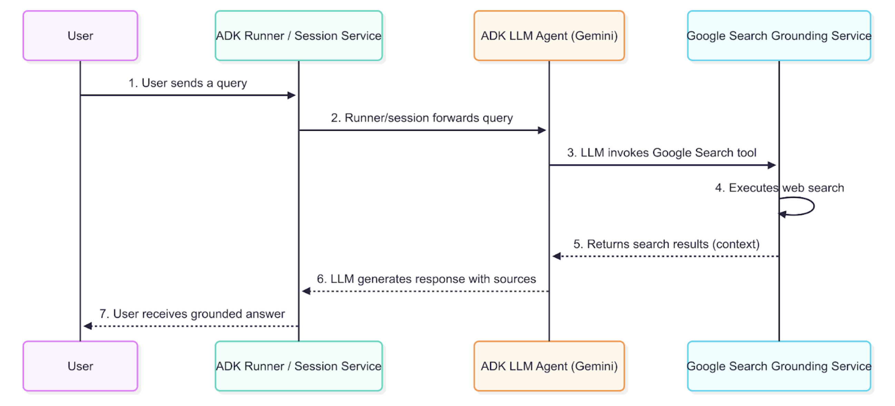

続けて、state 保存と候補ごとの調査 node を実装します。

```diff python
--- a/agents/coordinator/candidates.py
+++ b/agents/coordinator/candidates.py
@@
 research_report_formatter = Agent(
     name="research_report_formatter",
     model=RESEARCH_REPORT_FORMATTER_MODEL,
     description="検索済みリサーチメモをResearchReportへ構造化する。",
@@
     ),
     mode="single_turn",
 )
+
+
+def store_travel_options(ctx: Context, node_input: TravelOptions) -> TravelOptions:
+    ctx.state[STATE_TRAVEL_OPTIONS] = [option.model_dump() for option in node_input.options]
+    return node_input
+
+
+@node(name="research_candidate", rerun_on_resume=True)
+async def research_candidate(ctx: Context, node_input: dict[str, Any]) -> ResearchReport:
+    request = ctx.state.get(STATE_TRAVEL_REQUEST, {})
+    research_memo = await ctx.run_node(research_agent, build_research_input(request, node_input))
+    return await ctx.run_node(
+        research_report_formatter,
+        build_research_report_input(request, node_input, research_memo),
+    )
```

> **Tips:** ctx.run_node(...) が Workflow node の中から別 Agent を呼び、`async def` にしておくことで検索や formatter の待ち時間を自然に扱えます。

最後に、全候補を並列に調査して `research_reports` にまとめます。

```diff python
--- a/agents/coordinator/candidates.py
+++ b/agents/coordinator/candidates.py
@@
 @node(name="research_candidate", rerun_on_resume=True)
 async def research_candidate(ctx: Context, node_input: dict[str, Any]) -> ResearchReport:
     request = ctx.state.get(STATE_TRAVEL_REQUEST, {})
@@
         research_report_formatter,
         build_research_report_input(request, node_input, research_memo),
     )
+
+
+@node(name="travel_research_workflow", rerun_on_resume=True)
+async def travel_research_workflow(ctx: Context, node_input: Any) -> dict[str, dict[str, Any]]:
+    options = ctx.state.get(STATE_TRAVEL_OPTIONS)
+    if not options and isinstance(node_input, TravelOptions):
+        options = [option.model_dump() for option in node_input.options]
+        ctx.state[STATE_TRAVEL_OPTIONS] = options
+
+    tasks = [ctx.run_node(research_candidate, option) for option in options or []]
+    reports = await asyncio.gather(*tasks)
+    return collect_research_reports(ctx, reports)
+
+
+def collect_research_reports(ctx: Context, node_input: Any) -> dict[str, dict[str, Any]]:
+    reports: dict[str, dict[str, Any]] = {}
+    values = node_input.values() if isinstance(node_input, dict) else node_input
+    for value in values or []:
+        data = dump(value)
+        if isinstance(data, dict) and data.get("option_id"):
+            reports[data["option_id"]] = data
+    ctx.state[STATE_RESEARCH_REPORTS] = reports
+    return reports
```

> **Tips:** Graph-based workflow で固定本数の edge を用意するのではなく、Dynamic workflow の Python コードで `asyncio.gather(*tasks)` を使うことで、候補数に応じて並列数を可変にできます。

`build_research_input` と `build_research_report_input` は、`TravelRequest`、`TravelOption`、調査メモをテキストにして次の Agent に渡す helper として実装します。

### candidate_workflow を agent.py に追加する

`agents/coordinator/agent.py` に候補生成 Workflow を追加します。

```diff python
--- a/agents/coordinator/agent.py
+++ b/agents/coordinator/agent.py
@@
 from agents.coordinator.clarify import (
     ROUTE_CLARIFY,
     clarify_agent,
     build_reclarify_input,
@@
     request_clarification,
     route_after_clarification,
 )
+from agents.coordinator.candidates import (
+    store_travel_options,
+    strategist_agent,
+    travel_research_workflow,
+)


+candidate_workflow = Workflow(
+    name="travel_candidate_workflow",
+    description="Creates candidates and researches them.",
+    edges=[
+        (
+            "START",
+            strategist_agent,
+            store_travel_options,
+            travel_research_workflow,
+        ),
+    ],
+)
+
+
 root_agent = Workflow(
     name="dynamic_travel_planning_agent",
     description="Dynamic Research + Multi-Agent Evaluation 型の旅行計画AIエージェント。",
```

> **Tips:** candidate_workflow を候補生成から検索リサーチまでを 1 つの node として親 Workflow に組み込むための nested Workflow として作ります。

`root_agent` の `DEFAULT_ROUTE` を `candidate_workflow` に差し替えます。分岐の前後が分かるように、`edges` の該当箇所ごと diff にします。

```diff python
--- a/agents/coordinator/agent.py
+++ b/agents/coordinator/agent.py
@@
 root_agent = Workflow(
     name="dynamic_travel_planning_agent",
     description="Dynamic Research + Multi-Agent Evaluation 型の旅行計画AIエージェント。",
     edges=[
         ("START", capture_user_query, clarify_agent),
         (
             route_after_clarification,
             {
                 ROUTE_CLARIFY: request_clarification,
-                DEFAULT_ROUTE: request_clarification,
+                DEFAULT_ROUTE: candidate_workflow,
             },
         ),
         (request_clarification, build_reclarify_input, clarify_agent),
         (clarify_agent, route_after_clarification),
     ],
 )
```

> **Tips:** DEFAULT_ROUTE を差し替えることで、clarification が不要な入力だけが候補生成 Workflow に流れるようになります。

これで、旅行条件がそろった場合は候補生成と検索リサーチへ進みます。

### research_reports が state に保存されることを確認する

前のステップで `make run` を実行しているターミナル (黒い画面) をクリックし、Ctrl + C で閉じます。その後、再び同じコマンドを実行して再起動します。

```bash
make run
```

ADK Web で次の依頼を送ります。

```text
東京から一泊二日で、静かな田舎に行きたいです。公共交通で行けて、温泉があると嬉しいです。予算は3万円以内です。
```

**期待される state:**

```json
{
  "travel_options": [
    {"option_id": "option_1", "title": "..."}
  ],
  "research_reports": {
    "option_1": {
      "destination_summary": "...",
      "access": "...",
      "estimated_cost": "..."
    }
  }
}
```

`research_reports` の key が `option_id` になっていれば成功です。候補が欠ける場合は、`research_agent` と `research_report_formatter` の instruction に `option_id` を維持する指示が入っているか確認します。

## Specialist Agents を A2A サービスとして実装する

Duration: 0:20:00

このステップでは、3 つの評価専門 Agent を A2A サービスとして実装します。coordinator からは直接 import せず、Agent Card 経由で呼び出します。

### comfort_agent を作成する

`agents/comfort/agent.py` を次の内容にします。新規ファイルなので、次の diff は全行が追加です。

```diff python
--- /dev/null
+++ b/agents/comfort/agent.py
@@
+from __future__ import annotations
+
+from google.adk import Agent
+from agents._common import to_a2a_app
+
+COMFORT_AGENT_MODEL = "gemini-3.5-flash"
+
+root_agent = Agent(
+    name="comfort_agent",
+    model=COMFORT_AGENT_MODEL,
+    description="旅行候補を移動負荷、休憩、宿泊快適性、疲労しにくさで評価する。",
+    instruction=(
+        "あなたは comfort_agent です。初回評価では EvaluationReport を返してください。"
+        "候補ごとの評価は option_evaluations に option_id, score, "
+        "comment, concerns を入れてください。"
+        "移動負荷、休憩しやすさ、宿泊快適性、疲労しにくさを重視します。"
+        "Revision を求められた場合は RevisionReport を返し、修正不要なら revision_note に "
+        "'no change' と明記してください。revised_report も option_evaluations 形式です。"
+    ),
+    mode="chat",
+)
+
+app = to_a2a_app(root_agent, default_port=8101)
```

> **Tips:** to_a2a_app(root_agent, default_port=8101) が Agent を A2A server として公開し、`mode="chat"` が追加確認や再分析依頼を同じ会話として扱いやすくします。

`mode="chat"` にしておくと、coordinator からの追加確認や再分析依頼にも同じ会話として応答できます。

### risk_agent を作成する

`agents/risk/agent.py` を次の内容にします。

```diff python
--- /dev/null
+++ b/agents/risk/agent.py
@@
+from __future__ import annotations
+
+from google.adk import Agent
+from agents._common import to_a2a_app
+
+RISK_AGENT_MODEL = "gemini-3.5-flash"
+
+root_agent = Agent(
+    name="risk_agent",
+    model=RISK_AGENT_MODEL,
+    description="旅行候補を休業、混雑、天候、予約困難、交通遅延、不確実性で評価する。",
+    instruction=(
+        "あなたは risk_agent です。初回評価では EvaluationReport を返してください。"
+        "候補ごとの評価は option_evaluations に option_id, score, "
+        "comment, concerns を入れてください。"
+        "休業、混雑、天候、予約困難、交通遅延、不確実性を重視します。"
+        "Revision を求められた場合は RevisionReport を返し、修正不要なら revision_note に "
+        "'no change' と明記してください。revised_report も option_evaluations 形式です。"
+    ),
+    mode="chat",
+)
+
+app = to_a2a_app(root_agent, default_port=8102)
```

> **Tips:** risk_agent も comfort と同じ A2A server 形式にし、`instruction` の評価軸を休業、混雑、天候、遅延などのリスクに寄せています。

リスク評価は「悪い案を落とす」だけでなく、注意点を planner に渡すためにも使います。`concerns` に具体的な注意点を入れるようにします。

### experience_agent を作成する

`agents/experience/agent.py` を次の内容にします。

```diff python
--- /dev/null
+++ b/agents/experience/agent.py
@@
+from __future__ import annotations
+
+from google.adk import Agent
+from agents._common import to_a2a_app
+
+EXPERIENCE_AGENT_MODEL = "gemini-3.5-flash"
+
+root_agent = Agent(
+    name="experience_agent",
+    model=EXPERIENCE_AGENT_MODEL,
+    description="旅行候補を非日常性、記憶に残る体験、嗜好一致で評価する。",
+    instruction=(
+        "あなたは experience_agent です。初回評価では EvaluationReport を返してください。"
+        "候補ごとの評価は option_evaluations に option_id, score, "
+        "comment, concerns を入れてください。"
+        "非日常性、記憶に残る体験、ユーザー嗜好との一致を重視します。"
+        "Revision を求められた場合は RevisionReport を返し、修正不要なら revision_note に "
+        "'no change' と明記してください。revised_report も option_evaluations 形式です。"
+    ),
+    mode="chat",
+)
+
+app = to_a2a_app(root_agent, default_port=8103)
```

> **Tips:** 3 つの specialist は同じ応答形式を使い、`description` と `instruction` だけで担当する評価観点を分けます。

3 つの specialist は同じ `EvaluationReport` 形式で返します。評価軸だけを変えることで、coordinator が比較しやすい入力になります。

### Specialist Agents の Agent Card を確認する

前のステップで `make run` を実行しているターミナル (黒い画面) をクリックし、Ctrl + C で閉じます。その後、再び同じコマンドを実行して再起動します。

```bash
make run
```

別ターミナルで Agent Card を確認します。

```bash
curl http://localhost:8101/.well-known/agent-card.json
```

**期待される出力:**

```json
{
  "name": "comfort_agent",
  "description": "旅行候補を移動負荷、休憩、宿泊快適性、疲労しにくさで評価する。",
  "url": "http://localhost:8101/"
}
```

`risk_agent` と `experience_agent` も同じように確認します。

```bash
curl http://localhost:8102/.well-known/agent-card.json
curl http://localhost:8103/.well-known/agent-card.json
```

### Specialist Agents の動作を確認する

A2A サーバーとして Agent Card が返れば、coordinator から `RemoteA2aAgent` で発見できます。この時点では coordinator との接続は次ステップで実装するため、起動確認までで構いません。

`connection refused` が出た場合は、`make run` のターミナルにエラーが出ていないか確認します。port 8101 から 8103 を別プロセスが使っている場合は、そのプロセスを停止してから再実行します。

## Multi-Agent Evaluation を実装する

Duration: 0:25:00

このステップでは、coordinator から A2A specialist を呼び出し、快適性、リスク、体験価値、費用を統合して上位 3 案を作ります。

### evaluation_models.py を作成する

`agents/coordinator/evaluation_models.py` を作成します。新規ファイルなので、次の diff は全行が追加です。

```diff python
--- /dev/null
+++ b/agents/coordinator/evaluation_models.py
@@
+from __future__ import annotations
+
+from typing import Any
+
+from pydantic import BaseModel, Field, model_validator
+
+
+class OptionEvaluation(BaseModel):
+    option_id: str
+    score: int = Field(ge=1, le=10)
+    comment: str
+    concerns: list[str] = Field(default_factory=list)
+
+
+class EvaluationReport(BaseModel):
+    agent_name: str
+    preferred_option_id: str
+    option_evaluations: list[OptionEvaluation]
+
+    @model_validator(mode="before")
+    @classmethod
+    def migrate_legacy_option_maps(cls, data: Any) -> Any:
+        if not isinstance(data, dict) or "option_evaluations" in data:
+            return data
+        scores = data.get("scores_by_option")
+        comments = data.get("comments_by_option", {})
+        concerns = data.get("concerns_by_option", {})
+        if not isinstance(scores, dict):
+            return data
+        migrated = dict(data)
+        migrated["option_evaluations"] = [
+            {
+                "option_id": option_id,
+                "score": score,
+                "comment": comments.get(option_id, ""),
+                "concerns": concerns.get(option_id, []),
+            }
+            for option_id, score in scores.items()
+        ]
+        return migrated
+
+    def score_for(self, option_id: str) -> int | None:
+        for evaluation in self.option_evaluations:
+            if evaluation.option_id == option_id:
+                return evaluation.score
+        return None
+
+
+class EvaluationReports(BaseModel):
+    reports: list[EvaluationReport]
```

> **Tips:** Field(ge=1, le=10) が score の範囲を検証し、`@model_validator(mode="before")` が Pydantic の通常検証前に古い形式を新しい形式へ変換します。

`migrate_legacy_option_maps` は、LLM が古い map 形式で返した場合の保険です。通常は `option_evaluations` の list 形式で返ることを期待します。

### RemoteA2aAgent を定義する

`agents/coordinator/evaluation.py` を作成し、specialist を `RemoteA2aAgent` として定義します。

```diff python
--- /dev/null
+++ b/agents/coordinator/evaluation.py
@@
+from __future__ import annotations
+
+from typing import Any
+
+from google.adk import Agent, Context
+from google.adk.agents.remote_a2a_agent import RemoteA2aAgent
+from google.adk.tools.agent_tool import AgentTool
+
+from agents._common import remote_agent_card_url, runtime_a2a_httpx_client
+from agents.coordinator.candidates import STATE_RESEARCH_REPORTS, STATE_TRAVEL_OPTIONS
+from agents.coordinator.evaluation_models import EvaluationReport
+from agents.coordinator.clarify import STATE_TRAVEL_REQUEST
+from agents.coordinator.planner_models import CoordinatorRecommendation
+from agents.coordinator.utils import text
+
+STATE_REVISED_EVALUATIONS = "revised_evaluations"
+EVALUATION_AGENT_MODEL = "gemini-3.1-pro-preview"
+
+_remote_a2a_httpx_client = runtime_a2a_httpx_client()
+
+comfort_agent = RemoteA2aAgent(
+    name="comfort_agent",
+    agent_card=remote_agent_card_url("COMFORT_A2A_URL", "http://localhost:8101"),
+    httpx_client=_remote_a2a_httpx_client,
+    description="移動負荷、休憩、宿泊快適性、疲労しにくさで候補を評価する。",
+    output_schema=EvaluationReport,
+    use_legacy=False,
+)
```

> **Tips:** RemoteA2aAgent が別プロセスの Agent Card を読む proxy になり、`agent_card=remote_agent_card_url(...)` が環境変数があれば Runtime、なければ localhost を使います。

`risk_agent` と `experience_agent` も同じ形で追加します。環境変数が未設定なら localhost の Agent Card を読みに行きます。

### evaluation_agent を作成する

同じ `evaluation.py` に、3 つの specialist を tool として持つ coordinator 用 Agent を追加します。

```diff python
--- a/agents/coordinator/evaluation.py
+++ b/agents/coordinator/evaluation.py
@@
 comfort_agent = RemoteA2aAgent(
     name="comfort_agent",
     agent_card=remote_agent_card_url("COMFORT_A2A_URL", "http://localhost:8101"),
@@
     output_schema=EvaluationReport,
     use_legacy=False,
 )
+
+evaluation_agent = Agent(
+    name="multi_agent_evaluation",
+    model=EVALUATION_AGENT_MODEL,
+    description="Evaluates travel candidates with specialists and reconciles them into rankings.",
+    output_schema=CoordinatorRecommendation,
+    instruction=(
+        "あなたは旅行候補評価の coordinator です。\n"
+        "1. comfort_agent、risk_agent、experience_agent の全員に分析を依頼する。"
+        "TravelRequest、TravelOptions、ResearchReports の中身は展開し"
+        "各エージェントが必要な情報を渡してください。\n"
+        "2. 各エージェントの結果を元に、費用、費用対効果、隠れコストを分析してください。\n"
+        "3. 各 agent の分析が不足、矛盾、曖昧な場合は、1 に戻って再分析を依頼してください。\n"
+        "4. 専門家分析とあなたの費用分析を統合し、評価軸の衝突を調停して推薦順位を決めてください。"
+        "ユーザーに提示する ranked_options は最大3案です。"
+        "最終出力は CoordinatorRecommendation の JSON オブジェクトだけにしてください。"
+    ),
+    tools=[
+        AgentTool(comfort_agent),
+        AgentTool(risk_agent),
+        AgentTool(experience_agent),
+    ],
+    mode="single_turn",
+)
```

> **Tips:** AgentTool(comfort_agent) のように包むことで、coordinator Agent が remote specialist を tool 呼び出しとして使えるようになります。

`AgentTool` にすることで、`evaluation_agent` は必要なタイミングで specialist を呼び出せます。specialist の内部実装は coordinator に公開されません。

### evaluation フェーズを candidate_workflow に追加する

`agents/coordinator/planner_models.py` に、推薦結果の schema を先に作成します。

```diff python
--- /dev/null
+++ b/agents/coordinator/planner_models.py
@@
+from __future__ import annotations
+
+from pydantic import BaseModel, Field
+
+
+class RankedOption(BaseModel):
+    option_id: str
+    rank: int
+    title: str
+    reason: str
+    cautions: list[str]
+
+
+class CoordinatorRecommendation(BaseModel):
+    ranked_options: list[RankedOption] = Field(max_length=3)
+    comparison_summary: str
+    conflict_resolution: str
+    user_message: str
```

> **Tips:** RankedOption がユーザーに見せる 1 案の推薦情報で、`CoordinatorRecommendation` が上位 3 案、比較要約、調停理由、表示文を 1 つにまとめます。

`evaluation.py` に入力作成 node を追加します。

```diff python
--- a/agents/coordinator/evaluation.py
+++ b/agents/coordinator/evaluation.py
@@
 evaluation_agent = Agent(
     name="multi_agent_evaluation",
     model=EVALUATION_AGENT_MODEL,
     description="Evaluates travel candidates with specialists and reconciles them into rankings.",
@@
     ],
     mode="single_turn",
 )
+
+
+def build_evaluation_input(ctx: Context, node_input: Any) -> str:
+    research_reports = node_input or ctx.state.get(STATE_RESEARCH_REPORTS)
+    return "\n\n".join(
+        [
+            "TravelRequest、TravelOptions、ResearchReports を根拠に全候補を比較評価してください。",
+            "TravelRequest:",
+            text(ctx.state.get(STATE_TRAVEL_REQUEST)),
+            "TravelOptions:",
+            text(ctx.state.get(STATE_TRAVEL_OPTIONS)),
+            "ResearchReports keyed by option_id:",
+            text(research_reports),
+        ]
+    )
```

> **Tips:** build_evaluation_input が structured object をそのまま渡さず、specialist と coordinator が読みやすいテキスト入力に整えてから評価 Agent に渡します。

`agents/coordinator/planner.py` を作成し、推薦結果を state に保存する node を先に置きます。選択提示と planner 本体は後のステップで同じファイルに追加します。

```diff python
--- /dev/null
+++ b/agents/coordinator/planner.py
@@
+from __future__ import annotations
+
+from google.adk.agents.context import Context
+
+from agents.coordinator.planner_models import CoordinatorRecommendation
+
+STATE_COORDINATOR_RECOMMENDATION = "coordinator_recommendation"
+
+
+def store_recommendation(
+    ctx: Context,
+    node_input: CoordinatorRecommendation,
+) -> CoordinatorRecommendation:
+    ctx.state[STATE_COORDINATOR_RECOMMENDATION] = node_input.model_dump()
+    return node_input
```

> **Tips:** store_recommendation が Agent の出力を `model_dump()` して `ctx.state` に保存し、後続の選択画面や再提案で同じ推薦結果を参照できるようにします。

`agent.py` の `candidate_workflow` に evaluation と `store_recommendation` を接続します。

```diff python
--- a/agents/coordinator/agent.py
+++ b/agents/coordinator/agent.py
@@
 from agents.coordinator.candidates import (
     store_travel_options,
     strategist_agent,
     travel_research_workflow,
 )
+from agents.coordinator.evaluation import build_evaluation_input, evaluation_agent
+from agents.coordinator.planner import store_recommendation
@@
         (
             "START",
             strategist_agent,
             store_travel_options,
             travel_research_workflow,
+            build_evaluation_input,
+            evaluation_agent,
+            store_recommendation,
         ),
     ],
 )
```

> **Tips:** travel_research_workflow の後ろに `build_evaluation_input -> evaluation_agent -> store_recommendation` を直列接続し、調査結果がそろってから評価に進みます。

### coordinator_recommendation が state に保存されることを確認する

ADK Web の Inspector で、`evaluation_agent` の後に `coordinator_recommendation` が保存されることを確認します。

```json
{
  "coordinator_recommendation": {
    "ranked_options": [
      {
        "option_id": "option_2",
        "rank": 1,
        "title": "...",
        "reason": "...",
        "cautions": ["..."]
      }
    ],
    "comparison_summary": "...",
    "conflict_resolution": "...",
    "user_message": "..."
  }
}
```

前のステップで `make run` を実行しているターミナル (黒い画面) をクリックし、Ctrl + C で閉じます。その後、再び同じコマンドを実行して再起動します。

```bash
make run
```

Agent Card の取得に失敗する場合は、`COMFORT_A2A_URL`、`RISK_A2A_URL`、`EXPERIENCE_A2A_URL` が localhost の port 8101 から 8103 を指しているか確認します。

## User Selection と Replan 分岐を実装する

Duration: 0:20:00

このステップでは、評価結果の上位 3 案をユーザーに提示し、選択された案で進む route と、条件を変えて再提案する route を作ります。

### planner_models.py を作成する

`agents/coordinator/planner_models.py` に、planner が後で使う `SelectedOptionContext` を追加します。import と既存 class の前後を含めて差分を適用します。

```diff python
--- a/agents/coordinator/planner_models.py
+++ b/agents/coordinator/planner_models.py
@@
 from __future__ import annotations

 from pydantic import BaseModel, Field

+from agents.coordinator.candidates_models import ResearchReport, TravelOption
+from agents.coordinator.evaluation_models import EvaluationReport
+from agents.coordinator.clarify_models import TravelRequest
+

 class RankedOption(BaseModel):
     option_id: str
     rank: int
@@
 class CoordinatorRecommendation(BaseModel):
     ranked_options: list[RankedOption] = Field(max_length=3)
     comparison_summary: str
     conflict_resolution: str
     user_message: str
+
+
+class SelectedOptionContext(BaseModel):
+    travel_request: TravelRequest
+    selected_option: TravelOption
+    research_report: ResearchReport
+    evaluations: list[EvaluationReport]
+    recommendation: RankedOption | None
+    coordinator_notes: str
```

> **Tips:** SelectedOptionContext が planner に渡す入力の境界になり、ユーザーが選んだ候補、対応する調査結果、評価だけを 1 つにまとめます。

この model は、選ばれた候補に関する情報だけを 1 つにまとめます。全候補の state をそのまま planner に渡さないための境界です。

### planner.py に選択提示ノードを作成する

前のステップで作成した `agents/coordinator/planner.py` を開き、ユーザー選択 prompt を実装します。既存の `store_recommendation` は残します。

```diff python
--- a/agents/coordinator/planner.py
+++ b/agents/coordinator/planner.py
@@
 from __future__ import annotations

+from typing import Any
+
 from google.adk.agents.context import Context
+from google.adk.events import RequestInput
+from google.adk.events.event import Event

 from agents.coordinator.planner_models import CoordinatorRecommendation
+from agents.coordinator.utils import text

+ROUTE_REPLAN = "replan"
+ROUTE_SELECTED = "selected"
+MAX_USER_VISIBLE_OPTIONS = 3
+
 STATE_COORDINATOR_RECOMMENDATION = "coordinator_recommendation"
+STATE_SELECTED_OPTION_ID = "selected_option_id"


 def store_recommendation(
```

> **Tips:** ROUTE_SELECTED と `ROUTE_REPLAN` が選択後の分岐名で、`STATE_SELECTED_OPTION_ID` が planner がどの候補を使うかを後で読むための state key です。

ユーザーには上位 3 案と、再提案用の 4 番を提示します。

```diff python
--- a/agents/coordinator/planner.py
+++ b/agents/coordinator/planner.py
@@
 def store_recommendation(
     ctx: Context,
     node_input: CoordinatorRecommendation,
 ) -> CoordinatorRecommendation:
     ctx.state[STATE_COORDINATOR_RECOMMENDATION] = node_input.model_dump()
     return node_input
+
+
+def request_user_selection(ctx: Context, node_input: CoordinatorRecommendation):
+    ranked = node_input.ranked_options[:MAX_USER_VISIBLE_OPTIONS]
+    lines = [f"{item.rank}. {item.title} - {item.reason}" for item in ranked]
+    lines.append("4. 条件を変えて再提案")
+    message_parts = []
+    if node_input.user_message:
+        message_parts.append(node_input.user_message)
+    message_parts.append("どの案で詳細旅程を作りますか。\n" + "\n".join(lines))
+    yield RequestInput(
+        message="\n\n".join(message_parts),
+        payload={"ranked_options": [item.model_dump() for item in ranked]},
+        response_schema=str | int,
+    )
```

> **Tips:** response_schema=str | int にしておくと、ユーザーが `1` のような番号だけを返しても文字列入力でも受けられます。

`RequestInput` を使うため、Workflow はここで一度ユーザーの選択を待ちます。

### route_user_selection を実装する

同じ `planner.py` に選択結果の route 分岐を追加します。

```diff python
--- a/agents/coordinator/planner.py
+++ b/agents/coordinator/planner.py
@@
 def request_user_selection(ctx: Context, node_input: CoordinatorRecommendation):
     ranked = node_input.ranked_options[:MAX_USER_VISIBLE_OPTIONS]
     lines = [f"{item.rank}. {item.title} - {item.reason}" for item in ranked]
@@
         payload={"ranked_options": [item.model_dump() for item in ranked]},
         response_schema=str | int,
     )
+
+
+def route_user_selection(ctx: Context, node_input: Any):
+    response = text(node_input)
+    if response.startswith("4") or "再提案" in response or "変えて" in response:
+        yield Event(route=ROUTE_REPLAN, output=response)
+        return
+
+    recommendation = CoordinatorRecommendation.model_validate(
+        ctx.state[STATE_COORDINATOR_RECOMMENDATION]
+    )
+    selected = recommendation.ranked_options[0]
+    for item in recommendation.ranked_options:
+        selected_by_rank = response.startswith(str(item.rank))
+        selected_by_text = item.option_id in response or item.title in response
+        if selected_by_rank or selected_by_text:
+            selected = item
+            break
+    ctx.state[STATE_SELECTED_OPTION_ID] = selected.option_id
+    yield Event(route=ROUTE_SELECTED, output=selected.option_id)
```

> **Tips:** route_user_selection がユーザー入力を番号、`option_id`、タイトルで判定し、再提案なら `ROUTE_REPLAN`、候補選択なら `ROUTE_SELECTED` を返します。

ユーザーが何も明確に選ばなかった場合は 1 位の候補を選んだものとして進めます。ワークショップ中は「1」「2」「3」「4」の番号で入力すると確認しやすいです。

### build_replan_input を実装する

再提案 route では、現在の旅行希望、現在の推薦、ユーザーの変更希望をまとめて `clarify_agent` に戻します。

```diff python
--- a/agents/coordinator/planner.py
+++ b/agents/coordinator/planner.py
@@
 from google.adk.events import RequestInput
 from google.adk.events.event import Event

+from agents.coordinator.clarify import STATE_TRAVEL_REQUEST
 from agents.coordinator.planner_models import CoordinatorRecommendation
 from agents.coordinator.utils import text
@@
     ctx.state[STATE_SELECTED_OPTION_ID] = selected.option_id
     yield Event(route=ROUTE_SELECTED, output=selected.option_id)
+
+
+def build_replan_input(ctx: Context, node_input: Any) -> str:
+    return "\n\n".join(
+        [
+            "現在のTravelRequest:",
+            text(ctx.state.get(STATE_TRAVEL_REQUEST)),
+            "現在の推薦:",
+            text(ctx.state.get(STATE_COORDINATOR_RECOMMENDATION)),
+            "ユーザーの変更希望:",
+            text(node_input),
+            "条件変更を反映した TravelRequest を作り直してください。",
+        ]
+    )
```

> **Tips:** build_replan_input が現在の `TravelRequest`、推薦結果、変更希望をまとめ直し、再提案を最初からではなく条件更新として扱います。

この入力により「海が見える場所を優先」などの差分希望を、最初の旅行希望に反映できます。

### agent.py に選択と再提案の分岐を追加する

`agent.py` の import を追加します。既存の `store_recommendation` import を、選択関連を含む import に広げます。

```diff python
--- a/agents/coordinator/agent.py
+++ b/agents/coordinator/agent.py
@@
 from agents.coordinator.candidates import (
     store_travel_options,
     strategist_agent,
     travel_research_workflow,
 )
 from agents.coordinator.evaluation import build_evaluation_input, evaluation_agent
-from agents.coordinator.planner import store_recommendation
+from agents.coordinator.planner import (
+    ROUTE_REPLAN,
+    ROUTE_SELECTED,
+    build_replan_input,
+    request_user_selection,
+    route_user_selection,
+    store_recommendation,
+)
```

> **Tips:** ここで planner module から route 定数と node 関数を import し、`agent.py` が選択と再提案の分岐を組み立てられるようにします。

`candidate_workflow` を、評価結果の保存、選択提示、route 分岐まで進む形に更新します。

```diff python
--- a/agents/coordinator/agent.py
+++ b/agents/coordinator/agent.py
@@
 candidate_workflow = Workflow(
     name="travel_candidate_workflow",
-    description="Creates candidates and researches them.",
+    description="Creates candidates, researches them, evaluates them, and requests user selection.",
     edges=[
         (
             "START",
             strategist_agent,
@@
             build_evaluation_input,
             evaluation_agent,
             store_recommendation,
+            request_user_selection,
+            route_user_selection,
         ),
+        (
+            route_user_selection,
+            {
+                ROUTE_SELECTED: request_user_selection,
+                ROUTE_REPLAN: build_replan_input,
+            },
+        ),
+        (build_replan_input, clarify_agent),
     ],
 )
```

> **Tips:** この段階の `ROUTE_SELECTED: request_user_selection` は仮接続で、選択 route が動くことを確認してから次ステップで planner に差し替えます。

`ROUTE_SELECTED` の先は次ステップで planner に差し替えます。ここでは route が分かれることを確認します。

### 上位 3 案の提示と再提案ループを確認する

前のステップで `make run` を実行しているターミナル (黒い画面) をクリックし、Ctrl + C で閉じます。その後、再び同じコマンドを実行して再起動します。

```bash
make run
```

ADK Web で明確な依頼を送ります。

```text
東京から一泊二日で、静かな田舎に行きたいです。公共交通で行けて、温泉があると嬉しいです。予算は3万円以内です。
```

**期待される表示:**

```text
どの案で詳細旅程を作りますか。
1. ...
2. ...
3. ...
4. 条件を変えて再提案
```

次に、選択画面で再提案を試します。

```text
4. 条件を変えて再提案。もう少し海が見える場所を優先してください。
```

**期待される動作:** `clarify_agent` に戻り、新しい条件を反映した候補生成が再実行されます。

## Planner で詳細旅程を生成する

Duration: 0:20:00

このステップでは、ユーザーが選んだ 1 候補だけを使って詳細旅程 Markdown を作ります。

### SelectedOptionContext を追加する

前のステップで `planner_models.py` に追加した `SelectedOptionContext` を使います。追加済みの差分は次の形です。

```diff python
--- a/agents/coordinator/planner_models.py
+++ b/agents/coordinator/planner_models.py
@@
 class CoordinatorRecommendation(BaseModel):
     ranked_options: list[RankedOption] = Field(max_length=3)
     comparison_summary: str
     conflict_resolution: str
     user_message: str
+
+
+class SelectedOptionContext(BaseModel):
+    travel_request: TravelRequest
+    selected_option: TravelOption
+    research_report: ResearchReport
+    evaluations: list[EvaluationReport]
+    recommendation: RankedOption | None
+    coordinator_notes: str
```

> **Tips:** 前ステップで追加した `SelectedOptionContext` を再掲し、planner が全候補ではなく選択済み候補だけを見る設計を確認します。

この model を planner への入力境界として使います。`research_reports` 全体ではなく、選ばれた `option_id` の report だけを入れます。

### build_planner_input を実装する

`planner.py` に planner Agent を追加します。import、定数、既存 node の前後を含めて差分を適用します。

```diff python
--- a/agents/coordinator/planner.py
+++ b/agents/coordinator/planner.py
@@
 from __future__ import annotations

 from typing import Any

+from google.adk import Agent
 from google.adk.agents.context import Context
 from google.adk.events import RequestInput
 from google.adk.events.event import Event
@@
 ROUTE_REPLAN = "replan"
 ROUTE_SELECTED = "selected"
 MAX_USER_VISIBLE_OPTIONS = 3
+PLANNER_AGENT_MODEL = "gemini-3.5-flash"

 STATE_COORDINATOR_RECOMMENDATION = "coordinator_recommendation"
 STATE_SELECTED_OPTION_ID = "selected_option_id"
+STATE_SELECTED_OPTION_CONTEXT = "selected_option_context"
+STATE_ITINERARY_MARKDOWN = "itinerary_markdown"
+
+planner_agent = Agent(
+    name="planner",
+    model=PLANNER_AGENT_MODEL,
+    description="選ばれた候補だけを使って詳細な旅程をmarkdownで作る。",
+    instruction=(
+        "入力: 選択された旅行候補\n"
+        "出力: 詳細旅程のmarkdown"
+        "読みやすさを優先し、見出し、箇条書き、時間帯ごとの流れを自然に使います。"
+        "日程には移動、食事、宿泊、雨天代替、注意点を含めてください。"
+        "入力にない情報は断定せず「要確認」と書いてください。"
+    ),
+    mode="single_turn",
+)


 def store_recommendation(
```

> **Tips:** planner_agent が `output_schema` を指定しないため自由な Markdown を返し、`PLANNER_AGENT_MODEL` を分けておくと後から planner だけ model を差し替えられます。

`build_planner_input` は、選ばれた候補の情報だけを Markdown 風の入力にします。

```diff python
--- a/agents/coordinator/planner.py
+++ b/agents/coordinator/planner.py
@@
 def build_replan_input(ctx: Context, node_input: Any) -> str:
     return "\n\n".join(
         [
             "現在のTravelRequest:",
@@
             "条件変更を反映した TravelRequest を作り直してください。",
         ]
     )
+
+
+def build_planner_input(ctx: Context, node_input: Any) -> str:
+    context = build_selected_option_context(ctx, node_input)
+    recommendation = context.recommendation
+    recommendation_lines = []
+    if recommendation is not None:
+        cautions = ", ".join(recommendation.cautions) if recommendation.cautions else "なし"
+        recommendation_lines = [
+            f"- 推薦順位: {recommendation.rank}",
+            f"- 推薦理由: {recommendation.reason}",
+            f"- 注意点: {cautions}",
+        ]
+
+    return "\n\n".join(
+        [
+            "# Travel request",
+            f"- 元の希望: {context.travel_request.raw_user_query}",
+            f"- 出発地: {context.travel_request.origin or '要確認'}",
+            f"- 期間: {context.travel_request.duration or '要確認'}",
+            f"- 予算: {context.travel_request.budget or '要確認'}",
+            "# Selected option",
+            f"- ID: {context.selected_option.option_id}",
+            f"- タイトル: {context.selected_option.title}",
+            f"- 目的地: {context.selected_option.destination}",
+            f"- コンセプト: {context.selected_option.concept}",
+            "# Recommendation notes",
+            "\n".join(recommendation_lines) if recommendation_lines else "- 推薦情報: 要確認",
+            "# Research report",
+            f"- 目的地概要: {context.research_report.destination_summary}",
+            f"- アクセス: {context.research_report.access}",
+            f"- 概算費用: {context.research_report.estimated_cost}",
+            f"- リスク: {', '.join(context.research_report.risks)}",
+        ]
+    )
```

> **Tips:** build_planner_input が `SelectedOptionContext` から必要項目を抜き出し、見出し付きテキストにして planner が詳細旅程を作りやすい入力にします。

実際の完成コードでは、同行者、交通手段、食事候補、天候メモ、specialist 評価も含めます。ここで重要なのは、`build_selected_option_context` を通して候補を 1 つに絞ってから planner に渡すことです。

### store_itinerary_markdown を実装する

`planner.py` に planner 出力の保存 node を追加します。

```diff python
--- a/agents/coordinator/planner.py
+++ b/agents/coordinator/planner.py
@@
 def build_planner_input(ctx: Context, node_input: Any) -> str:
     context = build_selected_option_context(ctx, node_input)
     recommendation = context.recommendation
@@
             f"- リスク: {', '.join(context.research_report.risks)}",
         ]
     )
+
+
+def store_itinerary_markdown(ctx: Context, node_input: Any) -> str:
+    markdown = text(node_input)
+    ctx.state[STATE_ITINERARY_MARKDOWN] = markdown
+    return markdown
```

> **Tips:** store_itinerary_markdown が planner の出力を文字列化して `itinerary_markdown` に保存し、次の illustrator が同じ旅程を参照できるようにします。

`build_selected_option_context` では、`selected_option_id` に一致する `TravelOption`、`ResearchReport`、`EvaluationReport` だけを取り出し、`STATE_SELECTED_OPTION_CONTEXT` に保存します。

```diff python
--- a/agents/coordinator/planner.py
+++ b/agents/coordinator/planner.py
@@
 from google.adk.events.event import Event

+from agents.coordinator.candidates import STATE_RESEARCH_REPORTS, STATE_TRAVEL_OPTIONS
+from agents.coordinator.candidates_models import ResearchReport, TravelOption
 from agents.coordinator.clarify import STATE_TRAVEL_REQUEST
+from agents.coordinator.clarify_models import TravelRequest
 from agents.coordinator.planner_models import CoordinatorRecommendation
+from agents.coordinator.planner_models import SelectedOptionContext
 from agents.coordinator.utils import text
@@
 def store_itinerary_markdown(ctx: Context, node_input: Any) -> str:
     markdown = text(node_input)
     ctx.state[STATE_ITINERARY_MARKDOWN] = markdown
     return markdown
+
+
+def build_selected_option_context(ctx: Context, node_input: Any) -> SelectedOptionContext:
+    selected_option_id = ctx.state.get(STATE_SELECTED_OPTION_ID) or text(node_input)
+    options = [
+        TravelOption.model_validate(item)
+        for item in ctx.state.get(STATE_TRAVEL_OPTIONS, [])
+    ]
+    reports = {
+        key: ResearchReport.model_validate(value)
+        for key, value in ctx.state.get(STATE_RESEARCH_REPORTS, {}).items()
+    }
+    recommendation = CoordinatorRecommendation.model_validate(
+        ctx.state[STATE_COORDINATOR_RECOMMENDATION]
+    )
+    selected_option = next(option for option in options if option.option_id == selected_option_id)
+    selected_recommendation = next(
+        (item for item in recommendation.ranked_options if item.option_id == selected_option_id),
+        None,
+    )
+    context = SelectedOptionContext(
+        travel_request=TravelRequest.model_validate(ctx.state[STATE_TRAVEL_REQUEST]),
+        selected_option=selected_option,
+        research_report=reports[selected_option_id],
+        evaluations=[],
+        recommendation=selected_recommendation,
+        coordinator_notes=recommendation.conflict_resolution,
+    )
+    ctx.state[STATE_SELECTED_OPTION_CONTEXT] = context.model_dump()
+    return context
```

> **Tips:** model_validate(...) が state の dict を Pydantic model に戻し、`next(...)` と `reports[selected_option_id]` で選ばれた候補だけを取り出します。

完成コードでは `parse_evaluation_reports` を使って specialist 評価も `evaluations` に入れます。

### planner フェーズを agent.py に追加する

`agent.py` の import に planner 関連を追加します。

```diff python
--- a/agents/coordinator/agent.py
+++ b/agents/coordinator/agent.py
@@
 from agents.coordinator.planner import (
     ROUTE_REPLAN,
     ROUTE_SELECTED,
+    build_planner_input,
     build_replan_input,
+    planner_agent,
     request_user_selection,
     route_user_selection,
+    store_itinerary_markdown,
     store_recommendation,
 )
```

> **Tips:** import に `planner_agent`、`build_planner_input`、`store_itinerary_markdown` を追加すると、選択 route の先で旅程生成まで接続できます。

`candidate_workflow` の route を更新します。`ROUTE_SELECTED` の行と planner 接続の周辺を含めて差分にします。

```diff python
--- a/agents/coordinator/agent.py
+++ b/agents/coordinator/agent.py
@@
         (
             route_user_selection,
             {
-                ROUTE_SELECTED: request_user_selection,
+                ROUTE_SELECTED: build_planner_input,
                 ROUTE_REPLAN: build_replan_input,
             },
         ),
+        (
+            build_planner_input,
+            planner_agent,
+            store_itinerary_markdown,
+        ),
         (build_replan_input, clarify_agent),
     ],
 )
```

> **Tips:** ROUTE_SELECTED の行を `build_planner_input` に差し替え、続く edge で `planner_agent` と保存 node を直列に実行します。

これで、ユーザーが 1 から 3 を選ぶと planner に進み、4 を選ぶと再提案に戻ります。

### itinerary_markdown が state に保存されることを確認する

`make run` で全プロセスを起動し、候補選択まで進めます。

```text
1
```

**期待される state:**

```json
{
  "selected_option_id": "option_...",
  "selected_option_context": {
    "selected_option": {"option_id": "option_..."},
    "research_report": {"option_id": "option_..."}
  },
  "itinerary_markdown": "# ..."
}
```

`itinerary_markdown` に、選んでいない候補の観光地が混ざっている場合は、`build_selected_option_context` が `selected_option_id` で絞れているか確認します。

## Illustrator で旅しおり画像を生成する

Duration: 0:15:00

このステップでは、planner が作った旅程 Markdown から画像生成 prompt を作り、旅しおり画像を生成します。

### illustrator.py を作成する

`agents/coordinator/illustrator_prompts.py` を作成し、画像 prompt のフォーマット例を置きます。新規ファイルなので、次の diff は全行が追加です。

```diff python
--- /dev/null
+++ b/agents/coordinator/illustrator_prompts.py
@@
+IMAGE_PROMPT_FORMAT = """
+{
+  "task": "generate_image",
+  "image_type": "travel_itinerary_cover",
+  "canvas": {
+    "aspect_ratio": "9:16",
+  },
+  "text_elements": [
+    {
+      "text": "旅程タイトル",
+      "position": "center-left",
+      "font_style": <the_most_appropriate_font_for_each_text_element>,
+      "size": "very large",
+      "color": "white",
+    }
+  ],
+  "visual_elements": [
+    {
+      "subject": "main travel scene",
+      "position": "right side",
+      "style": "clean commercial illustration"
+    }
+  ]
+}
+"""
```

> **Tips:** IMAGE_PROMPT_FORMAT を画像生成 prompt の型紙として使い、縦長比率、文字要素、絵の主題を毎回同じ構造で指定します。

`agents/coordinator/illustrator.py` を作成します。

```diff python
--- /dev/null
+++ b/agents/coordinator/illustrator.py
@@
+from __future__ import annotations
+
+from google.adk import Agent
+
+from agents.coordinator.illustrator_prompts import IMAGE_PROMPT_FORMAT
+
+STATE_ILLUSTRATOR_PROMPT = "illustrator_prompt"
+
+ILLUSTRATOR_PROMPT_AGENT_MODEL = "gemini-3.1-pro-preview"
+ILLUSTRATOR_AGENT_MODEL = "gemini-3-pro-image"
```

> **Tips:** ILLUSTRATOR_PROMPT_AGENT_MODEL を旅程から画像 prompt を書く model、`ILLUSTRATOR_AGENT_MODEL` を実際に画像を生成する model として分けています。

prompt 作成 Agent と画像生成 Agent を分けます。画像生成 model に長い旅程を直接渡すより、先に画像向け prompt に変換するほうが制御しやすくなります。

### illustrator_prompt_agent を作成する

同じ `illustrator.py` に prompt 作成 Agent を追加します。

```diff python
--- a/agents/coordinator/illustrator.py
+++ b/agents/coordinator/illustrator.py
@@
 STATE_ILLUSTRATOR_PROMPT = "illustrator_prompt"

 ILLUSTRATOR_PROMPT_AGENT_MODEL = "gemini-3.1-pro-preview"
 ILLUSTRATOR_AGENT_MODEL = "gemini-3-pro-image"
+
+illustrator_prompt_agent = Agent(
+    name="illustrator_prompt_writer",
+    model=ILLUSTRATOR_PROMPT_AGENT_MODEL,
+    description="plannerの旅程markdownから表紙画像生成用promptを作る。",
+    instruction=(
+        "入力: 旅行旅程\n"
+        "出力: 1枚の旅行しおり画像を生成するための英語のprompt\n"
+        "- 画像生成プロンプト以外を出力するのは禁止です\n"
+        "- 入力された旅程情報を全て配置してください。省略は禁止です\n"
+        "- この画像を見るだけで旅程と全く同じ旅行ができることが目標です\n"
+        "- 画像のスタイルはこれをそのまま貼ってください: "
+        "'flat 2D cel-shaded anime illustration, hand-drawn line art, crisp black outlines, "
+        "minimal gradients, no realistic skin texture, no 3D rendering, "
+        "no photorealistic lighting, no glossy highlights, no cinematic color grading'"
+        f"- プロンプトは以下のフォーマット例に従ってください\n{IMAGE_PROMPT_FORMAT}"
+    ),
+    mode="single_turn",
+)
```

> **Tips:** illustrator_prompt_agent が Markdown 旅程を画像生成向けの英語 prompt に変換し、`IMAGE_PROMPT_FORMAT` を instruction に埋め込んで出力の形を誘導します。

旅しおり画像は、旅程を読まなくても概要が伝わることを目標にします。prompt には目的地、日数、主要スポット、移動、注意点を入れます。

### illustrator_agent を作成する

画像生成 Agent を追加します。

```diff python
--- a/agents/coordinator/illustrator.py
+++ b/agents/coordinator/illustrator.py
@@
 illustrator_prompt_agent = Agent(
     name="illustrator_prompt_writer",
     model=ILLUSTRATOR_PROMPT_AGENT_MODEL,
     description="plannerの旅程markdownから表紙画像生成用promptを作る。",
@@
     ),
     mode="single_turn",
 )
+
+illustrator_agent = Agent(
+    name="illustrator",
+    model=ILLUSTRATOR_AGENT_MODEL,
+    description="旅しおりの表紙画像を生成する。",
+    instruction="旅しおり画像を生成してください",
+    mode="single_turn",
+)
```

> **Tips:** illustrator_agent を入力 prompt を画像にするだけの薄い Agent にし、旅程情報の整理は前段の prompt writer に寄せます。

この Agent は prompt を画像に変換するだけです。旅程の解釈や情報の取捨選択は `illustrator_prompt_agent` 側で行います。

### illustrator フェーズを agent.py に追加する

`agent.py` に import を追加します。

```diff python
--- a/agents/coordinator/agent.py
+++ b/agents/coordinator/agent.py
@@
 from agents.coordinator.evaluation import build_evaluation_input, evaluation_agent
+from agents.coordinator.illustrator import illustrator_agent, illustrator_prompt_agent
 from agents.coordinator.planner import (
     ROUTE_REPLAN,
     ROUTE_SELECTED,
```

> **Tips:** illustrator_agent と `illustrator_prompt_agent` を `agent.py` から import し、planner の後段で使える node として登録します。

planner の後ろに illustrator を接続します。

```diff python
--- a/agents/coordinator/agent.py
+++ b/agents/coordinator/agent.py
@@
         (
             build_planner_input,
             planner_agent,
             store_itinerary_markdown,
+            illustrator_prompt_agent,
+            illustrator_agent,
         ),
         (build_replan_input, clarify_agent),
     ],
 )
```

> **Tips:** store_itinerary_markdown -> illustrator_prompt_agent -> illustrator_agent の順に並べ、旅程保存、画像 prompt 作成、画像生成を 1 本の route で続けます。

`store_itinerary_markdown` の戻り値がそのまま `illustrator_prompt_agent` に渡ります。

### 旅しおり画像が生成されることを確認する

`make run` で起動し、候補を選択します。

**期待される動作:**

```text
1. 詳細旅程 Markdown が生成される
2. 画像生成 prompt が生成される
3. 旅しおり画像が返る
```

画像が生成されない場合は、使用している環境で `gemini-3-pro-image` が利用可能か確認します。利用できない場合は、このステップを skip して planner の `itinerary_markdown` までを完成扱いにします。

## ローカルで完成したマルチエージェントを実行する

Duration: 0:15:00

このステップでは、完成したコードをローカルで一通り動かします。

### 全テストを実行する

このサンプルには独立したテストスイートはありません。静的チェックとして ruff を実行します。

```bash
make lint
```

**期待される出力:**

```text
All checks passed!
```

ruff が import error を報告する場合は、ファイル名と import 名が一致しているか確認します。たとえば `planner.py` を作った場合は、`agent.py` と `evaluation.py` も `agents.coordinator.planner`、`agents.coordinator.planner_models` を import します。

### Specialist、Coordinator、ADK Web を起動する

`make run` を実行しているターミナル (黒い画面) をクリックし、Ctrl + C で閉じます。その後、再び同じコマンドを実行して再起動します。

```bash
make run
```

**期待される出力:**

```text
Specialists, coordinator, and ADK Web are starting.
Specialist A2A agents are running on ports 8101-8103.
```

ADK Web を開きます。

```text
http://localhost:8000
```

`dynamic_travel_planning_agent` を選択します。

### 明確な依頼を送る

`QUERY.md` の Clear Request を送ります。

```text
東京から一泊二日で、静かな田舎に行きたいです。公共交通で行けて、温泉があると嬉しいです。予算は3万円以内です。
```

**期待される動作:**

```text
候補生成
-> 候補ごとの google_search
-> specialist 3 体による評価
-> 上位 3 案の提示
-> 選択
-> 詳細旅程
-> 旅しおり画像
```

途中で時間がかかる場合があります。検索と specialist 評価が並列で走るため、ターミナルに複数のリクエストログが出ます。

### 情報不足の依頼を送る

新しい会話で、情報不足の依頼を送ります。

```text
週末に一泊二日で温泉に行きたいです。静かで混みすぎない場所がいいです。
```

**期待される動作:** 出発地、予算、交通手段など、旅程品質に影響する不足情報を質問します。

追加回答を送ります。

```text
出発地は東京、予算は一人3万円以内、公共交通で行きたいです。
```

回答後に候補生成へ進めば成功です。

### 再提案を試す

候補選択画面で、次のように入力します。

```text
4. 条件を変えて再提案。もう少し海が見える場所を優先してください。
```

**期待される動作:** 既存の `travel_request` と変更希望をまとめて `clarify_agent` に戻し、新しい候補で再度リサーチと評価を実行します。

### ADK Web の Inspector で state を確認する

ADK Web の Inspector で、次の順に state が埋まっていることを確認します。

```text
raw_user_query
travel_request
travel_options
research_reports
coordinator_recommendation
selected_option_id
selected_option_context
itinerary_markdown
```

`research_reports` は `option_id` keyed dict、`selected_option_context` は選ばれた候補だけの情報になっていれば成功です。

## Agent Runtime にデプロイする

Duration: 0:20:00

このステップでは、specialist 3 体と coordinator を Agent Runtime にデプロイします。

### Google Cloud 認証を確認する

Application Default Credentials を設定します。

```bash
gcloud auth application-default login
```

project を確認します。

```bash
gcloud config list project
```

**期待される出力:**

```text
[core]
project = create-multi-agent
```

`.env` も同じ project を指していることを確認します。

```bash
grep GOOGLE_CLOUD_PROJECT .env
```

**期待される出力:**

```text
GOOGLE_CLOUD_PROJECT=create-multi-agent
```

### deploy_all.sh を実行する

デプロイ script を実行します。

```bash
./scripts/deploy_all.sh
```

**期待される出力:**

```text
[info] Deploying comfort_agent
[ ok ] comfort_agent deployed
[info] Deploying risk_agent
[ ok ] risk_agent deployed
[info] Deploying experience_agent
[ ok ] experience_agent deployed
[info] Deploying dynamic_travel_planning_agent
[ ok ] dynamic_travel_planning_agent deployed
```

script は specialist を先にデプロイし、取得した A2A URL を coordinator の環境変数に注入してから coordinator をデプロイします。

> **Warning:** Agent Runtime のリソースは課金対象です。ワークショップ後は最後のクリーンアップ手順で自分のエージェントを削除してください。

### Runtime A2A URL を確認する

デプロイ後、`.agent-runtime-temp` に engine ID や URL が保存されます。

```bash
ls .agent-runtime-temp
```

**期待される出力:**

```text
comfort_agent.engine_id
risk_agent.engine_id
experience_agent.engine_id
travel_coordinator_agent.engine_id
```

deploy log も確認できます。

```bash
tail -n 20 .agent-runtime-temp/travel_coordinator_agent.deploy.log
```

URL が出力されていれば、Runtime 上の coordinator が specialist の Runtime A2A URL を使う準備ができています。

### Runtime 上の Agent Card を確認する

Runtime の A2A URL を使う場合は認証付きリクエストが必要です。local の `RemoteA2aAgent` から Runtime の specialist を呼ぶ場合は、`.env` に次を追加します。

```bash
TRAVEL_AGENT_A2A_USE_ADC_AUTH=true
```

`runtime_a2a_httpx_client()` が ADC token 付きの httpx client を作り、Runtime の Agent Card と task endpoint にアクセスします。

## トラブルシューティング

Duration: 0:10:00

このステップでは、実装中によく起きる問題を確認します。

### google_search と structured output が両立しない場合

`research_agent` に `tools=[google_search]` と `output_schema=ResearchReport` を同時に付けると、期待どおりに構造化出力できないことがあります。

**対応:** 検索担当と構造化担当を分けます。

```text
research_agent              -> google_search を使い、自然文の調査メモを返す
research_report_formatter   -> 調査メモを ResearchReport に構造化する
```

この codelab の `candidates.py` はこの 2 段構成です。

### specialist に connection refused が出る場合

coordinator が specialist の Agent Card を読みに行く前に、specialist が起動している必要があります。

```bash
make run-specialists
```

別ターミナルで確認します。

```bash
curl http://localhost:8101/.well-known/agent-card.json
```

Agent Card が返ってから coordinator を起動します。

```bash
make run-coordinator
```

`make run` でまとめて起動した場合は、起動順の都合で一時的に失敗することがあります。その場合は数秒待ってから再実行します。

### research_reports に option が欠ける場合

`research_reports` は `option_id` を key にした dict です。候補が欠ける場合は、LLM が `option_id` を落としている可能性があります。

**確認する場所:**

```text
strategist_agent instruction
research_agent instruction
research_report_formatter instruction
collect_research_reports
```

すべての instruction に「`option_id` は必ず維持する」と書き、`collect_research_reports` が `data.get("option_id")` を見ていることを確認します。

### clarification が繰り返される場合

`unknowns` の判定が広すぎると、軽微な好みまで不足扱いになり、clarification が繰り返されます。

**対応:** `route_after_clarification` の `material_unknowns` は、出発地、期間、予算、交通手段に限定します。

```python
if any(key in unknown.lower() for key in ["origin", "duration", "budget", "transport"]):
    ...
```

`MAX_CLARIFICATION_ROUNDS = 2` も維持します。2 回聞いても足りない場合は、手元の情報で候補生成へ進めます。

### planner が全候補の情報を混ぜる場合

planner に `session.state` 全体や `research_reports` 全体を渡すと、選んでいない候補の観光地や注意点が混ざることがあります。

**対応:** `build_selected_option_context` で、`selected_option_id` に一致する候補だけを取り出します。

```python
selected_option = next(option for option in options if option.option_id == selected_option_id)
research_report = reports[selected_option_id]
```

planner へ渡すのは `SelectedOptionContext` から作った入力だけにします。

## おめでとうございます！

Duration: 0:05:00

このコードラボでは、ADK 2.1、A2A、Agent Runtime を使って、旅行計画を作成するマルチエージェント AI を作りました。

### 学んだこと

- ADK 2.1 の graph-based Workflow を使ってエージェントの制御フローを構築しました
- `output_schema` で旅行希望、候補、調査結果、推薦を構造化しました
- `google_search` を使った候補ごとの fan-out / fan-in リサーチを作りました
- A2A Agent Card を公開し、`RemoteA2aAgent` で専門エージェントを呼び出しました
- `RequestInput` で clarification、候補選択、再提案ルートを作りました
- planner / illustrator フェーズで旅程 Markdown と旅しおり画像を生成しました
- Agent Runtime にエージェントをデプロイしました

### クリーンアップ

課金を防ぐため、Agent Runtime に作成した自分のエージェントを削除します。まず dry-run で削除対象を確認します。

```bash
./scripts/cleanup_all.sh --dry-run
```

**期待される出力:**

```text
Travel Agent Runtime — Cleanup
[info] Participant: [alice_123]
[info] Dry run — no deletions performed.
```

削除対象が自分の connpass ID prefix のエージェントだけであることを確認してから、削除を実行します。

```bash
./scripts/cleanup_all.sh
```

**期待される出力:**

```text
[ ok ] Deleted [alice_123] Dynamic Travel Planning Agent
[ ok ] Deleted [alice_123] Comfort Agent
```

### 次のステップ

- [ADK documentation](https://adk.dev/)
- [Graph-based agent workflows](https://adk.dev/graphs/)
- [A2A Protocol specification](https://a2a-protocol.org/latest/specification/)
- [Gemini Enterprise Agent Platform overview](https://docs.cloud.google.com/gemini-enterprise-agent-platform/overview)
- [Agent Runtime overview](https://docs.cloud.google.com/gemini-enterprise-agent-platform/build/runtime)

## Extra: 画像生成プロンプトを改善する

Duration: 0:25:00

ここからは Extra 課題です。各 Extra は、本編を最後まで実装した `template/` の続きから適用できます。まず 1 つだけ選び、時間があれば複数を組み合わせてください。

このステップでは、旅しおり画像の prompt を改善します。画像生成そのもののコードは本編で作成済みなので、ここでは `illustrator_prompt_writer` の指示と prompt format を強くします。

> **Warning:** Extra 課題では API key、メールアドレス、Google Cloud project などの個人情報を扱うことがあります。値は `.env` に入れ、commit しないでください。

### 改善する観点を決める

本編の prompt は「旅程を画像にする」ための最小構成です。Extra では、次の 4 つを明示します。

- 旅程の主要情報を優先順位つきで配置する
- 小さすぎるテキストや詰め込みすぎを避ける
- 表紙、地図、チェックリストのどれに近い構図かを選ばせる
- 旅程に含まれない観光地、季節、交通手段を描かない

画像生成 prompt は、見た目だけでなく「旅程の誤読を減らす」ための interface です。旅行先が違って見える、季節が違って見える、読めない文字が多い、という結果は失敗として扱います。

### illustrator_prompts.py を更新する

`agents/coordinator/illustrator_prompts.py` の `IMAGE_PROMPT_FORMAT` を差し替えます。

```diff python
 IMAGE_PROMPT_FORMAT = """
 {
   "task": "generate_image",
   "image_type": "travel_itinerary_cover",
   "canvas": {
-    "aspect_ratio": "9:16",
+    "aspect_ratio": "9:16",
+    "safe_area": "keep all text at least 8% away from every edge",
+    "readability": "large readable Japanese text only; avoid dense paragraphs"
   },
+  "composition_type": "choose one: cover, illustrated map, or checklist poster",
+  "priority_order": [
+    "destination and trip length",
+    "top 3 itinerary highlights",
+    "transportation mode",
+    "important caution or rainy-day note"
+  ],
   "text_elements": [
     {
-      "text": "AI時代の仕事術",
-      "position": "center-left",
-      "font_style": <the_most_appropriate_font_for_each_test_element>,
-      "size": "very large",
-      "color": "white",
+      "text": "<destination and duration>",
+      "position": "top or center",
+      "font_style": "<choose a readable Japanese display font style>",
+      "size": "largest",
+      "color": "<high contrast color>"
+    },
+    {
+      "text": "<up to 3 short highlight labels>",
+      "position": "near matching visual elements",
+      "font_style": "<readable sans-serif style>",
+      "size": "large",
+      "color": "<high contrast color>"
     }
   ],
   "visual_elements": [
     {
-      "subject": "a focused Japanese office worker using a laptop",
-      "position": "right side",
-      "style": "clean commercial illustration"
+      "subject": "<landmarks, food, transport, and mood based only on the itinerary>",
+      "position": "balanced foreground and background",
+      "style": "flat 2D cel-shaded anime illustration, hand-drawn line art, crisp black outlines"
     }
   ],
   "composition": {
     "hierarchy": "main_title must be the largest and most readable element",
-    "safe_area": "keep all text away from edges by 8%",
-    "background": "dark blue gradient with subtle tech patterns"
+    "spacing": "leave generous empty space around each text block",
+    "background": "destination-specific scenery from the itinerary"
+  },
+  "negative_instructions": [
+    "do not add destinations, seasons, transport, prices, or events not present in the itinerary",
+    "do not use tiny unreadable text",
+    "do not create photorealistic people or 3D renderings",
+    "do not crop important landmarks or text"
+  ]
 }
 """
```

prompt format は「この形で出力してほしい」という見本です。実際の旅程に合わせて `<destination and duration>` などの placeholder を埋めるように、次の Agent instruction も更新します。

### illustrator.py の instruction を更新する

`agents/coordinator/illustrator.py` の `illustrator_prompt_agent` に、読みやすさと事実性の制約を追加します。

```diff python
 illustrator_prompt_agent = Agent(
     name="illustrator_prompt_writer",
     model=ILLUSTRATOR_PROMPT_AGENT_MODEL,
     description="plannerの旅程markdownから表紙画像生成用promptを作る。",
     instruction=(
         "入力: 旅行旅程\n"
         "出力: 1枚の旅行しおり画像を生成するための英語のprompt\n"
         "- 画像生成プロンプト以外を出力するのは禁止です\n"
         "- 旅程ごとに最適なしおり画像は異なります\n"
-        "- 入力された旅程情報を全て配置してください. 省略は禁止です.\n"
-        "- この画像を見るだけで旅程と全く同じ旅行ができることが目標です\n"
+        "- 入力された旅程のうち、destination, duration, top highlights, transport, caution を優先してください\n"
+        "- 小さな文字で全情報を詰め込むのは禁止です。読める短いラベルに要約してください\n"
+        "- 入力にない観光地、季節、交通手段、料金、イベントを追加してはいけません\n"
+        "- cover, illustrated map, checklist poster のうち旅程に最も合う構図を選んでください\n"
         "- text element ごとに適したフォントと太さを選んでください\n"
         "- デフォルトのフォントは避けてください\n"
         "- 常に同じフォントを使うのも避けてください\n"
```

この変更で、prompt writer は旅程全体を無理に画像へ詰め込まず、画像として読める情報量へ圧縮します。

### 画像を比較する

ADK Web を起動し、同じ旅行条件で変更前後を比較します。

```bash
make run
```

ADK Web で次の入力を送ります。

```text
東京から1泊2日で、公共交通で行ける静かな温泉地に行きたいです。予算は3万円以内です。混雑は避けたいです。
```

**期待される結果:**

- 画像の大きな文字で目的地と日数が読める
- 主要スポットが 3 つ程度に整理されている
- 旅程にない季節、観光地、交通手段が描かれていない
- 注意点や雨天代替が短いラベルで表現されている

### うまくいかない場合

画像が文字だらけになる場合は、`text_elements` の数を 2 つまでに制限します。目的地やスポットが違う場合は、`negative_instructions` に「do not add」を増やすより、prompt writer の入力に `SelectedOptionContext` のどのフィールドを使うかを明示します。

## Extra: Memory Bank でパーソナライズする

Duration: 0:35:00

このステップでは、過去の旅行嗜好を Memory から読み出して、候補生成と旅程作成に反映します。本編では `session.state` に現在の会話だけの中間結果を保存しました。Memory は session をまたいで検索できる長期的な情報に使います。

### 追加する構成を確認する

この Extra では、Memory を必須依存にはしません。環境変数 `TRAVEL_AGENT_USE_MEMORY=true` のときだけ Memory tool を有効にします。

```text
TRAVEL_AGENT_USE_MEMORY=false
  -> 本編と同じ動き

TRAVEL_AGENT_USE_MEMORY=true
  -> clarify / strategist / planner が Memory を参照
```

Memory の内容は、今回の明示的な希望より弱い補助情報として扱います。たとえば Memory に「車移動は避けたい」とあっても、今回ユーザーが「今回は車でもよい」と言った場合は今回の入力を優先します。

### memory.py を作成する

`agents/coordinator/memory.py` を作成します。

```python
from __future__ import annotations

from agents._common import env_bool


def personalization_tools():
    """Return memory tools only when the optional Memory extra is enabled."""
    if not env_bool("TRAVEL_AGENT_USE_MEMORY"):
        return []

    from google.adk.tools.preload_memory_tool import PreloadMemoryTool

    return [PreloadMemoryTool()]


def personalization_instruction() -> str:
    if not env_bool("TRAVEL_AGENT_USE_MEMORY"):
        return ""

    return (
        "Memory に過去の旅行嗜好や制約がある場合は、今回の明示的な希望を優先しつつ、"
        "候補生成、確認質問、旅程作成の補助情報として使ってください。"
        "Memory の内容だけを根拠に、ユーザーが今回言っていない制約を断定しないでください。"
    )
```

この helper により、Memory を使わない通常実行では tool も instruction も追加されません。

### clarify_agent に Memory を接続する

`agents/coordinator/clarify.py` を更新します。

```diff python
 from google.adk.workflow import DEFAULT_ROUTE

 from agents.coordinator.clarify_models import TravelRequest
+from agents.coordinator.memory import personalization_instruction, personalization_tools
 from agents.coordinator.utils import text
@@
 clarify_agent = Agent(
     name="clarify",
     model=CLARIFY_AGENT_MODEL,
     description="旅行希望を構造化し、不足情報を抽出する。",
     output_schema=TravelRequest,
     instruction=(
         "ユーザーの旅行希望を TravelRequest に構造化してください。"
         "期間、出発地、予算、交通手段、同行者、旅行嗜好、制約を抽出します。"
+        + personalization_instruction()
+        + "origin, duration, budget, transport など旅程品質に重大な影響がある情報が"
-        "origin, duration, budget, transport など旅程品質に重大な影響がある情報が"
         "不明な場合のみ unknowns に入れてください。"
         "推測で補える軽微な項目は unknowns に入れすぎないでください。"
     ),
+    tools=personalization_tools(),
     mode="single_turn",
 )
```

clarification では、Memory を不足情報の推測に使いすぎないことが重要です。Memory は質問を減らすための補助であり、今回の必須条件を勝手に確定するためのものではありません。

### strategist_agent に Memory を接続する

`agents/coordinator/candidates.py` を更新します。

```diff python
 from agents.coordinator.candidates_models import ResearchReport, TravelOption, TravelOptions
 from agents.coordinator.clarify import STATE_TRAVEL_REQUEST
+from agents.coordinator.memory import personalization_instruction, personalization_tools
 from agents.coordinator.utils import dump, text
@@
 strategist_agent = Agent(
     name="strategist",
     model=STRATEGIST_AGENT_MODEL,
     description="旅行方針と候補地を6案作る。",
     output_schema=TravelOptions,
     instruction=(
         "TravelRequest をもとに、旅行候補を6案作ってください。"
+        + personalization_instruction()
+        + "詳細旅程ではなく、旅行方針、候補地、調査観点を作ります。"
-        "詳細旅程ではなく、旅行方針、候補地、調査観点を作ります。"
         "option_id は option_1, option_2 のように安定した値にしてください。"
     ),
+    tools=personalization_tools(),
     mode="single_turn",
 )
```

候補生成では、Memory にある「好きな旅行の傾向」を候補の方向づけに使います。過去に「朝は遅めがよい」と分かっている場合、朝早い移動が必要な候補は評価を下げる、という使い方ができます。

### planner_agent に Memory を接続する

`agents/coordinator/planner.py` を更新します。

```diff python
 from agents.coordinator.evaluation_models import (
     EvaluationReport,
     EvaluationReports,
 )
+from agents.coordinator.memory import personalization_instruction, personalization_tools
 from agents.coordinator.planner_models import (
@@
 planner_agent = Agent(
     name="planner",
     model=PLANNER_AGENT_MODEL,
     description="選ばれた候補だけを使って詳細な旅程をmarkdownで作る。",
     instruction=(
         "入力: 選択された旅行候補\n"
         "出力: 詳細旅程のmarkdown"
+        + personalization_instruction()
+        + "読みやすさを優先し、見出し、箇条書き、時間帯ごとの流れを自然に使います。"
-        "読みやすさを優先し、見出し、箇条書き、時間帯ごとの流れを自然に使います。"
         "日程には移動、食事、宿泊、雨天代替、注意点を含めてください。"
         "入力にない情報は断定せず「要確認」と書いてください。"
     ),
+    tools=personalization_tools(),
     mode="single_turn",
 )
```

planner では、Memory を日程の細部に使います。たとえば「朝は遅め」「歩きすぎを避けたい」「カフェ休憩が好き」といった好みを、時間帯や休憩の入れ方に反映できます。

### Makefile に Memory 起動ターゲットを追加する

`Makefile` に `web-memory` を追加します。

```diff makefile
 UV ?= uv
 UV_RUN := $(UV) run

-.PHONY: setup lock lint run run-specialists run-coordinator run-ag-ui deploy-all web clean
+MEMORY_SERVICE_URI ?= memory://
+
+.PHONY: setup lock lint run run-specialists run-coordinator run-ag-ui deploy-all web web-memory clean
@@
 web:
  PYTHONPATH=. $(UV_RUN) adk web agents --port 8000
+
+web-memory:
+	TRAVEL_AGENT_USE_MEMORY=true PYTHONPATH=. $(UV_RUN) adk web agents --port 8000 --memory_service_uri="$(MEMORY_SERVICE_URI)"

 clean:
```

ローカルで試す場合は `memory://` を使います。Agent Runtime の Memory Bank を使う場合は `agentengine://...` を渡します。

### .env.example に設定を追加する

`.env.example` に Memory extra の設定を追加します。

```diff bash
 # Optional Cloud Trace.
 TRAVEL_AGENT_TRACE_TO_CLOUD=false
+
+# Optional Memory extra. Use `make web-memory MEMORY_SERVICE_URI=agentengine://...`
+# for Vertex AI Memory Bank, or keep memory:// for local prototyping.
+TRAVEL_AGENT_USE_MEMORY=false
```

### Memory を有効にして起動する

ローカルの in-memory service で起動します。

```bash
make web-memory
```

**期待される出力:**

```text
INFO:     Uvicorn running on http://127.0.0.1:8000
```

Agent Runtime の Memory Bank を使う場合は、Agent Runtime の ID を指定します。

```bash
make web-memory MEMORY_SERVICE_URI=agentengine://YOUR_AGENT_ENGINE_ID
```

### 動作を確認する

ADK Web で、まず好みが分かる会話をします。

```text
今後の旅行では、車移動は避けたいです。朝は遅めに出発したいです。温泉より古い町並みが好きです。
```

次に、条件をあえて曖昧にして相談します。

```text
来月、週末に短い旅行をしたいです。行き先はおまかせです。
```

**期待される結果:**

- 公共交通で行きやすい候補が優先される
- 朝早すぎる移動が避けられる
- 古い町並みや散策が候補や旅程に反映される
- 今回の入力にない制約を断定せず、必要なら確認質問をする

### うまくいかない場合

Memory が反映されない場合は、`TRAVEL_AGENT_USE_MEMORY=true` が有効になっているか確認します。

```bash
TRAVEL_AGENT_USE_MEMORY=true PYTHONPATH=. uv run --extra dev python - <<'PY'
from agents.coordinator.clarify import clarify_agent
from agents.coordinator.candidates import strategist_agent
from agents.coordinator.planner import planner_agent
print(len(clarify_agent.tools), len(strategist_agent.tools), len(planner_agent.tools))
PY
```

**期待される出力:**

```text
1 1 1
```

`0 0 0` の場合は、環境変数が読み込まれていません。`make web-memory` から起動してください。

## Extra: Evaluation と User Simulation を追加する

Duration: 0:35:00

このステップでは、旅行計画エージェントを評価するための EvalSet を作ります。本編では ADK Web で手動確認しましたが、同じ入力を何度も試すだけでは品質の変化を追いにくくなります。

ADK Evaluation では、保存した eval case を `adk eval` で実行します。User Simulation では、ユーザー役の LLM が複数ターンの会話を進め、clarification、候補選択、旅程生成までを含む会話を作ります。

### 評価したいことを決める

旅行計画エージェントでは、次の観点を評価します。

- ユーザーの出発地、期間、予算、交通手段を満たしている
- 不足情報がある場合だけ clarification している
- 候補選択まで自然に進めている
- 存在しない施設、料金、営業日を断定していない
- リスクや注意点を説明している

この Extra では、まず 2 つの user simulation scenario から EvalSet を作ります。

### evals ディレクトリを作成する

`evals/` を作成します。

```bash
mkdir -p evals
```

出力がなければ成功です。

### travel_scenarios.json を作成する

`evals/travel_scenarios.json` を作成します。

```json
{
  "scenarios": [
    {
      "starting_prompt": "東京から静かな温泉地に1泊2日で行きたいです。公共交通で移動し、予算は3万円以内です。",
      "conversation_plan": "候補を比較し、快適性とリスクの説明を確認する。上位候補から1つ選び、詳細旅程と旅しおり画像まで作らせる。",
      "user_persona": "NOVICE"
    },
    {
      "starting_prompt": "大阪発で、写真を撮るのが楽しい週末旅行を提案して。人混みは避けたいです。",
      "conversation_plan": "不足情報を聞かれたら短く答える。候補提示後に混雑リスクの根拠を質問し、納得できる候補で旅程を作らせる。",
      "user_persona": "EXPERT"
    }
  ]
}
```

1 つ目は初心者ユーザー、2 つ目は条件の意図を説明できるユーザーです。ユーザー役の性格を分けることで、clarification の出し方や候補説明の耐性を見られます。

### session_input.json を作成する

`evals/session_input.json` を作成します。

```json
{
  "app_name": "dynamic_travel_planning_agent",
  "user_id": "eval-user",
  "state": {}
}
```

このファイルは、eval case を作るときの初期 session を指定します。Memory extra と組み合わせる場合は、ここに user state を追加するか、Memory service 側に評価用の記憶を入れてから実行します。

### eval_config.json を作成する

`evals/eval_config.json` を作成します。

```json
{
  "criteria": {
    "hallucinations_v1": {
      "threshold": 0.5,
      "evaluate_intermediate_nl_responses": true
    },
    "safety_v1": {
      "threshold": 0.8
    },
    "multi_turn_task_success_v1": {
      "threshold": 0.6
    }
  },
  "user_simulator_config": {
    "model": "gemini-flash-latest",
    "max_allowed_invocations": 20
  }
}
```

`evaluate_intermediate_nl_responses` を有効にすると、最終回答だけでなく途中の自然言語応答も hallucination の評価対象になります。

### Makefile に eval ターゲットを追加する

`Makefile` に eval 用ターゲットを追加します。

```diff makefile
 UV ?= uv
 UV_RUN := $(UV) run
+EVAL_SET_ID ?= travel_planning_user_sim

-.PHONY: setup lock lint run run-specialists run-coordinator run-ag-ui deploy-all web clean
+.PHONY: setup lock lint run run-specialists run-coordinator run-ag-ui deploy-all web eval-create eval-add-scenarios eval-run clean
@@
 web:
  PYTHONPATH=. $(UV_RUN) adk web agents --port 8000
+
+eval-create:
+	PYTHONPATH=. $(UV_RUN) adk eval_set create agents/coordinator $(EVAL_SET_ID)
+
+eval-add-scenarios:
+	PYTHONPATH=. $(UV_RUN) adk eval_set add_eval_case agents/coordinator $(EVAL_SET_ID) --scenarios_file evals/travel_scenarios.json --session_input_file evals/session_input.json
+
+eval-run:
+	PYTHONPATH=. $(UV_RUN) adk eval agents/coordinator $(EVAL_SET_ID) --config_file_path evals/eval_config.json --print_detailed_results

 clean:
```

コマンドを Makefile に入れておくと、scenario や config を増やしても同じ手順で評価できます。

### EvalSet を作成する

EvalSet を作ります。

```bash
make eval-create
```

**期待される出力:**

```text
Eval set travel_planning_user_sim created
```

同名の EvalSet がすでにある場合は、次の `eval-add-scenarios` から進めて構いません。

### User Simulation から eval case を追加する

scenario を EvalSet に追加します。

```bash
make eval-add-scenarios
```

**期待される出力:**

```text
Added eval cases to travel_planning_user_sim
```

このコマンドは user simulator を使うため、モデル呼び出しが発生します。`GOOGLE_API_KEY` が設定されていることを確認してください。

### 評価を実行する

EvalSet を実行します。

```bash
make eval-run
```

**期待される出力:**

```text
Eval case results
...
```

結果では、失敗した turn、失敗した criteria、実際の応答を確認します。失敗した場合は、prompt を強くする前に「入力が足りないのか」「workflow の state が渡っていないのか」「専門 agent の評価が不足しているのか」を分けて見ます。

### 評価を増やす

慣れてきたら、`travel_scenarios.json` に scenario を追加します。

```json
{
  "starting_prompt": "福岡発で、祖母と一緒に行ける2泊3日の旅行を考えています。歩く距離は短めがいいです。",
  "conversation_plan": "移動負荷の説明を確認し、休憩が多い候補を選ぶ。旅程に無理な徒歩移動がないか質問する。",
  "user_persona": "NOVICE"
}
```

高齢の同行者、子ども連れ、悪天候、予算が厳しいケースなど、失敗してほしくない条件を増やすと評価の価値が上がります。

詳しくは [ADK Evaluation](https://adk.dev/evaluate/) と [User Simulation](https://adk.dev/evaluate/user-sim/) を参照してください。

## Extra: AgentMail で旅行プランをメール送信する

Duration: 0:45:00

このステップでは、完成した旅行プランと旅しおり画像の情報を AgentMail でメール送信します。本編の workflow は画像生成で終わっていました。ここでは、その後ろに optional node を追加します。

### 追加する構成を確認する

AgentMail は MCP server として接続します。`AGENTMAIL_API_KEY` が設定されている場合だけ送信 node が動くようにします。

```text
planner
-> illustrator_prompt_writer
-> store_illustrator_prompt
-> illustrator
-> maybe_send_itinerary_email
```

送信先は `TRAVEL_ITINERARY_EMAIL_TO` で指定します。初期値は確認用の `traveler@example.com` にします。本当に送信する場合は、自分が受信できるアドレスに変えてください。

### pyproject.toml に mcp を追加する

AgentMail MCP server と接続するため、`mcp` package を依存関係に追加します。

```diff toml
 dependencies = [
   "google-adk[a2a]==2.1.0",
   "google-cloud-aiplatform[agent_engines]==1.153.1",
   "a2a-sdk[http-server]==0.3.26",
   "pydantic==2.12.5",
   "python-dotenv==1.2.1",
   "uvicorn==0.38.0",
   "fastapi==0.136.3",
   "ag-ui-adk>=0.6.5",
+  "mcp>=1.22.0",
 ]
```

lock file を更新します。

```bash
uv lock
uv sync --extra dev
```

**期待される出力:**

```text
Resolved ... packages
Installed ...
```

### agentmail.py を作成する

`agents/coordinator/agentmail.py` を作成します。

```python
from __future__ import annotations

import os
from typing import Any

from google.adk import Agent, Context
from google.adk.workflow import node

from agents.coordinator.illustrator import STATE_ILLUSTRATOR_PROMPT
from agents.coordinator.planner import STATE_ITINERARY_MARKDOWN
from agents.coordinator.utils import text

STATE_AGENTMAIL_RESULT = "agentmail_result"

AGENTMAIL_AGENT_MODEL = "gemini-3.5-flash"
DEFAULT_ITINERARY_EMAIL_TO = "traveler@example.com"


def agentmail_enabled() -> bool:
    api_key = os.getenv("AGENTMAIL_API_KEY", "")
    return bool(api_key and api_key != "YOUR_AGENTMAIL_API_KEY")


def _agentmail_tools():
    if not agentmail_enabled():
        return []

    from google.adk.tools.mcp_tool.mcp_toolset import McpToolset
    from google.adk.tools.mcp_tool.mcp_session_manager import StdioConnectionParams
    from mcp import StdioServerParameters

    return [
        McpToolset(
            connection_params=StdioConnectionParams(
                server_params=StdioServerParameters(
                    command="npx",
                    args=[
                        "-y",
                        "agentmail-mcp",
                        "--tools",
                        "create_inbox,list_inboxes,send_message",
                    ],
                    env={
                        "AGENTMAIL_API_KEY": os.environ["AGENTMAIL_API_KEY"],
                    },
                ),
                timeout=30,
            ),
        )
    ]


agentmail_agent = Agent(
    name="agentmail_sender",
    model=AGENTMAIL_AGENT_MODEL,
    description="旅行プランと旅しおり画像情報をメールで送る。",
    instruction=(
        "あなたは旅行プラン送信担当です。AgentMail の MCP tool が使える場合は、"
        "既存 inbox を確認し、適切な inbox がなければ作成してから send_message で送信してください。"
        "件名は旅行先と日数が分かる短い日本語にしてください。"
        "本文には旅行プラン Markdown、旅しおり画像生成 prompt、"
        "画像生成結果への言及を含めてください。"
        "送信できた場合は宛先、件名、message_id または thread_id を簡潔に返してください。"
        "tool が使えない場合は送信用ドラフトだけを返し、送信済みとは書かないでください。"
    ),
    tools=_agentmail_tools(),
    mode="single_turn",
)


@node(name="maybe_send_itinerary_email", rerun_on_resume=True)
async def maybe_send_itinerary_email(ctx: Context, node_input: Any) -> Any:
    if not agentmail_enabled():
        return node_input

    result = await ctx.run_node(agentmail_agent, build_agentmail_input(ctx, node_input))
    ctx.state[STATE_AGENTMAIL_RESULT] = text(result)
    return result


def build_agentmail_input(ctx: Context, illustrator_output: Any) -> str:
    recipient = os.getenv("TRAVEL_ITINERARY_EMAIL_TO", DEFAULT_ITINERARY_EMAIL_TO)
    return "\n\n".join(
        [
            f"送信先: {recipient}",
            "旅行プラン Markdown:",
            text(ctx.state.get(STATE_ITINERARY_MARKDOWN)),
            "旅しおり画像生成 prompt:",
            text(ctx.state.get(STATE_ILLUSTRATOR_PROMPT)),
            "画像生成結果:",
            text(illustrator_output),
        ]
    )
```

`agentmail_enabled()` が `False` のときは、workflow は本編と同じように画像生成結果で終わります。API key がない環境でも壊れないようにするためです。

### illustrator_prompt を state に保存する

本編では `illustrator_prompt_writer` の出力をそのまま `illustrator` に渡しました。メール本文にも prompt を載せたいので、`agents/coordinator/illustrator.py` に保存 node を追加します。

```diff python
 from __future__ import annotations

 from google.adk import Agent
+from google.adk.agents.context import Context

 from agents.coordinator.illustrator_prompts import IMAGE_PROMPT_FORMAT
+from agents.coordinator.utils import text
@@
 illustrator_agent = Agent(
     name="illustrator",
     model=ILLUSTRATOR_AGENT_MODEL,
     description="旅しおりの表紙画像を生成する。",
     instruction="旅しおり画像を生成してください",
     mode="single_turn",
 )
+
+
+def store_illustrator_prompt(ctx: Context, node_input) -> str:
+    prompt = text(node_input)
+    ctx.state[STATE_ILLUSTRATOR_PROMPT] = prompt
+    return prompt
```

`store_illustrator_prompt` は入力を変えずに返すので、後続の `illustrator_agent` にはこれまで通り prompt が渡ります。

### agent.py に AgentMail node を接続する

`agents/coordinator/agent.py` に import と workflow node を追加します。

```diff python
 from agents._common import to_a2a_app
+from agents.coordinator.agentmail import maybe_send_itinerary_email
 from agents.coordinator.candidates import (
@@
 from agents.coordinator.illustrator import (
     illustrator_agent,
     illustrator_prompt_agent,
+    store_illustrator_prompt,
 )
@@
         (
             build_planner_input,
             planner_agent,
             store_itinerary_markdown,
             illustrator_prompt_agent,
+            store_illustrator_prompt,
             illustrator_agent,
+            maybe_send_itinerary_email,
         ),
```

この順番にすると、画像生成が終わった後にメール送信が実行されます。AgentMail が無効な場合、`maybe_send_itinerary_email` は画像生成結果をそのまま返します。

### .env.example に設定を追加する

`.env.example` に AgentMail 用の値を追加します。

```diff bash
 # Optional Cloud Trace.
 TRAVEL_AGENT_TRACE_TO_CLOUD=false
+
+# Optional AgentMail extra. When set, the coordinator emails the final itinerary
+# after image generation.
+AGENTMAIL_API_KEY=
+TRAVEL_ITINERARY_EMAIL_TO=traveler@example.com
```

`.env` にも同じ項目を追加し、実際に受信できる送信先へ変更します。

```bash
AGENTMAIL_API_KEY=YOUR_AGENTMAIL_API_KEY
TRAVEL_ITINERARY_EMAIL_TO=your-address@example.com
```

### AgentMail tool が読み込まれることを確認する

API key を仮に入れて、AgentMail agent が 1 つの MCP toolset を持つことを確認します。

```bash
AGENTMAIL_API_KEY=TEST PYTHONPATH=. uv run --extra dev python - <<'PY'
from agents.coordinator.agentmail import agentmail_agent
print(len(agentmail_agent.tools))
PY
```

**期待される出力:**

```text
1
```

`ImportError: No module named 'mcp'` が出る場合は、`uv lock` と `uv sync --extra dev` を再実行します。

### メール送信を試す

本当に送信する場合は、`.env` に正しい `AGENTMAIL_API_KEY` と受信できる `TRAVEL_ITINERARY_EMAIL_TO` を設定してから起動します。

```bash
make run
```

ADK Web で旅行相談を最後まで進めます。

```text
東京から1泊2日で、公共交通で行ける静かな温泉地に行きたいです。予算は3万円以内です。旅程ができたらメールで送ってください。
```

**期待される結果:**

- 旅程 Markdown が生成される
- 旅しおり画像が生成される
- `agentmail_sender` が呼ばれる
- `session.state["agentmail_result"]` に宛先、件名、message ID または thread ID が残る
- 指定した宛先でメールを確認できる

### うまくいかない場合

メールが送られない場合は、まず `AGENTMAIL_API_KEY` が空でないか確認します。`YOUR_AGENTMAIL_API_KEY` のままだと送信 node は無効扱いになります。

MCP server の起動に失敗する場合は、Cloud Shell で `npx` が使えるか確認します。

```bash
npx -y agentmail-mcp --help
```

**期待される出力:**

```text
Usage
```

送信先を間違えた場合は、`.env` の `TRAVEL_ITINERARY_EMAIL_TO` を修正して再実行します。

## Extra: AG-UI でフロントエンドから呼び出す

Duration: 0:30:00

このステップでは、ADK Web ではなく AG-UI endpoint から coordinator を呼び出します。フロントエンドを後で作る場合、ADK Web 専用の UI に閉じず、HTTP endpoint として workflow を扱えるようにしておくと便利です。

### AG-UI endpoint の役割を確認する

AG-UI endpoint は、`root_agent` を FastAPI app として公開します。

```text
frontend or client
-> POST /ag-ui
-> AG-UI adapter
-> ADK root_agent
```

この Extra では、`forwardedProps.userId` から user ID を取り出し、`thread_id` を session ID として使います。これにより、フロントエンド側でユーザーや会話を分けやすくなります。

### ag_ui_app.py を作成する

`agents/coordinator/ag_ui_app.py` を作成します。

```python
from __future__ import annotations

from typing import Any

from ag_ui.core import RunAgentInput
from ag_ui_adk import ADKAgent, add_adk_fastapi_endpoint
from fastapi import FastAPI
from fastapi.middleware.cors import CORSMiddleware

from agents.coordinator.agent import root_agent

APP_NAME = root_agent.name or "dynamic_travel_planning_agent"
DEFAULT_USER_ID = "ag-ui-user"


def user_id_from_input(input_data: RunAgentInput) -> str:
    forwarded_props: Any = input_data.forwarded_props
    if isinstance(forwarded_props, dict):
        return str(
            forwarded_props.get("userId")
            or forwarded_props.get("user_id")
            or DEFAULT_USER_ID
        )
    return DEFAULT_USER_ID


app = FastAPI(
    title="Dynamic Travel Planning Agent AG-UI",
    description="AG-UI endpoint for the ADK travel planning coordinator.",
)
app.add_middleware(
    CORSMiddleware,
    allow_origins=["*"],
    allow_methods=["GET", "POST", "OPTIONS"],
    allow_headers=["*"],
)

agent = ADKAgent(
    adk_agent=root_agent,
    app_name=APP_NAME,
    user_id_extractor=user_id_from_input,
    use_thread_id_as_session_id=True,
)
add_adk_fastapi_endpoint(app, agent, path="/ag-ui")


@app.get("/")
async def health() -> dict[str, str]:
    return {
        "name": APP_NAME,
        "protocol": "AG-UI",
        "endpoint": "/ag-ui",
    }
```

`use_thread_id_as_session_id=True` にすると、同じ thread ID の会話を同じ ADK session として扱えます。

### Makefile の run-ag-ui を確認する

`Makefile` に `run-ag-ui` がない場合は追加します。すでにある場合はこのままで構いません。

```diff makefile
 run-coordinator:
  PYTHONPATH=. $(UV_RUN) uvicorn agents.coordinator.agent:app --host 0.0.0.0 --port 8100

+run-ag-ui:
+	PYTHONPATH=. $(UV_RUN) uvicorn agents.coordinator.ag_ui_app:app --host 0.0.0.0 --port 8200
+
 deploy-all:
```

### AG-UI server を起動する

AG-UI server を起動します。

```bash
make run-ag-ui
```

**期待される出力:**

```text
Uvicorn running on http://0.0.0.0:8200
```

別のターミナルで health endpoint を確認します。

```bash
curl http://localhost:8200/
```

**期待される出力:**

```json
{"name":"dynamic_travel_planning_agent","protocol":"AG-UI","endpoint":"/ag-ui"}
```

### userId の扱いを確認する

AG-UI client から `forwardedProps.userId` を渡すと、その値が ADK の user ID になります。フロントエンドを作る場合は、ログインユーザー ID や demo 用の固定 ID をここに入れます。

```json
{
  "threadId": "travel-thread-001",
  "runId": "run-001",
  "messages": [],
  "forwardedProps": {
    "userId": "alice"
  }
}
```

同じ `threadId` と `userId` で送ると同じ会話として扱われます。別の `threadId` にすると、新しい旅行相談として分けられます。

### Memory extra と組み合わせる

Memory extra を実装済みなら、同じ `userId` の過去嗜好を使った候補生成まで試します。

```bash
TRAVEL_AGENT_USE_MEMORY=true PYTHONPATH=. uv run --extra dev uvicorn agents.coordinator.ag_ui_app:app --host 0.0.0.0 --port 8200
```

**期待される結果:**

- 同じ `userId` の会話で嗜好が参照される
- 別の `userId` では別ユーザーとして扱われる
- clarification や候補選択の途中状態が session ごとに分かれる

### うまくいかない場合

`ModuleNotFoundError: No module named 'ag_ui'` が出る場合は、依存関係が入っていません。

```bash
uv sync --extra dev
```

AG-UI client から CORS error が出る場合は、`allow_origins` を本番 frontend の origin に絞って設定します。開発中は `["*"]` で動作確認し、本番では明示的な origin に変更してください。
