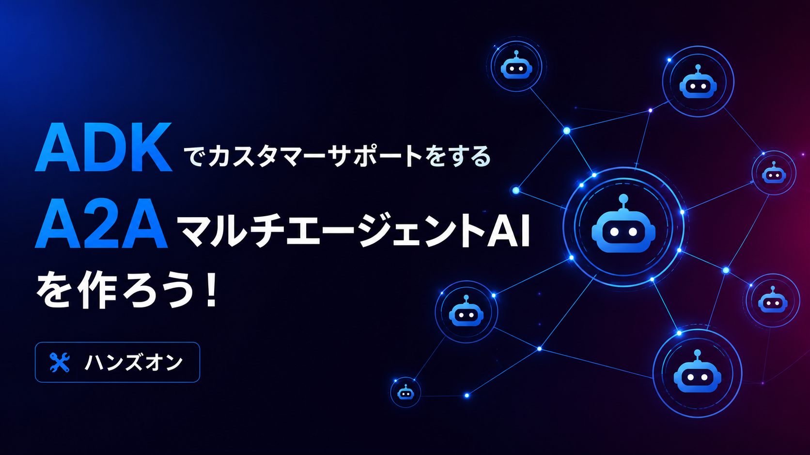
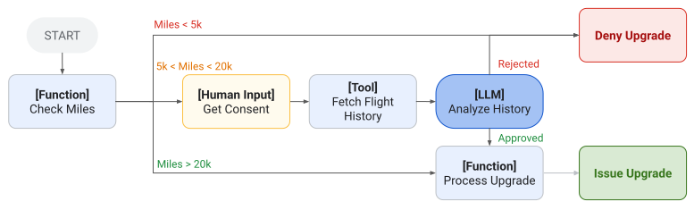
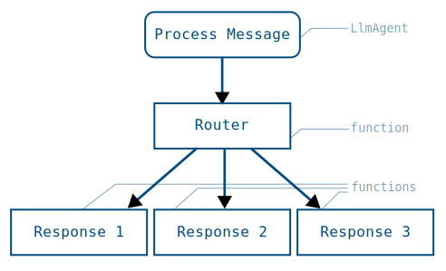
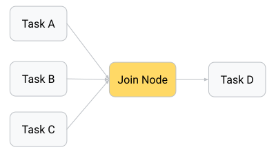
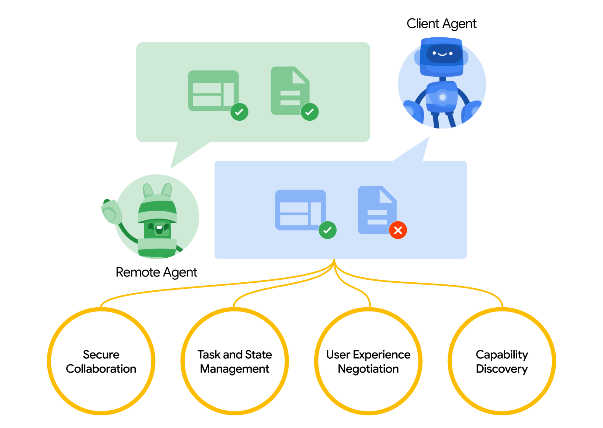
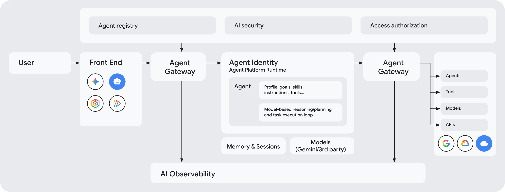
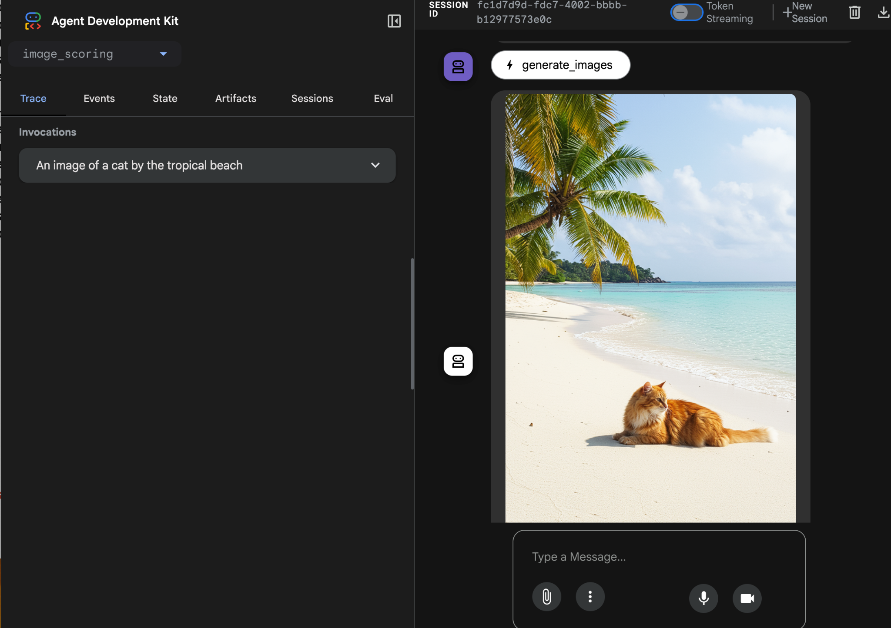
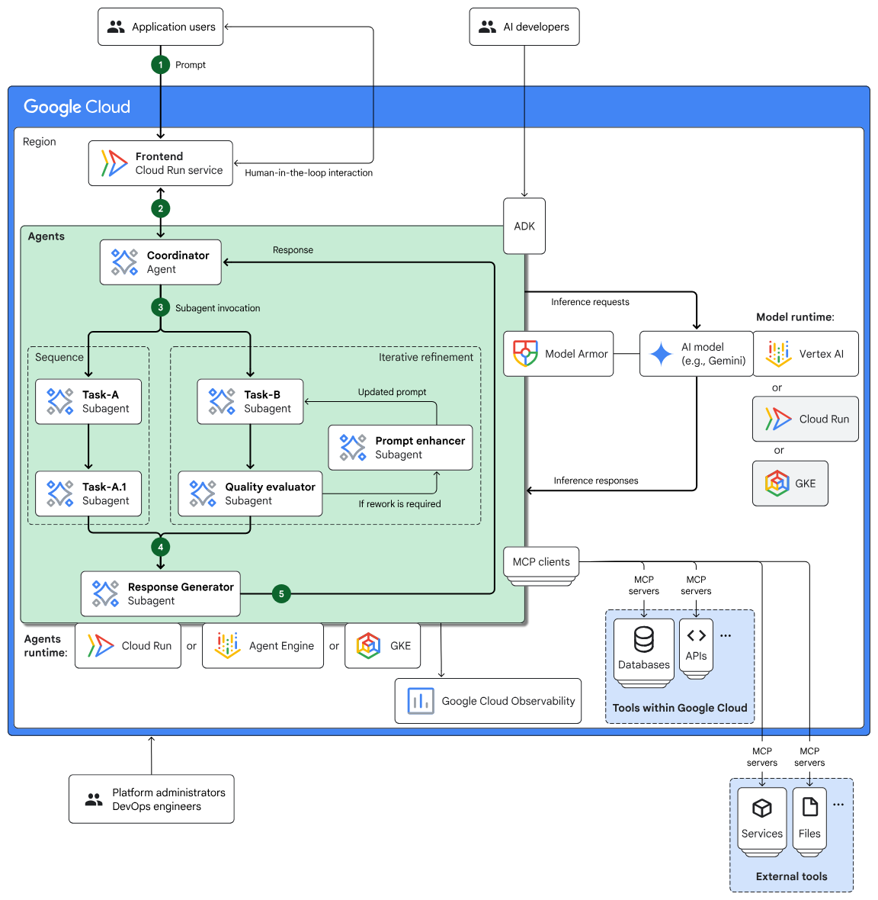

summary: ADK 2.0、A2A、Agent Runtime で作るマルチエージェント AI ハンズオン
id: create-multi-agent
categories: AI, Cloud
environments: Web
status: Published
feedback link: https://github.com/googlecodelabs/your-first-pwapp/issues
author: GDG on Campus University of Osaka

# ADK x A2A x Agent Runtime で作るマルチエージェント AI

## はじめに

Duration: 0:05:00



このコードラボでは、架空の採用管理 SaaS「HireNest ATS」のサポート問い合わせを題材に、専門エージェントが協調して調査するマルチエージェント AI を作ります。

### このコードラボで作るもの

完成すると、Support Coordinator Agent が問い合わせを受け取り、Ticket History Agent、Knowledge Base Agent、Account Context Agent、Incident Status Agent、Diagnostics Agent、Escalation Policy Agent に調査を依頼します。各専門エージェントは A2A サービスとして動き、Coordinator は調査結果を統合して Support Case Resolution Package を返します。

### このコードラボで学ぶこと

- ADK 2.0 の graph-based Workflow を使ってエージェントの制御フローを構築する方法
- Python 関数を tool として ADK Agent に接続する方法
- A2A Agent Card を公開し、`RemoteA2aAgent` で別エージェントを呼び出す方法
- `output_schema` で triage 結果を構造化する方法
- `RequestInput` で Human-in-the-loop の clarification ルートを作る方法
- Agent Runtime に参加者 ID 付きのエージェントをデプロイする方法
- 自分がデプロイした Agent Runtime リソースだけを削除する方法

### 必要なもの

- Google Cloud Shell
- ワークショップ運営が指定する Google Cloud project ID
- IAM 登録済みの Google アカウント
- connpass ID

### 前提知識

- Python の基本的な読み書き
- ターミナルでコマンドを実行する基本操作
- LLM と tool calling の基本的な理解

### このコードラボで扱わないこと

- 実顧客データや本番運用向けのセキュリティ設計
- Discord webhook などの外部通知の本番設定
- Gemini Enterprise Agent Search のコーパス作成
- Agent Gateway、Memory Bank、評価基盤の本格運用

## セットアップ

Duration: 0:15:00

このステップでは、Cloud Shell で配布コードを開き、依存関係と `.env` を準備します。セットアップはこのステップにまとめます。

### Cloud Shell を開く

Google Cloud Console で、ワークショップ運営が指定した Google Cloud project を選択します。画面右上の Cloud Shell アイコンを押して Cloud Shell を起動します。

Cloud Shell が開いたら、project が正しいことを確認します。

```bash
gcloud config get-value project
```

**期待される出力:**

```text
your-workshop-project-id
```

違う project が表示された場合は、運営が指定した project ID に切り替えます。

```bash
gcloud config set project YOUR_WORKSHOP_PROJECT_ID
```

### 配布コードを開く

ワークショップで案内されたリポジトリを Cloud Shell に clone します。

```bash
git clone WORKSHOP_REPOSITORY_URL
cd education/create-multi-agent/repos/template
```

すでに配布コードを Cloud Shell に展開済みの場合は、`template` ディレクトリへ移動します。

```bash
cd create-multi-agent/repos/template
```

### setup script を実行する

`scripts/setup.sh` は connpass ID を聞き、`.env` と `scripts/.state` を作成し、`uv sync --extra dev` を実行します。

```bash
./scripts/setup.sh
```

プロンプトが表示されたら、自分の connpass ID を入力します。

**期待される出力:**

```text
connpass ID: alice_123
Setup complete for [alice_123].
```

`scripts/.state` には参加者 ID が保存されます。Agent Runtime へデプロイするとき、この ID が Agent 名の prefix になります。

```text
[alice_123] Support Coordinator Agent
[alice_123] Ticket History Agent
```

### .env を確認する

`.env` が次の形になっていることを確認します。`GOOGLE_CLOUD_PROJECT` は運営が指定した project ID にします。

`.env`

```bash
ADK_MODEL=gemini-2.5-flash
HIRENEST_PARTICIPANT_ID=alice_123

TICKET_HISTORY_A2A_URL=http://localhost:8101
KNOWLEDGE_BASE_A2A_URL=http://localhost:8102
ACCOUNT_CONTEXT_A2A_URL=http://localhost:8103
INCIDENT_STATUS_A2A_URL=http://localhost:8104
ESCALATION_POLICY_A2A_URL=http://localhost:8105
DIAGNOSTICS_A2A_URL=http://localhost:8107

GOOGLE_API_KEY=
GOOGLE_GENAI_USE_VERTEXAI=true
GOOGLE_CLOUD_PROJECT=YOUR_WORKSHOP_PROJECT_ID
GOOGLE_CLOUD_LOCATION=us-central1
HIRENEST_TRACE_TO_CLOUD=false

HIRENEST_AGENT_SEARCH_SERVING_CONFIG=

HIRENEST_DISCORD_DRY_RUN=false
HIRENEST_DISCORD_WEBHOOK_URL=

HIRENEST_DATA_DIR=
```

> **補足:** このハンズオンでは、参加者全員が運営の用意した同じ Google Cloud project を使います。`.env` に credential や project ID を書く前提で進めます。

### ADK を import できることを確認する

```bash
uv run --extra dev python - <<'PY'
import google.adk
print("ADK is ready")
PY
```

**期待される出力:**

```text
ADK is ready
```

## Agent Development Kit 2.0 の概要

Duration: 0:08:00

このステップでは、今回使う ADK 2.0 の考え方を確認します。ADK 2.0 では、Agent、Tool、Python 関数、Human input、別 Workflow を graph の node として組み合わせられます。

### Graph-based Workflow



ADK 2.0 の中心は Workflow Runtime です。`Workflow(name=..., edges=[...])` で graph を定義し、`START` から node をつなぎます。node には ADK Agent、Python 関数、JoinNode、別 Workflow を置けます。

今回の Coordinator では、最初に triage を行い、情報が足りない場合は clarification に進みます。情報が足りている場合は専門エージェントへ並列調査を依頼します。

### Route と Human-in-the-loop



ADK の graph route では、関数 node が `Event(route=...)` を返し、次の edge で route と node を対応付けます。このコードラボでは `ready_for_investigation=false` のときに `retry` route を返し、`RequestInput` で人間に追加情報を依頼します。

### Parallel と JoinNode



複数の `START` edge を定義すると、複数 node が並列に開始されます。`JoinNode` は upstream node の出力を待ち、複数の調査結果を 1 つの入力として次の node に渡します。

このコードラボでは、次の形の graph を作ります。

```text
Triage / Planning
  |- retry -> Human clarification -> Triage / Planning
  `- default -> Parallel Investigation -> Synthesis -> Escalation -> Final Package
```

## A2A の概要

Duration: 0:08:00

このステップでは、A2A が何を標準化するのかを確認します。



### A2A が扱うもの

A2A は、エージェント同士が互いの内部実装を公開せずに、発見、通信、タスク委譲、成果物交換を行うためのプロトコルです。ADK、LangGraph、CrewAI、独自実装など、異なる実装のエージェントをつなぐ相互運用レイヤーとして使えます。

このコードラボでは、各専門エージェントを A2A Server として起動します。Coordinator は A2A Client として、`RemoteA2aAgent` から専門エージェントの Agent Card を読み、調査タスクを依頼します。

### Agent Card

Agent Card は、エージェントの名前、説明、endpoint、capabilities、skills などを表す JSON metadata です。ローカル起動した Ticket History Agent の Agent Card は、次の URL で確認できます。

```text
http://localhost:8101/.well-known/agent-card.json
```

この URL は後のステップで実際に確認します。

> **補足:** 古い記事やサンプルでは `/.well-known/agent.json` が出てくることがあります。今回のコードでは `/.well-known/agent-card.json` を使います。

## Gemini Enterprise Agent Platform の概要

Duration: 0:08:00

このステップでは、Agent Runtime へデプロイする理由を確認します。



### Agent Runtime

Gemini Enterprise Agent Platform は、エージェントの作成、デプロイ、状態管理、評価、監視、ガバナンス、他エージェント連携を扱う企業向けのエージェント基盤です。このコードラボでは、その中の Agent Runtime を使って ADK / A2A エージェントを Google Cloud 上にデプロイします。

今回のハンズオンでは、参加者全員が同じ Google Cloud project にデプロイします。そのため、デプロイ script は connpass ID を display name の prefix に入れます。

```text
[alice_123] Support Coordinator Agent
[alice_123] Ticket History Agent
```

この prefix により、他の参加者のエージェントと名前が衝突しにくくなり、cleanup script で自分のエージェントだけを削除できます。

### このリポジトリでの役割分担

`repos/template` には、完成形のうち一部だけが `TODO` として残っています。

```text
src/hirenest_support/tickets.py          チケット検索 tool
agents/ticket_history/agent.py           Ticket History Agent
agents/coordinator/schemas.py            structured output schema
agents/coordinator/steps.py              Human-in-the-loop route
agents/coordinator/agent.py              Coordinator Workflow
```

その他の専門エージェント、データ、ポリシー判定、通信文の安全チェック、デプロイ script は配布済みです。

## チケット検索 tool を実装する

Duration: 0:12:00

このステップでは、過去のサポートチケットを検索する tool 関数を実装します。まずは単純なキーワード一致で実装し、tool の品質がエージェントの回答に影響することを後で確認できるようにします。

### tickets.py を編集する

`src/hirenest_support/tickets.py` を開きます。`search_ticket_history()` と `_terms()` を次のように実装します。

`src/hirenest_support/tickets.py`

```diff py
 from __future__ import annotations

+import re
 from typing import Any

 from hirenest_support.loaders import load_jsonl
 from hirenest_support.paths import DATA_DIR


 def search_ticket_history(query: str, limit: int = 4) -> list[dict[str, Any]]:
-    # TODO
-    return []
+    query_terms = _terms(query)
+    scored: list[tuple[int, dict[str, Any]]] = []
+
+    for record in _load_ticket_records():
+        record_text = " ".join(
+            [
+                str(record.get("ticket_id", "")),
+                str(record.get("customer_id", "")),
+                str(record.get("category", "")),
+                str(record.get("severity", "")),
+                str(record.get("subject", "")),
+                str(record.get("summary", "")),
+                str(record.get("cause", "")),
+                str(record.get("resolution", "")),
+                " ".join(record.get("tags", [])),
+            ]
+        )
+        score = len(query_terms & _terms(record_text))
+        if score > 0:
+            scored.append((score, record))
+
+    ranked = sorted(scored, key=lambda item: item[0], reverse=True)[:limit]
+    return [_enrich_ticket(record, score) for score, record in ranked]
+
+
+def _terms(text: str) -> set[str]:
+    return set(re.findall(r"[a-z0-9]+", text.lower()))
```

この実装は、問い合わせ文とチケット本文の共通単語数でチケットを順位付けします。まだ顧客 ID やカテゴリ推定は使いませんが、tool として動作する最小の検索を作れます。

### チケット検索をテストする

```bash
uv run --extra dev pytest tests/test_search_and_redaction.py::test_ticket_search_prioritizes_customer_and_category
```

**期待される出力:**

```text
tests/test_search_and_redaction.py .  [100%]
```

エラーが出る場合は、`import re` を追加したか、`_terms()` を `search_ticket_history()` より下に追加したかを確認します。

### tool の出力を確認する

```bash
uv run --extra dev python - <<'PY'
from hirenest_support.tickets import search_ticket_history

tickets = search_ticket_history(
    "Apex Robotics interview invitation email not delivered to all candidates",
    limit=2,
)
for ticket in tickets:
    print(ticket["ticket_id"], ticket["category"], ticket["match_score"])
PY
```

**期待される出力:**

```text
TCK-4101 candidate_communication 10
```

2 行目以降の ticket ID や score は、同点のチケットにより変わることがあります。

## Ticket History Agent を実装する

Duration: 0:12:00

このステップでは、前のステップで作った `search_ticket_history()` を ADK Agent の tool として接続します。

### agent.py を編集する

`agents/ticket_history/agent.py` を開きます。`root_agent` の `instruction` と `tools` を次のように変更します。

`agents/ticket_history/agent.py`

```diff py
 root_agent = Agent(
     name="ticket_history_agent",
     model=model_name(),
     description="Searches HireNest historical support tickets and escalation cases.",
-    instruction="TODO",
-    tools=[],  # TODO
+    instruction=(
+        "You are the Ticket History Agent for HireNest ATS support. "
+        "Use search_similar_tickets to find relevant historical tickets. "
+        "After identifying the most relevant ticket IDs, use retrieve_ticket_thread "
+        "for the top one or two tickets. Return similar tickets, similarities, "
+        "differences, past causes, resolutions, useful internal comments, "
+        "and any remaining missing evidence. Do not decide severity or write "
+        "the final customer response."
+    ),
+    tools=[search_similar_tickets, retrieve_ticket_thread],
 )
```

この Agent は、問い合わせ文を受け取り、過去チケット検索とチケット詳細取得を tool として使います。エスカレーション判定や最終返信文の作成は、別のエージェントに任せます。

### Agent を import できることを確認する

```bash
uv run --extra dev python - <<'PY'
from agents.ticket_history.agent import root_agent

print(root_agent.name)
print([tool.__name__ for tool in root_agent.tools])
PY
```

**期待される出力:**

```text
ticket_history_agent
['search_similar_tickets', 'retrieve_ticket_thread']
```

### A2A Agent Card を確認する

Ticket History Agent を A2A サービスとして一時的に起動します。

```bash
PYTHONPATH=src uv run uvicorn agents.ticket_history.agent:app \
  --host 0.0.0.0 \
  --port 8101 \
  > /tmp/ticket-history.log 2>&1 &
export TICKET_HISTORY_PID=$!
sleep 5
```

Agent Card を取得します。

```bash
curl -s http://localhost:8101/.well-known/agent-card.json | python -m json.tool | head -n 20
```

**期待される出力:**

```json
{
  "capabilities": {
    "streaming": false
  },
  "defaultInputModes": ["text/plain"],
  "defaultOutputModes": ["text/plain"],
  "description": "Searches HireNest historical support tickets and escalation cases.",
  "name": "ticket_history_agent"
}
```

確認できたら、起動したプロセスを止めます。

```bash
kill "$TICKET_HISTORY_PID"
```

## Structured output を追加する

Duration: 0:10:00

このステップでは、Triage / Planning Agent の出力を `InvestigationPlan` として構造化します。prompt は配布済みなので、ここでは Pydantic model を作ります。

### schemas.py を編集する

`agents/coordinator/schemas.py` を次の内容で上書きします。

`agents/coordinator/schemas.py`

```py
from __future__ import annotations

from pydantic import BaseModel, Field


class SpecialistDirective(BaseModel):
    agent_name: str = Field(description="Specialist agent this directive is for.")
    focus: str = Field(description="What this specialist should investigate.")
    priority: str = Field(description="high, medium, or low.")


class InvestigationPlan(BaseModel):
    case_category: str = Field(description="The best current case category.")
    urgency: str = Field(description="Initial urgency or severity estimate.")
    business_impact: str = Field(description="Known or inferred business impact.")
    ready_for_investigation: bool = Field(
        description="Whether enough information exists to run parallel investigation."
    )
    clarification_questions: list[str] = Field(
        description="Questions to ask before investigation if important information is missing."
    )
    initial_hypotheses: list[str] = Field(description="Current working hypotheses.")
    specialist_directives: list[SpecialistDirective] = Field(
        description="Directives for Account Context, Ticket History, Incident Status, "
        "Knowledge Base, and Diagnostics."
    )
```

この schema は `agents/coordinator/nodes.py` の `triage_planning_agent` で `output_schema=InvestigationPlan` として使われます。

### schema を確認する

```bash
uv run --extra dev python - <<'PY'
from agents.coordinator.schemas import InvestigationPlan, SpecialistDirective

plan = InvestigationPlan(
    case_category="candidate_communication",
    urgency="high",
    business_impact="candidate-facing interview invitations are blocked",
    ready_for_investigation=True,
    clarification_questions=[],
    initial_hypotheses=["Invitation template or delivery pipeline issue"],
    specialist_directives=[
        SpecialistDirective(
            agent_name="ticket_history_agent",
            focus="Find similar invitation delivery incidents",
            priority="high",
        )
    ],
)
print(plan.model_dump()["specialist_directives"][0]["agent_name"])
PY
```

**期待される出力:**

```text
ticket_history_agent
```

## Human-in-the-loop ルートを実装する

Duration: 0:12:00

このステップでは、情報不足の問い合わせに対して、Coordinator が人間に clarification を求める route を実装します。

### steps.py を編集する

`agents/coordinator/steps.py` の 3 つの `TODO` 関数を次の内容に置き換えます。

`agents/coordinator/steps.py`

```py
def route_investigation_plan(ctx: Context, node_input: InvestigationPlan):
    ctx.state[STATE_INVESTIGATION_PLAN] = node_input.model_dump()
    if not node_input.ready_for_investigation:
        questions = [
            question.strip()
            for question in node_input.clarification_questions
            if question.strip()
        ]
        ctx.state[STATE_CLARIFICATION_QUESTIONS] = questions
        ctx.state[STATE_CLARIFICATION_REQUEST] = _format_clarification_request(questions)
        yield Event(route=ROUTE_RETRY)
        return

    yield Event(output=node_input, route=DEFAULT_ROUTE)


def request_retry_clarification(ctx: Context, node_input: Any):
    questions = ctx.state.get(STATE_CLARIFICATION_QUESTIONS, [])
    message = ctx.state.get(STATE_CLARIFICATION_REQUEST)
    if not message:
        message = _format_clarification_request([_stringify(node_input)] if node_input else [])

    yield RequestInput(
        message=message,
        payload={
            "investigation_plan": ctx.state.get(STATE_INVESTIGATION_PLAN),
            "clarification_questions": questions,
        },
        response_schema=str,
    )


def build_retry_planning_input(ctx: Context, node_input: Any) -> str:
    clarification_questions = ctx.state.get(STATE_CLARIFICATION_QUESTIONS, [])
    return "\n\n".join(
        [
            "Customer inquiry and session context:",
            "\n\n".join(_session_user_messages(ctx)),
            "Previous triage / investigation plan:",
            _stringify(ctx.state.get(STATE_INVESTIGATION_PLAN, "")),
            "Clarification questions asked:",
            "\n".join(f"- {question}" for question in clarification_questions),
            "Human clarification response:",
            _stringify(node_input),
            "Update the InvestigationPlan using the clarification response.",
        ]
    )
```

`route_investigation_plan()` は、調査できる場合は `DEFAULT_ROUTE`、情報が足りない場合は `retry` route を返します。`request_retry_clarification()` は `RequestInput` を発行し、workflow を一時停止して人間の入力を待ちます。

### Human-in-the-loop のテストを実行する

```bash
uv run --extra dev pytest tests/test_agent_imports.py::test_coordinator_retry_route_requests_human_input
```

**期待される出力:**

```text
tests/test_agent_imports.py .  [100%]
```

## Coordinator から専門エージェントを呼び出す

Duration: 0:10:00

このステップでは、配布済みの `RemoteA2aAgent` 定義を確認し、Coordinator が接続する専門エージェントの A2A endpoint を起動します。

### RemoteA2aAgent 定義を確認する

`agents/coordinator/nodes.py` には、専門エージェントが `RemoteA2aAgent` として定義されています。

```py
ticket_history_agent = RemoteA2aAgent(
    name="ticket_history_agent",
    agent_card=specialist_card_url("TICKET_HISTORY_A2A_URL", "http://localhost:8101"),
    httpx_client=_remote_a2a_httpx_client,
    description="Finds similar support tickets and historical resolutions.",
    use_legacy=False,
)
```

`specialist_card_url()` は `.env` の URL を読みます。ローカル開発では `http://localhost:8101/.well-known/agent-card.json` を参照し、Agent Runtime デプロイ後は runtime の A2A card URL を参照します。

### 専門エージェントを起動して確認する

配布済みの専門エージェントも含めて、すべての specialist を起動します。

```bash
make run-specialists > /tmp/hirenest-specialists.log 2>&1 &
export SPECIALISTS_PID=$!
sleep 8
```

Agent Card を 2 つ確認します。

```bash
curl -s http://localhost:8101/.well-known/agent-card.json | python -m json.tool | grep '"name"'
curl -s http://localhost:8102/.well-known/agent-card.json | python -m json.tool | grep '"name"'
```

**期待される出力:**

```text
    "name": "ticket_history_agent",
    "name": "knowledge_base_agent",
```

確認できたら、専門エージェントを止めます。

```bash
kill "$SPECIALISTS_PID"
```

`Address already in use` が出る場合は、前に起動した `uvicorn` が残っています。`pkill -f "uvicorn agents"` を実行してから、もう一度起動します。

## 並列調査 Workflow を完成させる

Duration: 0:15:00

このステップでは、Coordinator の graph を完成させます。Triage / Planning の後に、retry route または並列調査 workflow へ進む構成にします。

### agent.py を上書きする

`agents/coordinator/agent.py` を次の内容で上書きします。

`agents/coordinator/agent.py`

```py
from __future__ import annotations

from google.adk import Workflow
from google.adk.workflow import DEFAULT_ROUTE

from agents._common import build_a2a_app
from agents.coordinator.constants import ROUTE_RETRY
from agents.coordinator.nodes import (
    account_context_agent,
    diagnostics_agent,
    escalation_policy_agent,
    final_package_agent,
    incident_status_agent,
    knowledge_base_agent,
    parallel_investigation_join,
    synthesis_hypothesis_agent,
    ticket_history_agent,
    triage_planning_agent,
)
from agents.coordinator.steps import (
    build_escalation_policy_input,
    build_final_package_input,
    build_retry_planning_input,
    build_synthesis_input,
    request_retry_clarification,
    route_investigation_plan,
)

support_resolution_workflow = Workflow(
    name="support_case_resolution_workflow",
    description="Runs parallel investigation through final package generation.",
    edges=[
        ("START", account_context_agent, parallel_investigation_join),
        ("START", ticket_history_agent, parallel_investigation_join),
        ("START", incident_status_agent, parallel_investigation_join),
        ("START", knowledge_base_agent, parallel_investigation_join),
        ("START", diagnostics_agent, parallel_investigation_join),
        (
            parallel_investigation_join,
            build_synthesis_input,
            synthesis_hypothesis_agent,
            build_escalation_policy_input,
            escalation_policy_agent,
            build_final_package_input,
            final_package_agent,
        ),
    ],
)

root_agent = Workflow(
    name="support_coordinator_agent",
    description="Runs the generic Support Case Resolution Workflow over specialist A2A agents.",
    edges=[
        ("START", triage_planning_agent, route_investigation_plan),
        (
            route_investigation_plan,
            {
                ROUTE_RETRY: request_retry_clarification,
                DEFAULT_ROUTE: support_resolution_workflow,
            },
        ),
        (request_retry_clarification, build_retry_planning_input, triage_planning_agent),
    ],
)

app = build_a2a_app(root_agent, default_port=8100)
```

この graph では、5 つの調査系専門エージェントが並列に動きます。`JoinNode` の後で synthesis を行い、Escalation Policy Agent と Final Package Agent へ順番に渡します。

### Workflow の構造をテストする

```bash
uv run --extra dev pytest tests/test_agent_imports.py::test_adk_agent_entrypoints_import_when_dependencies_exist
```

**期待される出力:**

```text
tests/test_agent_imports.py .  [100%]
```

### ここまでのテストをまとめて実行する

```bash
uv run --extra dev pytest tests/test_search_and_redaction.py tests/test_agent_imports.py
```

**期待される出力:**

```text
tests/test_search_and_redaction.py ......  [ 54%]
tests/test_agent_imports.py .....          [100%]
```

警告が出ても、`passed` になっていればこのステップは成功です。

## ローカルで完成したマルチエージェントを実行する

Duration: 0:15:00

このステップでは、コード全体のテストを通し、Cloud Shell 上の ADK Web で完成したマルチエージェントを動かします。

### 全テストを実行する

```bash
make test
```

**期待される出力:**

```text
22 passed
```

### Specialist、Coordinator、ADK Web を起動する

```bash
make run
```

**期待される出力:**

```text
Specialists, coordinator, and ADK Web are starting.
Specialist A2A agents are running on ports 8101-8105 and 8107.
```

このコマンドは起動したままにします。Cloud Shell の Web Preview から port `8000` を開きます。



### 明確な問い合わせを送る

ADK Web で `support_coordinator_agent` を選び、次の問い合わせを送ります。

```text
Apex Robotics reports that interview invitation emails are not delivered to all candidates
for a manufacturing hiring event. They are a Premier customer, and recruiting operations
are blocked. Check prior cases, known incidents, SLA, first response, and escalation plan.
```

**期待される結果:**

- Ticket History、Knowledge Base、Account Context、Incident Status、Diagnostics の調査結果が統合される
- Escalation Policy Check に `SEV2` や `Messaging Platform` が含まれる
- Customer Communication Draft と Internal Next Steps が出力される

### 情報不足の問い合わせを送る

次に、情報不足の問い合わせを送ります。

```text
Candidates are not getting emails. Can you check what is going on?
```

**期待される結果:**

```text
I need a little more information before running the support investigation:
- Which customer or tenant is affected?
- Which email workflow is affected?
```

質問が表示されたら、次のように回答します。

```text
The affected customer is Apex Robotics. The workflow is interview invitation email delivery.
All candidates for requisition REQ-7842 are affected, and the first failures started today
at 09:20 UTC. This is a Premier customer.
```

回答後、Coordinator は triage をやり直し、並列調査へ進みます。

## Agent Runtime にデプロイする

Duration: 0:15:00

このステップでは、完成したエージェントを Agent Runtime にデプロイします。デプロイは `scripts/deploy_all.sh` がまとめて実行します。



### Google Cloud 認証を確認する

Cloud Shell で認証と project を確認します。

```bash
gcloud auth list
gcloud config get-value project
```

**期待される出力:**

```text
ACTIVE  ACCOUNT
*       your-account@example.com

your-workshop-project-id
```

必要に応じて Application Default Credentials も設定します。

```bash
gcloud auth application-default login
```

> **補足:** API の有効化と IAM 登録は、ワークショップ運営が事前に行います。権限エラーが出た場合は、表示されたエラー文を運営に共有してください。

### deploy_all.sh を実行する

```bash
./scripts/deploy_all.sh
```

**期待される出力:**

```text
HireNest Agent Runtime — Parallel Deploy
[info] Participant: [alice_123]
[ ok ] Deployed [alice_123] Ticket History Agent
[ ok ] Deployed [alice_123] Support Coordinator Agent
```

デプロイは数分かかります。途中で `Reasoning Engine` と表示されることがありますが、これは Agent Runtime の API / SDK 名に残っている互換名です。

### Runtime A2A URL を確認する

デプロイが終わったら、Coordinator が使う runtime の A2A card URL を確認します。

```bash
grep '_A2A_URL=' .agent-runtime-temp/deploy.env
```

**期待される出力:**

```text
TICKET_HISTORY_A2A_URL=https://us-central1-aiplatform.googleapis.com/...
KNOWLEDGE_BASE_A2A_URL=https://us-central1-aiplatform.googleapis.com/...
ACCOUNT_CONTEXT_A2A_URL=https://us-central1-aiplatform.googleapis.com/...
INCIDENT_STATUS_A2A_URL=https://us-central1-aiplatform.googleapis.com/...
ESCALATION_POLICY_A2A_URL=https://us-central1-aiplatform.googleapis.com/...
DIAGNOSTICS_A2A_URL=https://us-central1-aiplatform.googleapis.com/...
```

## Agent Runtime 上のエージェントを確認する

Duration: 0:10:00

このステップでは、runtime にデプロイされた A2A Agent Card を確認します。

### deploy.env を読み込む

```bash
set -a
. .agent-runtime-temp/deploy.env
set +a
```

### runtime の Agent Card を取得する

```bash
curl -s \
  -H "Authorization: Bearer $(gcloud auth print-access-token)" \
  "$TICKET_HISTORY_A2A_URL" \
  | python -m json.tool | head -n 20
```

**期待される出力:**

```json
{
  "capabilities": {
    "streaming": false
  },
  "name": "ticket_history_agent"
}
```

ローカルの `localhost:8101` ではなく、Agent Runtime の URL から Agent Card が取得できていれば成功です。

### 自分の display name を確認する

```bash
cat scripts/.state
ls .agent-runtime-temp/*.engine_id | head
```

**期待される出力:**

```text
HIRENEST_PARTICIPANT_ID=alice_123
.agent-runtime-temp/alice_123_support_coordinator_agent.engine_id
```

## Extra: チケット検索 tool を改善する

Duration: 0:10:00

このステップは任意です。単純なキーワード一致を、顧客 ID とカテゴリを使う検索に改善します。

### 改善の観点

今の `search_ticket_history()` は、単語の重なりだけで順位付けしています。そのため、同じ顧客の別カテゴリや、別顧客の同カテゴリが上位に混ざることがあります。

改善版では、配布済みの helper を使います。

```py
from hirenest_support.intake import parse_case
from hirenest_support.text import score_text, text_from_record
```

改善の方針は次です。

- `parse_case()` で顧客とカテゴリを推定する
- `text_from_record()` で ticket record を検索用テキストにする
- `score_text()` で query と record の類似度を計算する
- 顧客 ID が一致したら加点する
- カテゴリが一致したら加点する

### 完成形との差分を確認する

完成形は `repos/example/src/hirenest_support/tickets.py` にあります。差分を確認します。

```bash
diff -u src/hirenest_support/tickets.py ../example/src/hirenest_support/tickets.py | sed -n '1,120p'
```

この改善により、Ticket History Agent はより関連性の高い過去事例を参照しやすくなります。

## Extra: AgentRAG ループを追加する

Duration: 0:10:00

このステップは任意です。検索結果が足りない場合に、エージェント自身が query を改善して再検索する流れを追加します。

### 配布済み helper を確認する

`src/hirenest_support/agent_rag.py` には、検索結果の十分性を判定する helper と、再検索 query を作る helper が用意されています。

```bash
sed -n '1,150p' src/hirenest_support/agent_rag.py
```

Ticket History Agent に追加する tool は次です。

```py
from hirenest_support.agent_rag import assess_retrieval_coverage, refine_retrieval_query
```

完成形は `repos/example/agents/ticket_history/agent.py` にあります。AgentRAG 版では、`search_similar_tickets()` の後に evidence を評価し、不十分なら refined query で検索し直します。

## Extra: Discord 通知を有効化する

Duration: 0:08:00

このステップは任意です。Escalation Policy Agent は配布済みで、Discord 通知 tool も実装済みです。webhook URL を設定すると、SEV2 以上のケースで通知できます。

### webhook URL を設定する

`.env` に Discord webhook URL を設定します。

`.env`

```bash
HIRENEST_DISCORD_DRY_RUN=false
HIRENEST_DISCORD_WEBHOOK_URL=https://discord.com/api/webhooks/...
```

設定後、Escalation Policy Agent のテストを実行します。

```bash
uv run --extra dev pytest tests/test_accounts_and_policy.py::test_discord_escalation_tool_uses_webhook_url_only
```

**期待される出力:**

```text
tests/test_accounts_and_policy.py .  [100%]
```

> **Warning:** webhook URL を設定すると、実際の Discord チャンネルへ通知されます。共有チャンネルを使う場合は、運営の指示に従ってください。

## Extra: 他参加者の A2A エージェントを呼び出す

Duration: 0:10:00

このステップは任意です。ほかの参加者が公開した specialist の A2A card URL を `.env` に設定すると、自分の Coordinator から別参加者の専門エージェントを呼び出せます。

### A2A URL を差し替える

たとえば、別参加者の Ticket History Agent を使う場合は、`.env` の `TICKET_HISTORY_A2A_URL` を差し替えます。

`.env`

```bash
TICKET_HISTORY_A2A_URL=https://us-central1-aiplatform.googleapis.com/v1beta1/projects/...
```

Coordinator を再起動して、同じ問い合わせを投げます。

```bash
make run-coordinator
```

自分の tool 実装と他参加者の tool 実装で、過去チケットの見つけ方や最終回答がどう変わるかを比較します。

## おめでとうございます！

Duration: 0:05:00

このコードラボでは、ADK 2.0、A2A、Agent Runtime を使って、サポート問い合わせを調査するマルチエージェント AI を作りました。

### 学んだこと

- ADK 2.0 の graph-based Workflow を使ってエージェントの制御フローを構築しました
- Python 関数を tool として ADK Agent に接続しました
- A2A Agent Card を公開し、`RemoteA2aAgent` で別エージェントを呼び出しました
- `output_schema` で triage 結果を構造化しました
- `RequestInput` で Human-in-the-loop の clarification ルートを作りました
- Agent Runtime に参加者 ID 付きのエージェントをデプロイしました
- 自分がデプロイした Agent Runtime リソースだけを削除する方法を確認しました

### クリーンアップ

課金を防ぐため、Agent Runtime に作成した自分のエージェントを削除します。まず dry-run で削除対象を確認します。

```bash
./scripts/cleanup.sh --dry-run
```

**期待される出力:**

```text
HireNest Agent Runtime — Cleanup
[info] Participant: [alice_123]
[info] Dry run — no deletions performed.
```

削除対象が自分の connpass ID prefix のエージェントだけであることを確認してから、削除を実行します。

```bash
./scripts/cleanup.sh
```

**期待される出力:**

```text
[ ok ] Deleted [alice_123] Support Coordinator Agent
[ ok ] Deleted [alice_123] Ticket History Agent
```

### 次のステップ

- [ADK 2.0 documentation](https://adk.dev/2.0/)
- [Graph-based agent workflows](https://adk.dev/graphs/)
- [A2A Protocol specification](https://a2a-protocol.org/latest/specification/)
- [Gemini Enterprise Agent Platform overview](https://docs.cloud.google.com/gemini-enterprise-agent-platform/overview)
- [Agent Runtime overview](https://docs.cloud.google.com/gemini-enterprise-agent-platform/build/runtime)
