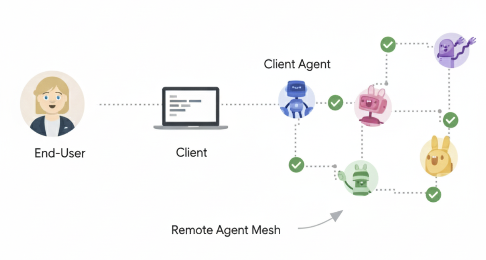
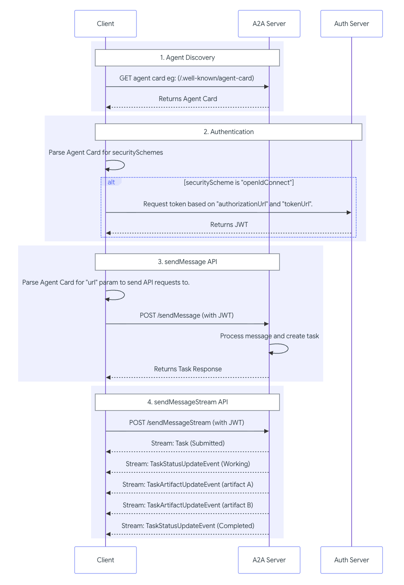

<!-- _class: title -->
<!-- _paginate: false -->

<h1 style="font-size: 2.5em; line-height: 1.08; max-width: 700px;">
ADK x A2A x Agent Runtime で作る <strong>マルチエージェント AI</strong>
</h1>

GDG on Campus University of Osaka

---

<!-- _class: lead -->

# 1 つの巨大 prompt から **分割して動く Workflow** へ

---

## このコードラボの着地点

旅行計画 AI が、候補探しから旅しおり画像まで進めます

  
このコードラボで作るもの

  
→

  
このコードラボで学ぶこと

  
→

  
必要なもの

  
前提知識

  
このコードラボで扱わないこと

---

<!-- _class: section -->

# 01. 全体アーキテクチャ

---

<!-- _class: split -->

## Coordinator Workflow の流れを確認する

入力を構造化し、候補、評価、選択、旅程、画像へ渡します

---

## session.state に保存するデータを確認する

  
raw_user_query

  
travel_request

  
clarification_rounds

  
travel_options

  
research_reports

  
coordinator_recommendation

  
selected_option_id

  
selected_option_context

  
itinerary_markdown

  
illustrator_prompt

planner には選ばれた候補だけを渡し、情報の混線を減らします

---

<!-- _class: section yellow -->

# 02. セットアップ

---

## セットアップの 5 ステップ

  
セットアップフォームに回答する

  
→

  
Google Cloud Shell を開く

  
→

  
setup script を実行する

  
→

  
環境変数を設定する

  
→

  
ADK を import できることを確認する

Cloud Shell で同じ環境から始めます

  
二段階認証が必要な方へ

---

<!-- _class: section green -->

# 03. ADK の考え方

---

<!-- _class: split -->

## グラフベースのワークフロー

  
ルートシーケンス

  
ルート分岐と条件付き実行

  
並列タスク: fan out と join

  
ネストされたワークフロー

---

## Workflow の制御パターン

  
<h3>データの受け渡し</h3>
node 間の成果物を state に残します

  
<h3>Dynamic workflow</h3>
入力や状態で次の処理を変えます

  
<h3>Collaborative workflow</h3>
人と agent が交互に進めます

  
<h3>Human input</h3>
足りない情報を人に聞きます

  
モード設定

  
Session、State、Memory

---

<!-- _class: split -->

## Session、State、Memory

  
Session: 現在の会話スレッド

  
State (`session.state`): 現在の会話内のデータ

  
Memory: session をまたいで検索できる情報

---

<!-- _class: section red -->

# 04. A2A

---

<!-- _class: split -->

## A2A とは

別プロセスの specialist agent を、Agent Card 経由で呼び出します

---

## Why Use the A2A Protocol

  
Problems that A2A Solves

  
A2A Example Scenario

  
Core Benefits of A2A

  
A2A とローカル sub-agent の使い分け

  
Core Concepts in A2A

  
Agent Discovery と security

---

<!-- _class: split -->

## A2A Request Lifecycle

discover → auth → message → stream

---

<!-- _class: section -->

# 05. Gemini Enterprise Agent Platform

---

<!-- _class: split -->

## Gemini Enterprise Agent Platform とは

Build / Scale / Govern / Optimize を 1 つの面で扱います

---

## エージェントを構築する（Agents - Build）

  
ADK と Agent Studio

  
データ、ツール、エージェント間連携

  
このリポジトリで実装するもの

実装する場所を先にそろえます

---

## エージェントを本番運用に載せる（Agents - Scale）

  
Agent Runtime

  
Sessions と Memory Bank

  
このコードラボでのデプロイ順序

---

## エージェントを統制する（Agents - Govern）

  
Agent Registry と Agent Gateway

  
Identity、Policy、Security

誰が、何を、どの agent に許すか

---

## エージェントを改善する（Agents - Optimize）

  
Observability

  
Evaluation と Example Store

動かして終わりではなく、測って直します

---

<!-- _class: section green -->

# 06. Coordinator を実装する

---

## Clarify Agent を実装する

  
clarify_models.py を作成する

  
→

  
clarify.py を作成する

  
→

  
agent.py を最小 Workflow に更新する

  
→

  
Clarify Agent の動作を確認する

---

## Strategist と Research の Fan-out / Fan-in を実装する

  
candidates_models.py を作成する

  
→

  
candidates.py を作成する

  
→

  
candidate_workflow を agent.py に追加する

  
How grounding with Google Search works

  
research_reports が state に保存されることを確認する

---

<!-- _class: split -->

## Grounding のデータフロー

候補ごとに検索し、結果を fan-in して評価へ渡します

---

<!-- _class: section red -->

# 07. A2A Specialist

---

## Specialist Agents を A2A サービスとして実装する

  
comfort_agent を作成する

  
risk_agent を作成する

  
experience_agent を作成する

  
Specialist Agents の Agent Card を確認する

  
Specialist Agents の動作を確認する

---

## Multi-Agent Evaluation を実装する

  
evaluation_models.py を作成する

  
→

  
RemoteA2aAgent を定義する

  
→

  
evaluation_agent を作成する

  
evaluation フェーズを candidate_workflow に追加する

  
coordinator_recommendation が state に保存されることを確認する

---

<!-- _class: section yellow -->

# 08. 選択、旅程、画像生成

---

## User Selection と Replan 分岐を実装する

  
planner_models.py を作成する

  
planner.py に選択提示ノードを作成する

  
route_user_selection を実装する

  
build_replan_input を実装する

  
agent.py に選択と再提案の分岐を追加する

  
上位 3 案の提示と再提案ループを確認する

---

## Planner で詳細旅程を生成する

  
SelectedOptionContext を追加する

  
→

  
build_planner_input を実装する

  
→

  
store_itinerary_markdown を実装する

  
planner フェーズを agent.py に追加する

  
itinerary_markdown が state に保存されることを確認する

---

## Illustrator で旅しおり画像を生成する

  
illustrator.py を作成する

  
illustrator_prompt_agent を作成する

  
illustrator_agent を作成する

  
illustrator フェーズを agent.py に追加する

  
旅しおり画像が生成されることを確認する

---

<!-- _class: section -->

# 09. 実行とデプロイ

---

## ローカルで完成したマルチエージェントを実行する

  
全テストを実行する

  
Specialist、Coordinator、ADK Web を起動する

  
明確な依頼を送る

  
情報不足の依頼を送る

  
再提案を試す

  
ADK Web の Inspector で state を確認する

---

## Agent Runtime にデプロイする

  
Google Cloud 認証を確認する

  
→

  
deploy_all.sh を実行する

  
→

  
Runtime A2A URL を確認する

  
→

  
Runtime 上の Agent Card を確認する

---

<!-- _class: section green -->

# 10. Team Challenge

---

## Team Challenge: Specialist Agent を改善する

  
改善方針を決める

  
specialist 用 tool を確認する

  
agent に tool を追加する

  
新しい specialist を追加する

  
改善結果を確認する

---

## Team Challenge: Specialist Agent を差し替える

  
specialist をデプロイする

  
他のメンバーの specialist に切り替える

  
Runtime が使えない場合

---

## Team Challenge: Illustrator の出力品質を改善する

  
改善観点を決める

  
prompt format を改善する

  
画像を比較する

---

<!-- _class: section red -->

# 11. 困ったとき

---

## トラブルシューティング

  
google_search と structured output が両立しない場合

  
specialist に connection refused が出る場合

  
research_reports に option が欠ける場合

  
clarification が繰り返される場合

  
planner が全候補の情報を混ぜる場合

---

## 成果発表と評価

  
発表する内容

  
評価観点

  
ふりかえり

チームごとに設計判断と改善結果を共有します

---

## おめでとうございます！

  
学んだこと

  
クリーンアップ

  
次のステップ

ここから自分の agent に育てていきましょう!

---

<!-- _class: section yellow -->

# 12. Extra

---

## Extra: 画像生成プロンプトを改善する

  
改善する観点を決める

  
illustrator_prompts.py を更新する

  
illustrator.py の instruction を更新する

  
画像を比較する

  
うまくいかない場合

---

## Extra: Memory Bank でパーソナライズする

  
追加する構成を確認する

  
memory.py を作成する

  
clarify_agent に Memory を接続する

  
strategist_agent に Memory を接続する

  
planner_agent に Memory を接続する

  
Makefile に Memory 起動ターゲットを追加する

  
.env.example に設定を追加する

  
Memory を有効にして起動する

  
動作を確認する

  
うまくいかない場合

---

## Extra: Evaluation と User Simulation を追加する

  
評価したいことを決める

  
evals ディレクトリを作成する

  
travel_scenarios.json を作成する

  
session_input.json を作成する

  
eval_config.json を作成する

  
Makefile に eval ターゲットを追加する

  
EvalSet を作成する

  
User Simulation から eval case を追加する

  
評価を実行する

  
評価を増やす

---

## Extra: AgentMail で旅行プランをメール送信する

  
追加する構成を確認する

  
pyproject.toml に mcp を追加する

  
agentmail.py を作成する

  
illustrator_prompt を state に保存する

  
agent.py に AgentMail node を接続する

  
.env.example に設定を追加する

  
AgentMail tool が読み込まれることを確認する

  
メール送信を試す

  
うまくいかない場合

---

## Extra: AG-UI でフロントエンドから呼び出す

  
AG-UI endpoint の役割を確認する

  
ag_ui_app.py を作成する

  
Makefile の run-ag-ui を確認する

  
AG-UI server を起動する

  
userId の扱いを確認する

  
Memory extra と組み合わせる

  
うまくいかない場合

---

<!-- _class: lead -->

# Thank you!

Questions?
