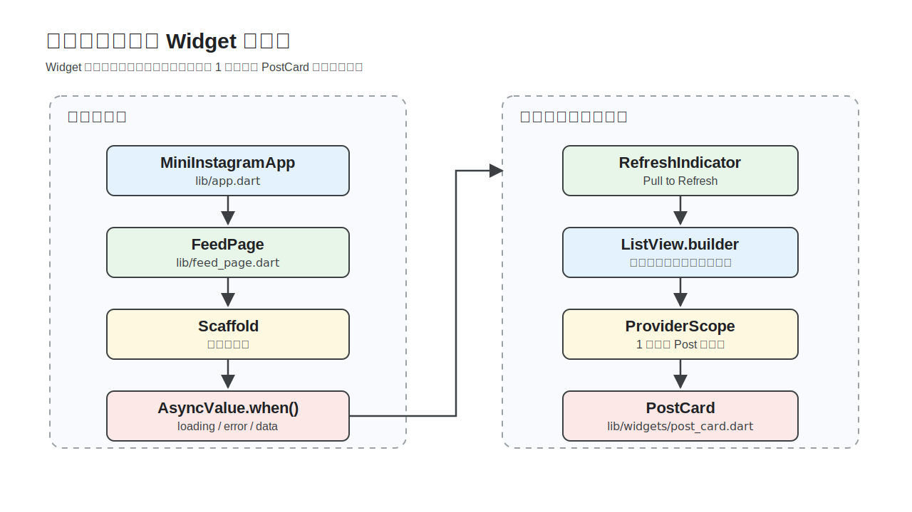
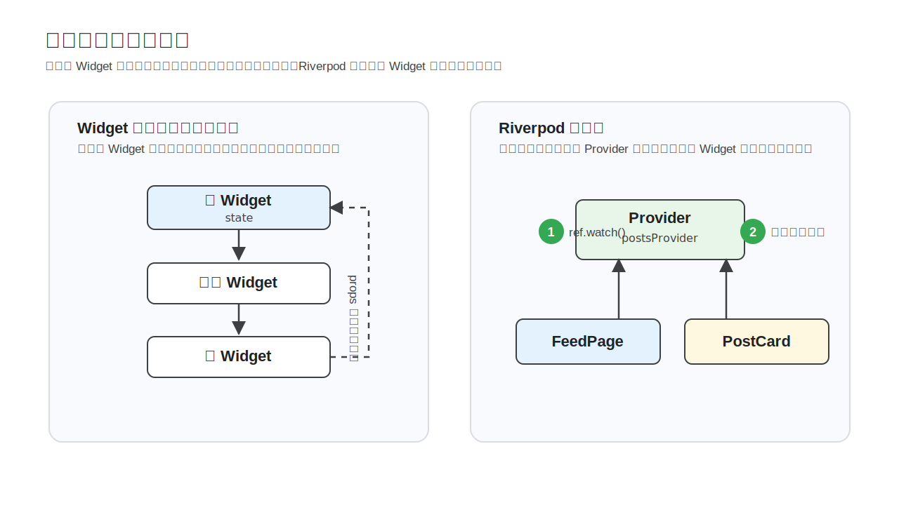
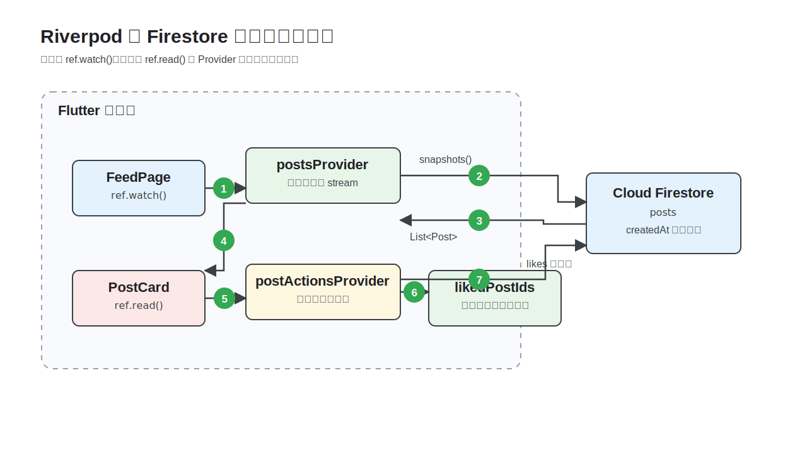
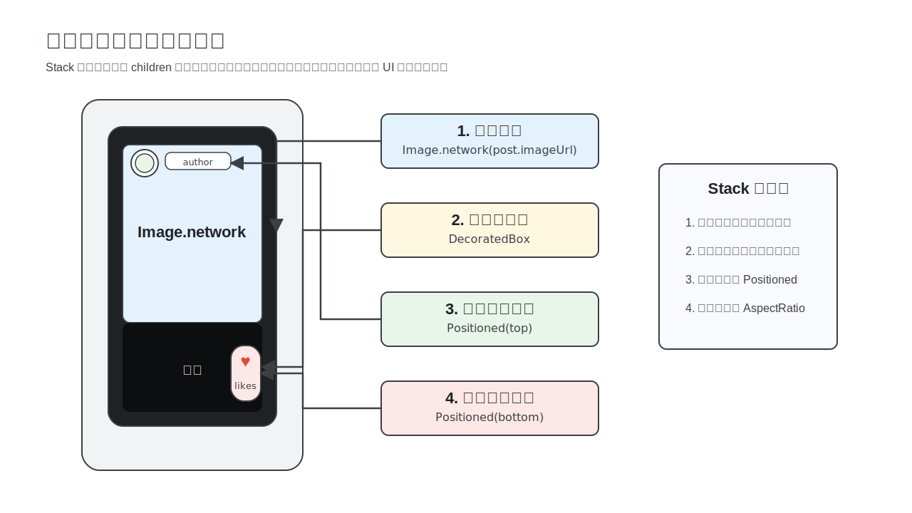

summary: Flutter と Riverpod でミニ SNS フィードを作る 120 分ハンズオン
id: flutter-workshop
categories: Flutter, Dart, Firebase, Web
environments: Web
status: Draft
feedback link: https://github.com/gdsc-osaka/flutter-workshop/issues
author: GDG on Campus University of Osaka

# Flutter でミニ SNS アプリを作ろう

## はじめに
Duration: 0:05:00

このコードラボでは、Flutter と Riverpod を使って、Firestore から投稿をリアルタイム取得するミニ SNS フィードを作ります。テンプレートコードから始めて、3 つの Dart ファイルを編集しながら完成版に近づけます。


### このコードラボで作るもの

縦スクロールで投稿を眺める Web 対応の Flutter アプリを作ります。


完成すると、次の機能を持つフィード画面になります。

* Firestore の `posts` コレクションから投稿を新着順に表示する
* 投稿ごとに画像、ユーザー名、本文、いいね数を表示する
* いいねボタンを押すと画面の状態と Firestore の値を更新する
* Pull to Refresh で投稿リストを再取得する

### このコードラボで学ぶこと

* Flutter の Widget ツリーで画面を構築する方法
* `ConsumerWidget` と `WidgetRef` で Riverpod の値を読む方法
* `StreamProvider` で Firestore のリアルタイム更新を扱う方法
* `AsyncValue.when()` で loading / error / data を出し分ける方法
* `ProviderScope` の override でリストの 1 件分のデータを子 Widget に渡す方法
* `Stack` と `Positioned` で画像の上に UI を重ねる方法

### 必要なもの

* Windows または macOS の PC
* Google Chrome
* Visual Studio Code
* VS Code の Flutter 拡張機能
* Flutter SDK
* Git

このコードラボでは Flutter Web を Chrome で動かします。Android Studio、Android SDK、Xcode、iOS シミュレータ、Android エミュレータは使いません。

### 前提知識

* JavaScript、TypeScript、Java、Kotlin、Swift、C# など、いずれかのプログラミング言語の基本的な理解
* 関数、クラス、配列、非同期処理という言葉を見たことがある程度の理解

### 本編で扱わないこと

* Firebase プロジェクトの作成と初期設定
* 認証、投稿作成、投稿削除
* iOS / Android のネイティブビルド
* Riverpod のコード生成、テスト、アーキテクチャ設計

認証と投稿作成は、本編完了後の Extra ステップで挑戦できます。

### 参考にした公開資料

構成は Google Codelabs の進め方に合わせています。完成像を先に示し、セットアップを独立させ、各ステップで目に見える成果を作る流れにしています。

* [Your first Flutter app](https://codelabs.developers.google.com/codelabs/flutter-codelab-first)
* [Take your Flutter app from boring to beautiful](https://codelabs.developers.google.com/codelabs/flutter-boring-to-beautiful)
* [Get to know Firebase for Flutter](https://firebase.google.com/codelabs/firebase-get-to-know-flutter)
* [Flutter learning pathway](https://docs.flutter.dev/learn/pathway)
* [Install Flutter](https://docs.flutter.dev/install)
* [Set up web development](https://docs.flutter.dev/platform-integration/web/setup)
* [Approaches to state management](https://docs.flutter.dev/data-and-backend/state-mgmt/options)
* [Riverpod Providers](https://riverpod.dev/docs/concepts2/providers)

> **Note:** 2026-05-21 時点で Flutter 公式ドキュメントを確認しています。公式の Install ページでは Flutter 3.44 が公開済みで、VS Code などの Code OSS ベースのエディタを使う Quick start が推奨されています。

## セットアップ (Windows)
Duration: 0:15:00

このステップでは、Windows で Flutter Web を Chrome から起動できる状態を作ります。macOS を使っている場合は、次の「セットアップ (macOS)」へ進んでください。

### コードの場所を確認する

このコードラボでは、テンプレートコードを編集します。詰まったときは完成版のコードと見比べてください。

* テンプレートコード: https://github.com/gdsc-osaka/flutter-workshop
* 完成版のコード: https://github.com/gdsc-osaka/flutter-workshop-example

> **Tip:** まずは手順どおりにテンプレートコードを編集し、詰まったときだけ完成版のコードを参照してください。

### 必要なツールをインストールする

PowerShell を開き、Git、Google Chrome、Visual Studio Code をインストールします。

```powershell
winget install --id Git.Git -e --source winget
winget install --id Google.Chrome -e --source winget
winget install --id Microsoft.VisualStudioCode -e --source winget
```

**期待される出力:**

```text
Successfully installed
```

`winget` が使えない場合は、次の公式サイトからインストーラをダウンロードします。

* [Git for Windows](https://git-scm.com/download/win)
* [Google Chrome](https://www.google.com/chrome/)
* [Visual Studio Code](https://code.visualstudio.com/)

### Flutter SDK をインストールする

Flutter 公式のインストールページでは、VS Code などの Code OSS ベースのエディタからセットアップする Quick start が推奨されています。このコードラボでも VS Code の Flutter 拡張機能から SDK を入れます。

1. VS Code を開きます。
2. 左サイドバーの拡張機能を開きます。
3. `Flutter` を検索し、**Flutter** 拡張機能をインストールします。
4. `Ctrl + Shift + P` で Command Palette を開きます。
5. `Flutter: New Project` を選択します。
6. Flutter SDK が見つからない場合は **Download SDK** を選択します。
7. SDK の保存先として `C:\src` などの短いパスを選びます。

> **Warning:** Flutter SDK は `C:\Program Files` のようにスペースを含むパスに置かないでください。`C:\src\flutter` のような短いパスを使うと、ツールや拡張機能のパス解決でつまずきにくくなります。

インストール後、VS Code と PowerShell を開き直します。

### Flutter Web を確認する

PowerShell で次を実行します。

```powershell
git --version
flutter --version
flutter doctor -v
flutter devices
```

**期待される出力の例:**

```text
git version 2.x.x
Flutter 3.44.x • channel stable
[✓] Chrome - develop for the web
Chrome (web) • chrome • web-javascript • Google Chrome
```

このコードラボでは Chrome で動かすため、`Chrome - develop for the web` にチェックが付き、`flutter devices` に Chrome が表示されていれば進められます。Android toolchain、Android Studio にエラーが出ても、このハンズオンでは無視して構いません。

> **Troubleshooting:** PowerShell で `flutter` コマンドが見つからない場合は、VS Code と PowerShell をすべて閉じて開き直してください。それでも解決しない場合は、Flutter SDK の `bin` フォルダが PATH に追加されているか確認します。

### テンプレートコードを起動する

任意の作業フォルダでテンプレートリポジトリをクローンします。

```powershell
git clone https://github.com/gdsc-osaka/flutter-workshop.git
cd flutter-workshop
flutter pub get
flutter run -d chrome
```

**期待される出力:**

```text
Launching lib/main.dart on Chrome in debug mode
Flutter run key commands
```

Chrome が開いて `TODO: 投稿一覧を表示する` と表示されたら準備完了です。

最後に VS Code でプロジェクトを開きます。

```powershell
code .
```

出力がなければ成功です。

## セットアップ (macOS)
Duration: 0:15:00

このステップでは、macOS で Flutter Web を Chrome から起動できる状態を作ります。Windows でセットアップ済みの場合は、次の「Flutter の画面構造をつかむ」へ進んでください。

### コードの場所を確認する

このコードラボでは、テンプレートコードを編集します。詰まったときは完成版のコードと見比べてください。

* テンプレートコード: https://github.com/gdsc-osaka/flutter-workshop
* 完成版のコード: https://github.com/gdsc-osaka/flutter-workshop-example

> **Tip:** まずは手順どおりにテンプレートコードを編集し、詰まったときだけ完成版のコードを参照してください。

### 必要なツールをインストールする

ターミナルを開き、Xcode Command Line Tools をインストールします。これで `git` などの基本ツールが使えるようになります。

```bash
xcode-select --install
```

**期待される表示:**

```text
xcode-select: note: install requested for command line developer tools
```

すでにインストール済みの場合は、そのまま次へ進んでください。

Google Chrome と Visual Studio Code は公式サイトからインストールします。Homebrew を使っている場合は、次のコマンドでもインストールできます。

```bash
brew install --cask google-chrome visual-studio-code
```

VS Code をターミナルから `code .` で開きたい場合は、VS Code を起動して `Cmd + Shift + P` を押し、`Shell Command: Install 'code' command in PATH` を実行します。

### Flutter SDK をインストールする

Flutter 公式のインストールページでは、VS Code などの Code OSS ベースのエディタからセットアップする Quick start が推奨されています。このコードラボでも VS Code の Flutter 拡張機能から SDK を入れます。

1. VS Code を開きます。
2. 左サイドバーの拡張機能を開きます。
3. `Flutter` を検索し、**Flutter** 拡張機能をインストールします。
4. `Cmd + Shift + P` で Command Palette を開きます。
5. `Flutter: New Project` を選択します。
6. Flutter SDK が見つからない場合は **Download SDK** を選択します。
7. SDK の保存先として `~/development` などの作業用フォルダを選びます。

インストール後、VS Code とターミナルを開き直します。

### Flutter Web を確認する

ターミナルで次を実行します。

```bash
git --version
flutter --version
flutter doctor -v
flutter devices
```

**期待される出力の例:**

```text
git version 2.x.x
Flutter 3.44.x • channel stable
[✓] Chrome - develop for the web
Chrome (web) • chrome • web-javascript • Google Chrome
```

このコードラボでは Chrome で動かすため、`Chrome - develop for the web` にチェックが付き、`flutter devices` に Chrome が表示されていれば進められます。Android toolchain、Xcode、Android Studio にエラーが出ても、このハンズオンでは無視して構いません。

> **Troubleshooting:** ターミナルで `flutter` コマンドが見つからない場合は、VS Code とターミナルをすべて閉じて開き直してください。それでも解決しない場合は、Flutter SDK の `bin` フォルダが PATH に追加されているか確認します。

### テンプレートコードを起動する

任意の作業フォルダでテンプレートリポジトリをクローンします。

```bash
git clone https://github.com/gdsc-osaka/flutter-workshop.git
cd flutter-workshop
flutter pub get
flutter run -d chrome
```

**期待される出力:**

```text
Launching lib/main.dart on Chrome in debug mode
Flutter run key commands
```

Chrome が開いて `TODO: 投稿一覧を表示する` と表示されたら準備完了です。

最後に VS Code でプロジェクトを開きます。

```bash
code .
```

出力がなければ成功です。

## Flutter の画面構造をつかむ
Duration: 0:10:00

このステップでは、実装で使う Flutter / Dart の考え方だけを確認します。詳しい文法を全部覚える必要はありません。

### Flutter は Widget で画面を作る

Flutter は Google が開発しているマルチプラットフォーム UI フレームワークです。Flutter 公式の learning pathway でも、Dart と Flutter の基礎、Widget、状態管理、レイアウトを順に学ぶ構成になっています。

Flutter では、画面の部品を Widget と呼びます。

* 文字は `Text`
* 画像は `Image`
* 縦並びは `Column`
* スクロールリストは `ListView`
* 画面の土台は `Scaffold`



Widget は入れ子になって 1 本のツリーを作ります。親 Widget が `child` または `children` で子 Widget を持ちます。

### Web 開発の知識と対応させる

すでに Web 開発を知っている場合は、次の対応で考えると理解しやすくなります。

| Web | Flutter |
|-----|---------|
| DOM ツリー | Widget ツリー |
| `<div>` / `<button>` | `Container` / `ElevatedButton` |
| CSS の色、余白、角丸 | Widget のプロパティ |
| React の component | Widget |
| React の state / hooks | `StatefulWidget` / Riverpod |
| Vite の HMR | Hot reload |

Flutter のコードでは末尾のカンマをよく使います。Dart formatter が読みやすい形に整えてくれるため、複数行の Widget ではカンマを付けておくと便利です。

### アプリの入口を確認する

`lib/main.dart` と `lib/app.dart` はすでに用意されています。今回は編集しません。

`lib/main.dart` は次の流れでアプリを起動しています。

```dart
Future<void> main() async {
  WidgetsFlutterBinding.ensureInitialized();
  await Firebase.initializeApp(
    options: DefaultFirebaseOptions.currentPlatform,
  );

  runApp(const ProviderScope(child: MiniInstagramApp()));
}
```

`Firebase.initializeApp()` で Firebase を初期化し、`ProviderScope` で Riverpod をアプリ全体から使えるようにしています。

### Hot reload で確認する

`flutter run -d chrome` で起動している間は、ファイル保存後にターミナルで `r` を押すと Hot reload、`R` を押すと Hot restart できます。

```text
r  Hot reload
R  Hot restart
q  Quit
```

表示だけを変えたときは Hot reload、Firebase 初期化や Provider の作りを変えたときは Hot restart を使います。

> **Note:** Flutter Web では開発環境や変更内容によって Hot reload の効き方に差があります。画面が更新されない場合は `R` で Hot restart してください。

## Riverpod と Firestore のデータフローをつかむ
Duration: 0:15:00

このステップでは、今回使う Riverpod の部品を確認します。覚えるのは `ProviderScope`、`Provider`、`StreamProvider`、`NotifierProvider`、`ref.watch`、`ref.read` だけです。

### Riverpod を使う理由

`StatefulWidget` だけで状態を持つと、その状態は基本的に Widget の内側に閉じます。離れた Widget で同じ状態を使いたい場合、親から子へ値を渡し続ける必要があります。



Riverpod では、状態やデータ取得処理を Widget の外に置きます。Widget は必要な Provider を `ref.watch()` で読み、値が変わると自動で再描画されます。

### 今回の Provider を確認する

今回のデータフローは次の形です。



`lib/providers/post_providers.dart` には、すでに次の Provider が用意されています。

```dart
final firestoreProvider = Provider<FirebaseFirestore>((ref) {
  return FirebaseFirestore.instance;
});

final postsProvider = StreamProvider<List<Post>>((ref) {
  // TODO
  return const Stream<List<Post>>.empty();
});

final likedPostIdsProvider = NotifierProvider<LikedPostIds, Set<String>>(
  LikedPostIds.new,
);
```

`postsProvider` はこのあと Firestore の stream に置き換えます。`likedPostIdsProvider` は、いいね済み投稿 ID の集合を管理します。

### ref.watch と ref.read を使い分ける

Widget から Provider を使うときは、表示用と操作用で読み方を分けます。

| やりたいこと | 使う API | 例 |
|--------------|----------|----|
| 画面に表示する値を読む | `ref.watch(provider)` | `final posts = ref.watch(postsProvider);` |
| ボタン押下で処理を呼ぶ | `ref.read(provider)` | `ref.read(postActionsProvider).toggleLike(...);` |

表示は `watch`、操作は `read` と覚えてください。

### AsyncValue を扱う

`StreamProvider<List<Post>>` を `watch` すると、Widget 側には `AsyncValue<List<Post>>` が届きます。`AsyncValue.when()` を使うと、読み込み中、エラー、データありの UI を分けられます。

```dart
final posts = ref.watch(postsProvider);

return posts.when(
  loading: () => const CircularProgressIndicator(),
  error: (error, stackTrace) => Text('エラー: $error'),
  data: (items) => Text('投稿数: ${items.length}'),
);
```

この形を次のステップで `FeedPage` に組み込みます。

## 投稿一覧の状態を分ける
Duration: 0:10:00

このステップでは、`postsProvider` から届く値を `AsyncValue.when()` で `data` / `error` / `loading` に分けます。まずは最小限の表示だけを作り、あとで各状態の UI を整えます。

### 現在の FeedPage を確認する

`lib/feed_page.dart` を開きます。

```dart
class FeedPage extends ConsumerWidget {
  const FeedPage({super.key});

  @override
  Widget build(BuildContext context, WidgetRef ref) {
    // TODO
    ref.watch(postsProvider);

    return const Scaffold(
      body: Center(
        child: Text('TODO: 投稿一覧を表示する'),
      ),
    );
  }
}
```

`postsProvider` を `watch` していますが、まだ画面には使っていません。

### posts.when の形を作る

`lib/feed_page.dart` の `build` メソッドを以下に置き換えます。

```dart
@override
Widget build(BuildContext context, WidgetRef ref) {
  final posts = ref.watch(postsProvider);

  return Scaffold(
    body: posts.when(
      data: (items) {
        return Center(child: Text('投稿数: ${items.length}'));
      },
      error: (error, stackTrace) {
        return Center(child: Text('エラー: $error'));
      },
      loading: () {
        return const Center(child: Text('投稿を読み込んでいます...'));
      },
    ),
  );
}
```

`ref.watch(postsProvider)` の戻り値は `AsyncValue<List<Post>>` です。`when()` を使うと、データ取得の結果ごとに表示する Widget を分けられます。

### loading の表示を確認する

ファイルを保存し、必要に応じてターミナルで `R` を押します。

**期待される表示:**

```text
投稿を読み込んでいます...
```

この時点では `postsProvider` がまだ Firestore に接続されていないため、読み込み中の表示だけが見えます。次のステップで Firestore の stream を返すようにします。

## Firestore から投稿を取得する
Duration: 0:15:00

このステップでは、`postsProvider` を Firestore に接続します。Firestore の `posts` コレクションを購読し、変更があれば画面へリアルタイムに反映します。

### 現在の postsProvider を確認する

`lib/providers/post_providers.dart` を開きます。

```dart
final postsProvider = StreamProvider<List<Post>>((ref) {
  // TODO
  return const Stream<List<Post>>.empty();
});
```

今は空の stream を返しているため、投稿データは届きません。

### Post モデルを確認する

`lib/models/post.dart` には、Firestore のドキュメントをアプリ用の `Post` に変換する処理が用意されています。

| フィールド | 型 | 内容 |
|------------|----|------|
| `id` | `String` | Firestore ドキュメント ID |
| `imageUrl` | `String` | 投稿画像の URL |
| `authorUrl` | `String` | 投稿者アイコンの URL |
| `authorId` | `String` | 投稿者のユーザー名 |
| `text` | `String` | 投稿本文 |
| `likes` | `int` | いいね数 |
| `createdAt` | `DateTime` | 投稿日時 |

`Post.fromDocument()` を使うと、Firestore の `DocumentSnapshot` を `Post` に変換できます。

### Firestore の stream を作る

Firestore から投稿を取得する処理は次の形です。

```dart
final firestore = ref.watch(firestoreProvider);

return firestore
    .collection('posts')
    .orderBy('createdAt', descending: true)
    .snapshots()
    .map((snapshot) {
      return snapshot.docs.map(Post.fromDocument).toList();
    });
```

`collection('posts')` でコレクションを選び、`orderBy('createdAt', descending: true)` で新着順に並べます。`snapshots()` は Firestore の変更を stream として返します。

### postsProvider を実装する

`lib/providers/post_providers.dart` の `postsProvider` だけを以下に置き換えます。

```dart
final postsProvider = StreamProvider<List<Post>>((ref) {
  final firestore = ref.watch(firestoreProvider);

  return firestore
      .collection('posts')
      .orderBy('createdAt', descending: true)
      .snapshots()
      .map((snapshot) {
        return snapshot.docs.map(Post.fromDocument).toList();
      });
});
```

この Provider は `List<Post>` の stream を返します。Firestore のデータが増えたり、いいね数が変わったりすると、`FeedPage` が再描画されます。

### 投稿データを確認する

ファイルを保存し、ターミナルで `R` を押して Hot restart します。

**期待される表示:**

```text
投稿数: 3
```

Firestore に `posts` データがある場合は、件数が表示されます。ここではまだリスト UI を作っていないため、投稿カードは表示されません。

> **Troubleshooting:** Firestore の権限エラーが表示される場合は、配布された Firebase 設定と Firestore ルールがハンズオン用のものになっているか確認してください。このコードラボでは Firebase プロジェクトの作成やルール変更は扱いません。

## 投稿一覧を表示する
Duration: 0:15:00

このステップでは、`posts.when(data: ...)` に渡す UI を作ります。投稿数のテキスト表示から、縦スクロールのリスト表示へ変えます。

### PostCard を import する

`lib/feed_page.dart` の import に `PostCard` を追加します。

```dart
import 'widgets/post_card.dart';
```

この import により、`FeedPage` から `PostCard` と `currentPostProvider` を使えるようになります。

### data の UI をリストにする

`lib/feed_page.dart` の `posts.when(data: ...)` の中身を以下に置き換えます。

```dart
data: (items) {
  if (items.isEmpty) {
    return const _EmptyFeed();
  }

  return RefreshIndicator(
    onRefresh: () async {
      ref.invalidate(postsProvider);
    },
    child: ListView.builder(
      padding: EdgeInsets.zero,
      itemCount: items.length,
      itemBuilder: (context, index) {
        return ProviderScope(
          overrides: [
            currentPostProvider.overrideWithValue(items[index]),
          ],
          child: const PostCard(),
        );
      },
    ),
  );
},
```

`ListView.builder` で投稿の数だけ `PostCard` を作ります。1 件分の投稿は `ProviderScope` の `overrides` で `currentPostProvider` に渡します。

### 空状態の UI を追加する

`lib/feed_page.dart` の `FeedPage` クラスの下に、空状態用の Widget を追加します。

```dart
class _EmptyFeed extends StatelessWidget {
  const _EmptyFeed();

  @override
  Widget build(BuildContext context) {
    return const Center(
      child: Padding(
        padding: EdgeInsets.all(24),
        child: Text(
          '投稿がまだありません。Firestore に posts データを追加してください。',
          textAlign: TextAlign.center,
        ),
      ),
    );
  }
}
```

Firestore に投稿がない場合は、真っ白な画面ではなく次に何を確認すればよいかを表示します。

### error の UI を整える

`lib/feed_page.dart` の `posts.when(error: ...)` の中身を以下に置き換えます。

```dart
error: (error, stackTrace) {
  return _ErrorView(message: error.toString());
},
```

> **Tip:** ここでの `error` は発生した例外オブジェクト、`stackTrace` はその例外がどこから発生したかを示す呼び出し経路です。画面には `error.toString()` のような短い情報を表示し、`stackTrace` はログや Crashlytics などの調査用に使います。

`lib/feed_page.dart` の `_EmptyFeed` クラスの下に、エラー表示用の Widget を追加します。

```dart
class _ErrorView extends StatelessWidget {
  const _ErrorView({required this.message});

  final String message;

  @override
  Widget build(BuildContext context) {
    return Center(
      child: Padding(
        padding: const EdgeInsets.all(24),
        child: Column(
          mainAxisSize: MainAxisSize.min,
          children: [
            Icon(
              Icons.cloud_off_outlined,
              size: 40,
              color: Theme.of(context).colorScheme.error,
            ),
            const SizedBox(height: 12),
            const Text(
              'Firestore から投稿を読み込めませんでした。',
              textAlign: TextAlign.center,
            ),
            const SizedBox(height: 8),
            Text(
              message,
              textAlign: TextAlign.center,
              style: Theme.of(context).textTheme.bodySmall,
            ),
          ],
        ),
      ),
    );
  }
}
```

この Widget は、エラーの概要と実際のメッセージを分けて表示します。

### loading の UI を整える

`lib/feed_page.dart` の `posts.when(loading: ...)` の中身を以下に置き換えます。

```dart
loading: () {
  return const Center(child: CircularProgressIndicator());
},
```

読み込み中はテキストではなく、Flutter 標準のインジケータを表示します。

### 投稿一覧を確認する

ファイルを保存し、必要に応じて `R` を押して Hot restart します。

**期待される表示:**

* Firestore に `posts` データがある場合は、縦長のプレースホルダーが投稿数分表示される
* `PostCard` はまだ未実装なので、各カードには `TODO: 投稿カードを作る` と表示される
* Pull to Refresh してもエラーにならない

## 投稿画像を表示する
Duration: 0:10:00

このステップでは、`PostCard` で投稿データを読み、まずは投稿画像だけを表示します。投稿一覧の各プレースホルダーが画像に変わるところを確認します。

### 現在の PostCard を確認する

`lib/widgets/post_card.dart` を開きます。

```dart
class PostCard extends ConsumerWidget {
  const PostCard({super.key});

  @override
  Widget build(BuildContext context, WidgetRef ref) {
    // TODO
    ref.watch(currentPostProvider);

    return const AspectRatio(
      aspectRatio: 9 / 16,
      child: ColoredBox(
        color: Color(0xFF1D1D21),
        child: Center(
          child: Text('TODO: 投稿カードを作る'),
        ),
      ),
    );
  }
}
```

`currentPostProvider` を `watch` していますが、まだ投稿データを表示していません。

### 投稿データを読む

`lib/widgets/post_card.dart` の `build` メソッドを以下に置き換えます。

```dart
@override
Widget build(BuildContext context, WidgetRef ref) {
  final post = ref.watch(currentPostProvider);

  return AspectRatio(
    aspectRatio: 9 / 16,
    child: Image.network(
      post.imageUrl,
      fit: BoxFit.cover,
      loadingBuilder: (context, child, loadingProgress) {
        if (loadingProgress == null) {
          return child;
        }

        return const Center(child: CircularProgressIndicator());
      },
      errorBuilder: (context, error, stackTrace) {
        return const ColoredBox(
          color: Color(0xFF1D1D21),
          child: Center(
            child: Icon(Icons.broken_image_outlined, size: 48),
          ),
        );
      },
    ),
  );
}
```

`currentPostProvider` から投稿 1 件分の `Post` を読み、`Image.network` で `post.imageUrl` を表示します。画像読み込み中と失敗時の表示もここで用意します。

### 画像表示を確認する

ファイルを保存し、必要に応じて `R` を押して Hot restart します。

**期待される表示:**

* 投稿カードの黒いプレースホルダーが画像に変わる
* 画像 URL が壊れている投稿では、壊れた画像アイコンが表示される
* 本文、ユーザー名、いいねボタンはまだ表示されない

## 投稿本文を重ねる
Duration: 0:10:00

このステップでは、画像の上に本文を重ねます。`Stack` と `Positioned` を使うと、背景画像の上に UI を配置できます。

### Stack の構造を確認する

カードは `Stack` で作ります。背景画像を一番下に置き、その上にグラデーション、本文、いいねボタン、ユーザー情報を重ねます。



`AspectRatio(aspectRatio: 9 / 16)` で縦長の投稿カードにします。

### グラデーションと本文を追加する

`lib/widgets/post_card.dart` の `build` メソッドを以下に置き換えます。

```dart
@override
Widget build(BuildContext context, WidgetRef ref) {
  final post = ref.watch(currentPostProvider);

  return AspectRatio(
    aspectRatio: 9 / 16,
    child: Stack(
      fit: StackFit.expand,
      children: [
        Image.network(
          post.imageUrl,
          fit: BoxFit.cover,
          loadingBuilder: (context, child, loadingProgress) {
            if (loadingProgress == null) {
              return child;
            }

            return const Center(child: CircularProgressIndicator());
          },
          errorBuilder: (context, error, stackTrace) {
            return const ColoredBox(
              color: Color(0xFF1D1D21),
              child: Center(
                child: Icon(Icons.broken_image_outlined, size: 48),
              ),
            );
          },
        ),
        const DecoratedBox(
          decoration: BoxDecoration(
            gradient: LinearGradient(
              begin: Alignment.topCenter,
              end: Alignment.bottomCenter,
              colors: [
                Colors.transparent,
                Colors.transparent,
                Color(0xB0000000),
              ],
            ),
          ),
        ),
        Positioned(
          left: 16,
          right: 80,
          bottom: 28,
          child: Text(
            post.text,
            maxLines: 3,
            overflow: TextOverflow.ellipsis,
            style: Theme.of(context).textTheme.bodyLarge?.copyWith(
              color: Colors.white,
              fontWeight: FontWeight.w600,
              shadows: const [Shadow(color: Colors.black87, blurRadius: 8)],
            ),
          ),
        ),
      ],
    ),
  );
}
```

`DecoratedBox` のグラデーションで画像の下側を暗くし、その上に `Positioned` で本文を置きます。

### 本文表示を確認する

ファイルを保存し、必要に応じて `R` を押して Hot restart します。

**期待される表示:**

* 投稿画像の下側に本文が表示される
* 長い本文は 3 行で省略される
* ユーザー名といいねボタンはまだ表示されない

## いいねと投稿者情報を追加する
Duration: 0:10:00

このステップでは、投稿カードを完成させます。画像と本文の上に、投稿者情報といいねボタンを追加します。

### post_providers を import する

`lib/widgets/post_card.dart` の import に `post_providers.dart` を追加します。

```dart
import '../providers/post_providers.dart';
```

`likedPostIdsProvider` と `postActionsProvider` を使うための import です。

### いいね状態を読む

`lib/widgets/post_card.dart` の `build` メソッドで、`final post = ref.watch(currentPostProvider);` の下に次の 2 行を追加します。

```dart
final likedPostIds = ref.watch(likedPostIdsProvider);
final isLiked = likedPostIds.contains(post.id);
```

いいね済みかどうかは、いいね済み投稿 ID の集合に `post.id` が含まれているかで判断します。

### いいねボタンを追加する

`Stack` の `children` に、本文の `Positioned` より前または後に次の Widget を追加します。

```dart
Positioned(
  right: 8,
  bottom: 20,
  child: Column(
    mainAxisSize: MainAxisSize.min,
    children: [
      IconButton.filledTonal(
        tooltip: isLiked ? 'いいねを取り消す' : 'いいね',
        onPressed: () async {
          await ref
              .read(postActionsProvider)
              .toggleLike(post, isLiked: isLiked);
        },
        icon: Icon(
          isLiked ? Icons.favorite : Icons.favorite_border,
          color: isLiked ? Colors.pinkAccent : Colors.white,
        ),
      ),
      Text(
        '${post.likes}',
        style: const TextStyle(
          color: Colors.white,
          fontWeight: FontWeight.w700,
          shadows: [Shadow(color: Colors.black54, blurRadius: 8)],
        ),
      ),
    ],
  ),
),
```

ボタンを押したときは `postActionsProvider` を `read` して、Firestore の `likes` を更新します。表示に使う値は `watch`、操作を呼び出す Provider は `read` と使い分けます。

### 投稿者情報を追加する

`Stack` の `children` の最後に、投稿者情報の Widget を追加します。

```dart
Positioned(
  top: 12,
  left: 12,
  right: 12,
  child: SafeArea(
    bottom: false,
    child: Row(
      children: [
        CircleAvatar(
          radius: 17,
          backgroundColor: Colors.white,
          child: CircleAvatar(
            radius: 15,
            backgroundColor: const Color(0xFF2A2A2E),
            backgroundImage: post.authorUrl.isEmpty
                ? null
                : NetworkImage(post.authorUrl),
            child: post.authorUrl.isEmpty
                ? const Icon(
                    Icons.person,
                    color: Colors.white,
                    size: 18,
                  )
                : null,
          ),
        ),
        const SizedBox(width: 10),
        Text(
          post.authorId,
          maxLines: 1,
          overflow: TextOverflow.ellipsis,
          style: const TextStyle(
            color: Colors.white,
            fontWeight: FontWeight.w700,
            shadows: [Shadow(color: Colors.black54, blurRadius: 8)],
          ),
        ),
      ],
    ),
  ),
),
```

`SafeArea` を使うと、スマートフォンのノッチやステータスバーに近い位置でも UI が隠れにくくなります。

### いいねを確認する

ファイルを保存し、必要に応じて `R` を押して Hot restart します。

**期待される表示:**

* 投稿画像、ユーザー名、本文、いいね数が表示される
* いいねボタンを押すとハートの見た目が変わる
* Firestore の `likes` が更新され、しばらくすると画面にも反映される

> **Troubleshooting:** 画像が表示されない場合は、Firestore の `imageUrl` が空でないか、ブラウザから直接開ける URL かを確認してください。

## おめでとうございます！
Duration: 0:05:00

このコードラボでは、Flutter Web でミニ SNS フィードを作りました。

### 動作を確認する

ターミナルで起動していない場合は、プロジェクトのルートで次を実行します。

```bash
flutter run -d chrome
```

**期待される出力:**

```text
Launching lib/main.dart on Chrome in debug mode
Flutter run key commands
```

Chrome で次の動作を確認します。

* 投稿が新着順に縦スクロールで表示される
* Pull to Refresh してもエラーにならない
* いいねボタンを押すとハート表示が切り替わる
* 画像 URL が壊れている投稿では、壊れた画像アイコンが表示される

### 学んだこと

* Flutter の Widget ツリーで画面を構築する方法
* `ConsumerWidget` と `WidgetRef` で Riverpod の値を読む方法
* `StreamProvider` で Firestore のリアルタイム更新を扱う方法
* `AsyncValue.when()` で loading / error / data を出し分ける方法
* `ProviderScope` の override でリストの 1 件分のデータを子 Widget に渡す方法
* `Stack` と `Positioned` で画像の上に UI を重ねる方法

### 余裕があれば改善する

時間が残ったら、この後の Extra ステップに挑戦してください。短い改善から始める場合は、次のどれかを選びます。

* 投稿本文の文字サイズや影を調整する
* いいねボタンの位置や色を変える
* `createdAt` を使って投稿時間を表示する
* 空状態の画面をより親切にする

### 次のステップ

* 完成版のコード: https://github.com/gdsc-osaka/flutter-workshop-example
* Flutter の学習パス: https://docs.flutter.dev/learn/pathway
* Flutter の状態管理: https://docs.flutter.dev/data-and-backend/state-mgmt/options
* Riverpod の Provider: https://riverpod.dev/docs/concepts2/providers

詰まったところ、改善したところ、気づいたことを Discord `#260521-flutter-workshop` に共有してください。

## Extra: ログイン機能を追加する
Duration: 0:25:00

この Extra では、Firebase Authentication の匿名ログインを使って、アプリに「ログインしてからフィードを見る」流れを追加します。メールアドレスやパスワードを扱わず、まずはユーザー ID を持てる状態にします。

### ゴールを確認する

このステップで目指す状態は次のとおりです。

* 未ログインならログイン画面を表示する
* **匿名でログイン** ボタンを押すとフィード画面へ進む
* Firebase Auth の `uid` を投稿者 ID として使えるようにする
* ログアウトできる余地を残す

> **Note:** Firebase Authentication の匿名ログインを使うには、Firebase Console の Authentication で Anonymous プロバイダを有効にします。短時間に大量の匿名アカウントを作ると制限されることがあります。

### firebase_auth を追加する

プロジェクトのルートで次を実行します。

```bash
flutter pub add firebase_auth
```

**期待される出力:**

```text
Changed 1 dependency!
```

`pubspec.yaml` に `firebase_auth` が追加されていれば成功です。

### Auth 用の Provider を作る

`lib/providers/auth_providers.dart` を新規作成します。

```dart
import 'package:firebase_auth/firebase_auth.dart';
import 'package:flutter_riverpod/flutter_riverpod.dart';

final firebaseAuthProvider = Provider<FirebaseAuth>((ref) {
  return FirebaseAuth.instance;
});

final authStateProvider = StreamProvider<User?>((ref) {
  return ref.watch(firebaseAuthProvider).authStateChanges();
});

final authActionsProvider = Provider<AuthActions>((ref) {
  return AuthActions(ref.watch(firebaseAuthProvider));
});

class AuthActions {
  const AuthActions(this._auth);

  final FirebaseAuth _auth;

  Future<void> signInAnonymously() async {
    await _auth.signInAnonymously();
  }

  Future<void> signOut() async {
    await _auth.signOut();
  }
}
```

`authStateProvider` はログイン状態の stream を返します。ログインすると `User` が届き、ログアウトすると `null` が届きます。

### AuthGate を作る

`lib/auth_gate.dart` を新規作成します。

```dart
import 'package:flutter/material.dart';
import 'package:flutter_riverpod/flutter_riverpod.dart';

import 'feed_page.dart';
import 'providers/auth_providers.dart';

class AuthGate extends ConsumerWidget {
  const AuthGate({super.key});

  @override
  Widget build(BuildContext context, WidgetRef ref) {
    final authState = ref.watch(authStateProvider);

    return authState.when(
      data: (user) {
        if (user == null) {
          return const _SignInView();
        }

        return const FeedPage();
      },
      error: (error, stackTrace) {
        return Scaffold(
          body: Center(
            child: Text('ログイン状態を確認できませんでした: $error'),
          ),
        );
      },
      loading: () {
        return const Scaffold(
          body: Center(child: CircularProgressIndicator()),
        );
      },
    );
  }
}

class _SignInView extends ConsumerWidget {
  const _SignInView();

  @override
  Widget build(BuildContext context, WidgetRef ref) {
    return Scaffold(
      body: Center(
        child: FilledButton.icon(
          onPressed: () async {
            await ref.read(authActionsProvider).signInAnonymously();
          },
          icon: const Icon(Icons.login),
          label: const Text('匿名でログイン'),
        ),
      ),
    );
  }
}
```

`AuthGate` はログイン状態に応じて、ログイン画面か `FeedPage` を出し分けます。

### アプリの入口を差し替える

`lib/app.dart` に `AuthGate` を import します。

```dart
import 'auth_gate.dart';
```

`MaterialApp` の `home` を次のように変更します。

```dart
home: const AuthGate(),
```

これでアプリ起動時に、ログイン状態を見てから画面を選ぶようになります。

### ログインを確認する

Hot restart して、Chrome で動作を確認します。

**期待される表示:**

* 未ログイン時は **匿名でログイン** ボタンが表示される
* ボタンを押すとフィード画面へ遷移する
* Firebase Console の Authentication に匿名ユーザーが作成される

## Extra: 投稿機能を追加する
Duration: 0:30:00

この Extra では、画像 URL と本文を入力して新しい投稿を Firestore に追加します。まずは画像アップロードではなく、画像 URL を貼り付ける最小構成にします。

### ゴールを確認する

このステップで目指す状態は次のとおりです。

* フィード画面から投稿作成画面を開く
* 画像 URL と本文を入力して投稿する
* Firestore の `posts` コレクションに新しいドキュメントを追加する
* 投稿後、`postsProvider` の stream によってフィードの先頭に反映される

> **Tip:** この Extra はログイン機能の後に進めます。Firebase Auth の `uid` を `authorId` として使うと、誰が投稿したかを Firestore に残せます。

### createPost を追加する

`lib/providers/post_providers.dart` の `PostActions` にメソッドを追加します。

```dart
Future<void> createPost({
  required String authorId,
  required String imageUrl,
  required String text,
});
```

次に、`FirestorePostActions` に実装を追加します。

```dart
@override
Future<void> createPost({
  required String authorId,
  required String imageUrl,
  required String text,
}) async {
  await _firestore.collection('posts').add({
    'authorId': authorId,
    'authorUrl': '',
    'imageUrl': imageUrl,
    'text': text,
    'likes': 0,
    'createdAt': FieldValue.serverTimestamp(),
  });
}
```

Cloud Firestore の `add()` は、コレクションに自動 ID のドキュメントを追加します。`createdAt` にはサーバー時刻を入れるため、ユーザーの端末時刻に依存しません。

### 投稿作成画面を作る

`lib/create_post_page.dart` を新規作成します。

```dart
import 'package:flutter/material.dart';
import 'package:flutter_riverpod/flutter_riverpod.dart';

import 'providers/auth_providers.dart';
import 'providers/post_providers.dart';

class CreatePostPage extends ConsumerStatefulWidget {
  const CreatePostPage({super.key});

  @override
  ConsumerState<CreatePostPage> createState() => _CreatePostPageState();
}

class _CreatePostPageState extends ConsumerState<CreatePostPage> {
  final _imageUrlController = TextEditingController();
  final _textController = TextEditingController();
  bool _isSaving = false;

  @override
  void dispose() {
    _imageUrlController.dispose();
    _textController.dispose();
    super.dispose();
  }

  Future<void> _submit() async {
    final imageUrl = _imageUrlController.text.trim();
    final text = _textController.text.trim();

    if (imageUrl.isEmpty || text.isEmpty) {
      return;
    }

    setState(() {
      _isSaving = true;
    });

    try {
      final user = ref.read(authStateProvider).value;
      await ref.read(postActionsProvider).createPost(
            authorId: user?.uid ?? 'anonymous_user',
            imageUrl: imageUrl,
            text: text,
          );

      if (!mounted) {
        return;
      }

      Navigator.of(context).pop();
    } catch (error) {
      if (!mounted) {
        return;
      }

      ScaffoldMessenger.of(context).showSnackBar(
        SnackBar(content: Text('投稿に失敗しました: $error')),
      );
    } finally {
      if (mounted) {
        setState(() {
          _isSaving = false;
        });
      }
    }
  }

  @override
  Widget build(BuildContext context) {
    return Scaffold(
      appBar: AppBar(title: const Text('投稿を作成')),
      body: ListView(
        padding: const EdgeInsets.all(16),
        children: [
          TextField(
            controller: _imageUrlController,
            decoration: const InputDecoration(
              labelText: '画像 URL',
              border: OutlineInputBorder(),
            ),
          ),
          const SizedBox(height: 12),
          TextField(
            controller: _textController,
            maxLines: 4,
            decoration: const InputDecoration(
              labelText: '本文',
              border: OutlineInputBorder(),
            ),
          ),
          const SizedBox(height: 16),
          FilledButton.icon(
            onPressed: _isSaving ? null : _submit,
            icon: _isSaving
                ? const SizedBox.square(
                    dimension: 18,
                    child: CircularProgressIndicator(strokeWidth: 2),
                  )
                : const Icon(Icons.send),
            label: const Text('投稿する'),
          ),
        ],
      ),
    );
  }
}
```

この画面では、入力された画像 URL と本文を `postActionsProvider` 経由で Firestore に保存します。

### FeedPage から開けるようにする

`lib/feed_page.dart` に投稿作成画面を import します。

```dart
import 'create_post_page.dart';
```

`Scaffold` に `floatingActionButton` を追加します。

```dart
floatingActionButton: FloatingActionButton(
  onPressed: () {
    Navigator.of(context).push(
      MaterialPageRoute<void>(
        builder: (context) => const CreatePostPage(),
      ),
    );
  },
  child: const Icon(Icons.add),
),
```

`Scaffold` には `body` と同じ階層で `floatingActionButton` を渡します。

### 投稿を確認する

アプリを Hot restart し、`+` ボタンから投稿を作成します。

**期待される表示:**

* 投稿作成画面で画像 URL と本文を入力できる
* **投稿する** を押すとフィードに戻る
* 新しい投稿がフィードの先頭に表示される
* Firebase Console の Firestore に新しい `posts` ドキュメントが追加される

## Extra: 投稿時刻を表示する
Duration: 0:10:00

この Extra では、投稿カードに `createdAt` を表示します。Firestore の `createdAt` を UI に出すと、フィードが新着順で並んでいることを確認しやすくなります。

### 時刻表示用の関数を追加する

`lib/widgets/post_card.dart` の末尾に関数を追加します。

```dart
String formatCreatedAt(DateTime value) {
  final now = DateTime.now();
  final difference = now.difference(value);

  if (difference.inMinutes < 1) {
    return 'たった今';
  }

  if (difference.inHours < 1) {
    return '${difference.inMinutes}分前';
  }

  if (difference.inDays < 1) {
    return '${difference.inHours}時間前';
  }

  return '${difference.inDays}日前';
}
```

`intl` などの追加パッケージを使わず、相対時間を簡単に表示する関数です。

### 投稿者情報の横に表示する

投稿者名の `Text(post.authorId, ...)` の近くに、時刻表示を追加します。

```dart
Text(
  formatCreatedAt(post.createdAt),
  maxLines: 1,
  overflow: TextOverflow.ellipsis,
  style: const TextStyle(
    color: Colors.white70,
    fontWeight: FontWeight.w500,
    shadows: [Shadow(color: Colors.black54, blurRadius: 8)],
  ),
),
```

表示位置は、投稿者名の右側でも下でも構いません。画面幅が狭い場合は `Column` にして、投稿者名の下に時刻を置くと崩れにくくなります。

### 表示を確認する

Hot reload して投稿カードを確認します。

**期待される表示:**

* 投稿者名の近くに `たった今`、`5分前`、`2時間前` のような表示が出る
* 古い投稿ほど大きい時間差が表示される
* 投稿本文やいいねボタンと重ならない
