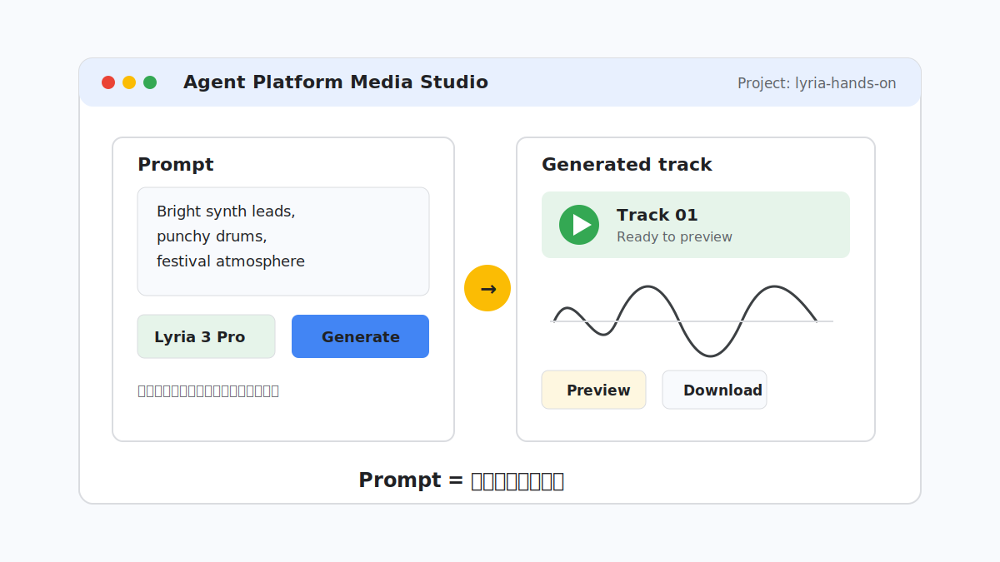
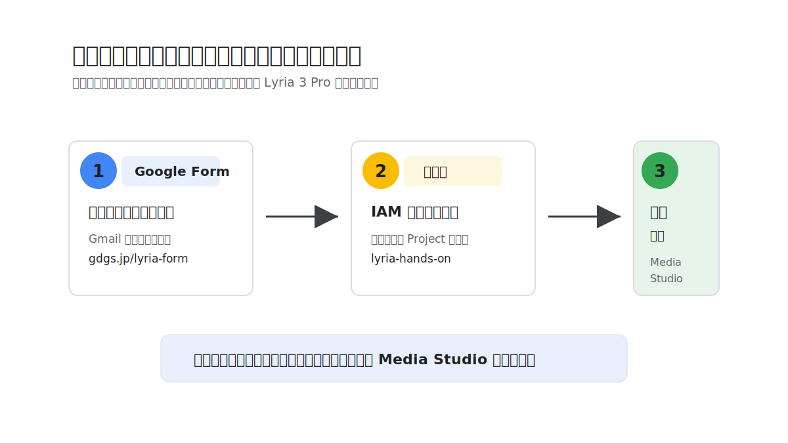
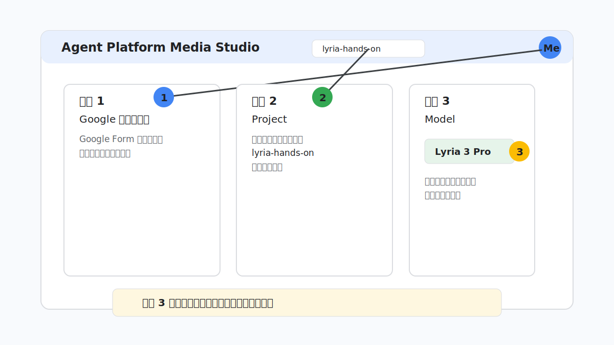
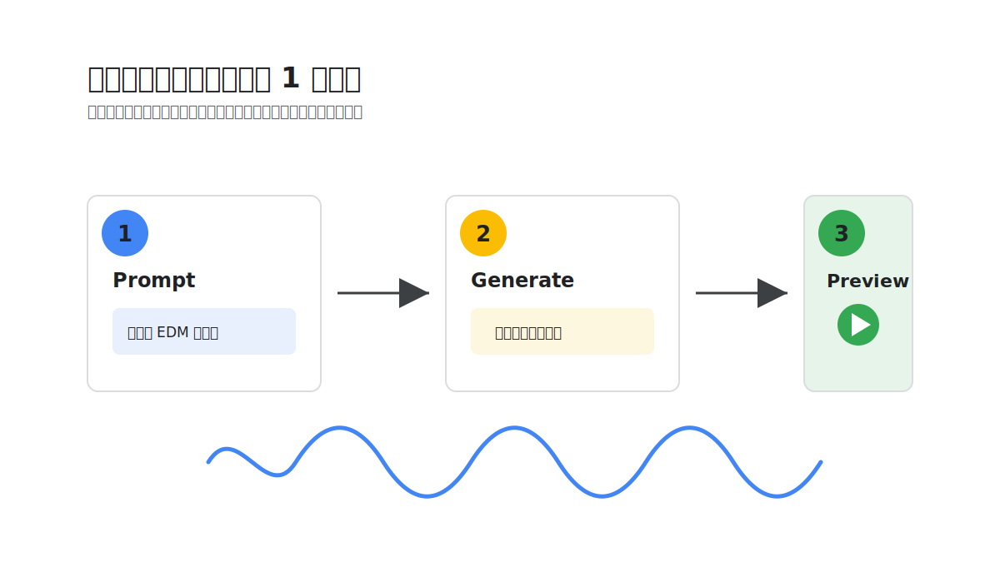
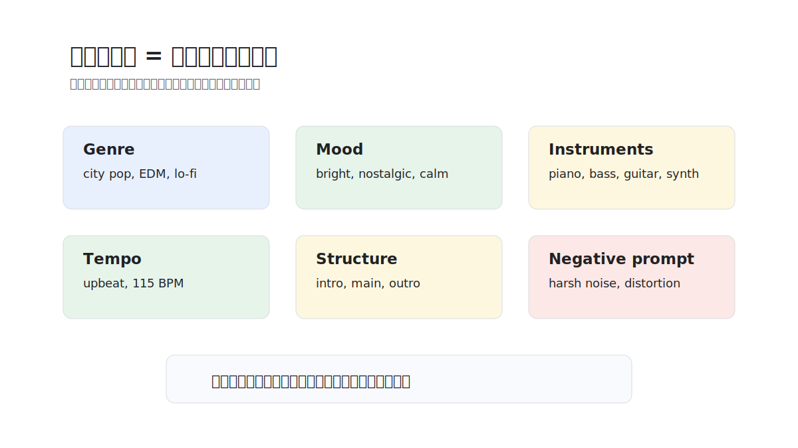
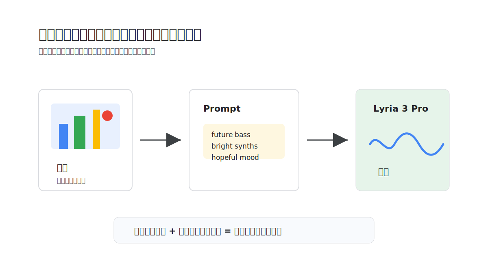

summary: Lyria 3 Pro と Media Studio で音楽生成を体験する 15 分ハンズオン
id: try-lyria
categories: AI, Google Cloud, Lyria
environments: Web
status: Draft
feedback link: https://github.com/gdsc-osaka/education/issues
author: GDG on Campus University of Osaka

# Lyria 3 Pro で音楽生成を体験しよう

## はじめに
Duration: 0:01:00

このコードラボでは、プログラミングや音楽制作の経験がない方を対象に、ブラウザだけで Lyria 3 Pro による音楽生成を体験します。



### このコードラボで作るもの

Google Cloud の Agent Platform Media Studio を使って、テキストや画像から短い音楽を生成します。最初は短い説明で作り、その後にジャンル、雰囲気、楽器、テンポなどを足して、生成結果がどう変わるかを聴き比べます。

### このコードラボで学ぶこと

- Media Studio を開いて Lyria 3 Pro を選択する方法
- 短いテキストプロンプトから音楽を生成する方法
- ジャンル、雰囲気、楽器、テンポを指定して生成結果を調整する方法
- Negative prompt で避けたい要素を伝える方法
- 画像とテキストを組み合わせて曲の方向性を伝える方法

### 必要なもの

- インターネットに接続された PC
- Google Chrome などの Web ブラウザ
- Google Cloud にログインする Google アカウント
- 音を聴くためのイヤホンまたはスピーカー

### このコードラボで扱わないこと

- Google Cloud プロジェクトの作成
- 課金設定や IAM の詳しい説明
- API、Python、ターミナルを使った生成
- 音楽理論や作曲ソフトの使い方

> **補足:** 参加者は、運営側が用意した課金有効済みの Google Cloud プロジェクトを使います。自分の Google Cloud プロジェクトでは作業しません。

## Google Form でメールアドレスを登録する
Duration: 0:02:00

このステップは、まだ参加用メールアドレスを登録していない方だけが行います。すでに登録済みの方は、次のステップへ進んでください。



### 登録が必要な理由

Media Studio で Lyria 3 Pro を使うには、運営側が用意した Google Cloud プロジェクト `lyria-hands-on` に、参加者の Google アカウントを IAM ユーザーとして追加する必要があります。

### フォームに回答する

下のボタンから Google Form を開き、Google Cloud にログインする Gmail アドレスを入力して送信します。

<button>
  [参加用 Google Form を開く](https://gdgs.jp/lyria-form)
</button>

フォーム送信後、運営スタッフがアカウントを登録します。登録が終わるまで、Media Studio にアクセスできない場合があります。

> **Warning:** 必ず、これから Google Cloud Console にログインするアカウントのメールアドレスを入力してください。別のアカウントを入力すると、プロジェクトが見えません。

### 登録完了を待つ

フォームを送信したら、メンターまたは運営スタッフに声をかけてください。登録完了の案内を受けてから、次のステップへ進みます。

## Media Studio を開く
Duration: 0:03:00

このステップでは、Media Studio を開き、利用するアカウント、プロジェクト、モデルを確認します。



### Media Studio の URL を開く

下のボタンから、イベント用プロジェクトを指定した Media Studio を開きます。

<button>
  [Media Studio を開く](https://console.cloud.google.com/agent-platform/studio/media/music?project=lyria-hands-on)
</button>

画面が開いたら、右上のアカウントアイコンを確認します。Google Form に登録したアカウントでログインしていることを確認してください。

### プロジェクトを確認する

画面上部のプロジェクト選択欄で、プロジェクトが `lyria-hands-on` になっていることを確認します。

別のプロジェクトが表示されている場合は、プロジェクト選択欄を開き、`lyria-hands-on` を選びます。

> **Warning:** このハンズオンでは、必ず `lyria-hands-on` プロジェクトを使います。自分のプロジェクトに切り替えて生成しないでください。

### Lyria 3 Pro を選ぶ

音楽生成の画面で、モデルとして `Lyria 3 Pro` を選択します。すでに選ばれている場合は、そのままで構いません。

### 困ったときの見分け方

| 症状 | よくある原因 | 対応 |
| --- | --- | --- |
| プロジェクトが見えない | メールアドレス未登録、または別アカウントでログインしている | アカウントを切り替える、またはメンターに声をかける |
| 権限エラーが出る | IAM 登録がまだ反映されていない | メンターに画面を見せる |
| Lyria 3 Pro が見えない | 画面やモデル選択欄が更新されている | ページを再読み込みし、メンターに確認する |

## テキストから最初の曲を作る
Duration: 0:03:00

このステップでは、短いテキストだけで最初の曲を生成します。まずは細かく考えすぎず、1 回作って再生することを目標にします。



### 短いプロンプトを入力する

プロンプト入力欄に、次の英文を貼り付けます。

```text
Energetic electronic dance music with bright synth leads, punchy drums, and a cheerful festival atmosphere. Clean mix, upbeat rhythm.
```

このプロンプトは、「明るいシンセ」「力強いドラム」「フェスのような雰囲気」を Lyria に伝えています。

### 生成して再生する

生成ボタンを押し、結果が表示されるまで待ちます。生成が完了したら、再生ボタンを押して音を確認します。

**期待される結果:**

音楽プレイヤーのような表示が出て、生成された曲を再生できます。最初の生成では、思った通りでなくても問題ありません。

### できた曲を言葉にする

再生したら、次の 3 点を心の中で確認します。

- 明るいか、暗いか
- 速いか、ゆっくりか
- どんな楽器が目立つか

このあと、これらの要素をプロンプトで調整します。

## プロンプトを音楽の指示書にする
Duration: 0:03:00

このステップでは、短いプロンプトを「音楽の制作指示書」に変えて、生成結果をコントロールします。



### 短すぎるプロンプトを確認する

たとえば、次のようなプロンプトでも音楽は生成できます。

```text
Cool pop music.
```

ただし、これだけでは「どんな pop なのか」「どんな楽器なのか」「速さはどれくらいか」が Lyria に伝わりにくくなります。

### 指示を具体的にする

同じ pop でも、次のように要素を分けて書くと、曲の方向性を伝えやすくなります。

```text
Modern city pop with nostalgic 80s synth textures.
Mood: bright, nostalgic, and relaxed.
Instruments: warm electric piano, slap bass, clean guitar, and disco-inspired drums.
Tempo: upbeat, around 115 BPM.
Structure: short intro, catchy main section, gentle outro.
Production: clean mix with soft reverb.
```

このプロンプトでは、ジャンル、雰囲気、楽器、テンポ、構成、音作りを分けて指定しています。

### 避けたい要素を書く

画面に Negative prompt の入力欄がある場合は、避けたい要素を書きます。

```text
harsh noise, aggressive distortion, sudden volume changes
```

Negative prompt は「入れてほしくないもの」を伝える欄です。最初は短く、明確な言葉だけを書くのがおすすめです。

### 聴き比べる

生成した曲を聴き、短いプロンプトとの違いを確認します。

| 指定した要素 | 変わりやすいところ |
| --- | --- |
| Genre | 曲全体の方向性 |
| Mood | 明るさ、落ち着き、緊張感 |
| Instruments | 目立つ音色 |
| Tempo | ノリや速さ |
| Structure | 曲の展開 |
| Production | 音の質感 |

> **Tip:** 良いプロンプトは、感想文ではなく制作指示書です。「かっこいい曲」よりも、「何が、どんな速さで、どんな雰囲気で鳴るか」を書きます。

## 画像から曲の雰囲気を作る
Duration: 0:02:00

このステップでは、画像とテキストを組み合わせて、曲の世界観を伝えます。



### 画像を 1 枚選ぶ

手元にある写真やイラストを 1 枚選びます。夜景、海、自然、部屋、イベント写真など、雰囲気が伝わりやすい画像が向いています。

手元に画像がない場合は、次のサンプル画像を使っても構いません。


### 画像とプロンプトを入力する

画像アップロード欄がある場合は画像を追加し、テキスト欄に次のプロンプトを入力します。

```text
Emotional future bass inspired by neon city nightlife. Bright synth chords, soft vocal chops, deep bass, and a hopeful mood.
```

画像は色、明暗、構図、世界観を伝える材料になります。テキストでは、ジャンルや楽器など、画像だけでは分かりにくい音楽的な指示を補います。

### 生成して聴き比べる

生成ボタンを押して、画像なしで作った曲と聴き比べます。画像の雰囲気が曲にどのように反映されたかを確認します。

> **Troubleshooting:** 画像アップロード欄が見つからない場合は、このステップをスキップして、テキストプロンプトだけで生成してください。画面の機能は更新されることがあります。

## まとめと次の一手
Duration: 0:01:00

このコードラボでは、Lyria 3 Pro と Media Studio を使って、ブラウザだけで音楽生成を体験しました。

### 学んだこと

- Media Studio を開いて Lyria 3 Pro を選択する方法
- 短いテキストプロンプトから音楽を生成する方法
- ジャンル、雰囲気、楽器、テンポを指定して生成結果を調整する方法
- Negative prompt で避けたい要素を伝える方法
- 画像とテキストを組み合わせて曲の方向性を伝える方法

### 余裕がある人向けのプロンプト例

EDM:

```text
Festival EDM with energetic synth leads, huge drops, punchy kick drums, and emotional chord progressions.
```

Lo-fi:

```text
Relaxed lo-fi hip hop with dusty vinyl texture, mellow piano, soft drums, and rainy night atmosphere.
```

Cinematic:

```text
Epic cinematic orchestral music with rising strings, deep percussion, and emotional brass swells.
```

Anime opening:

```text
Emotional anime opening theme with fast drums, bright guitars, uplifting energy, and a dramatic chorus.
```

### 次のステップ

- [Lyria のプロンプトガイド](https://docs.cloud.google.com/vertex-ai/generative-ai/docs/music/music-gen-prompt-guide?hl=ja)を読んで、プロンプト要素を増やす
- [Vertex AI の音楽生成ドキュメント](https://docs.cloud.google.com/vertex-ai/generative-ai/docs/music/generate-music?hl=ja)で Media Studio の使い方を確認する
- [Lyria 3 のモデル紹介](https://deepmind.google/models/lyria/)で、モデルが扱える表現を確認する

> **補足:** 2026-05-23 時点で、Cloud の音楽生成ドキュメントには Lyria 2 / `lyria-002` を中心とした説明も含まれています。このハンズオンでは、イベント用の Media Studio 画面に表示される `Lyria 3 Pro` を使います。
